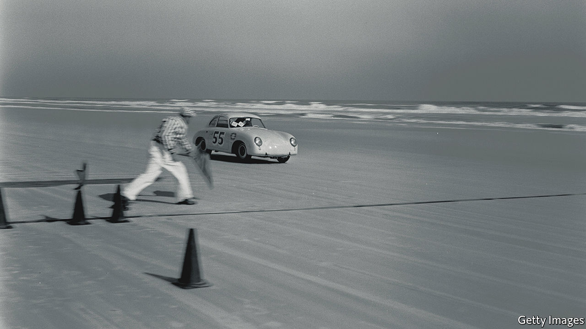

###### Reverse gear

# Porsche and Volkswagen are set to uncouple—at last 

##### A flotation will end an uneasy relationship 

 

> Feb 26th 2022 

PURCHASING A NEW Porsche often involves a long wait. If limited production and aloof dealers weren’t enough of a bottleneck, some buyers face further delays after a fire that broke out last week mid-Atlantic on a ship carrying 4,000 vehicles, including Porsches, from the stable of brands owned by Volkswagen (VW).

As with Porsches, so, too, with Porsche the company. Talk of letting investors buy a slice of the illustrious sports-car maker has been in the air almost ever since it combined with VW after Porsche’s audacious attempt to take over the much larger German company in 2008. That misadventure brought Porsche close to bankruptcy, averted thanks to a rescue by VW. One upshot of the affair was for the Porsche brand to become VW’s wholly owned subsidiary in 2012. Another was that the holding company controlled by the secretive Porsche and Piëch families, descendants of the sports-car maker’s founders, became VW’s largest shareholder.


A parting of the ways now looks closer than ever. On February 22nd VW and the families’ holding company said they were in “advanced discussions” over an initial public offering (IPO) of Porsche.

For VW’s boss, Herbert Diess, the spin-off could not come soon enough. He has been trying to streamline VW’s unwieldy collection of ten distinct marques. Dealing with flashy Porsche, which has always regarded itself as a cut above the rest of the group, is a headache he can do without. Porsche insisted, for example, on developing its own platform to underpin electric models rather than cutting costs by sharing one with the group’s other brands.

An IPO would also raise cash for Mr Diess to plough into his reinvention of VW as a maker of software-intensive electric vehicles. Manufacturers of upmarket cars have looked enviously at Ferrari since its flotation in 2015. The Italian firm’s stockmarket value has doubled in three years, to €35bn ($40bn). It is valued more richly, relative to earnings, than the luxury-goods firms it sought to match—let alone than lowly carmakers. (The family holding company of Ferrari’s chairman owns part of The Economist’s parent company.)

Porsche is no Ferrari. Its operating margin of over 15% is well below the Italian company’s 25% or so. But it handily outperforms the rest of VW. Despite making only 277,000 of the 11m vehicles that the group turned out in 2019, before the pandemic and the ensuing chip crunch, it accounted for a tenth of the group’s revenues and a quarter of its operating profit. The Taycan, a battery-powered model, shows it has a clear and profitable strategy for electrification that most other sports-car firms lack. Philippe Houchois of Jefferies, a bank, reckons that Porsche is worth €60bn-90bn. That is more than half of VW’s current market capitalisation of €109bn.

And the Porsche and Piëch families? By some estimates their members would now be twice as rich had they not attempted the abortive takeover in 2008. And their holding company will need to raise money to buy Porsche stock, perhaps by selling some of their VW shares. But, as Mr Houchois points out, they would at least reclaim a more direct stake in the firm that bears the family name. Perhaps that is what they have been waiting for. ■


