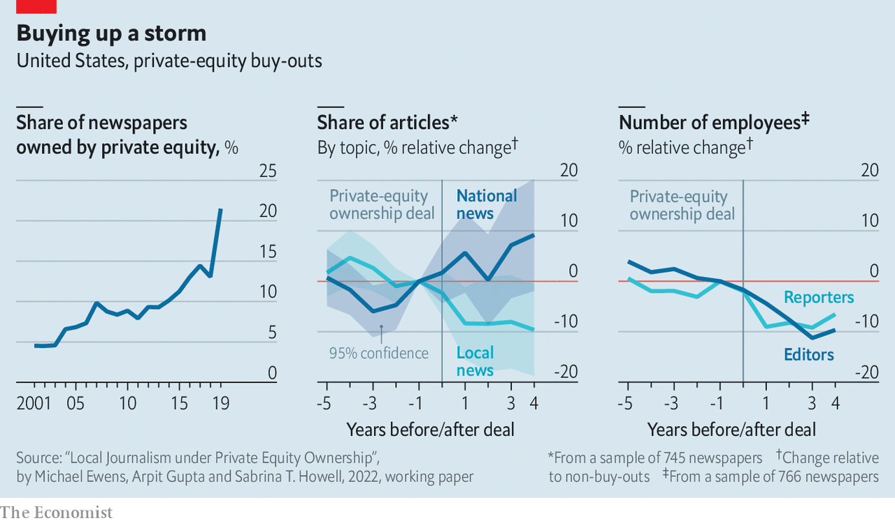

###### Culture vultures

# Private equity is buying up America’s newspapers 

##### It may be helping more than it’s hurting 

 

> Feb 26th 2022 

AMERICA’S LOCAL newspapers have been struggling to stay afloat for years. Since 2005 roughly 2,200 of them have folded. Private-equity firms, which often swoop on businesses in distress, have descended on the industry. The share of American newspapers owned by private-equity groups increased from 5% to 23% between 2001 and 2019 (see chart). The covid-19 pandemic has presented new opportunities for buy-outs of troubled media companies. That has led many of those who read the papers, or write for them, to fear that buy-out barons’ readiness to slash costs and seek out new sources of revenue will be bad for newsrooms. New evidence suggests that things are not quite that simple.

In a new working paper, researchers at the California Institute of Technology and New York University compare how newspapers that were purchased by private-equity firms have fared relative to those that were not. Some of the findings seem to confirm the fear of those newspaper readers and writers who see private-equity types as heartless vulture capitalists unconcerned about democracy.


After private-equity buy-outs, for example, newspapers laid off more reporters and editors. Across a sample of 766 American publications (accounting for around 45% of total circulation), payrolls were about 7% lower after a couple of years at those with new private-equity capital relative to those without such capital. The researchers also identified a 16.7% relative decline in the number of articles written within five years of the buy-outs.

 


And the focus of coverage shifted from local to national news: the share of articles on local politics dropped by about a tenth. That looks worrying in the context of a study published last year, by researchers at Colorado State University, Louisiana State University and Texas A&amp;M University, which concluded that when readers consume national news their views become more polarised. Poor local coverage is also associated with less competitive mayoral elections, and newsroom staff shortages are linked to lower voter turnout.

Local news may, though, be a losing battle from the business perspective. Local reporting is expensive, because it requires journalists on the ground and cannot be syndicated. Moreover, readers appear increasingly apathetic towards local news—a survey in 2018 by the Pew Research Centre, a think-tank, found that only 14% of respondents paid for local papers that year—and instead seek out national online media.

As for the size of newsrooms, things could have been much worse were it not for private equity. For the study also found that newspapers which had been bought out were 75% less likely to shut down than if they hadn’t been. Dailies were also 60% less likely to become weeklies—a common downgrade for many a suffering rag.

The study’s authors caution that they cannot estimate the general causal effect of private-equity buy-outs on the press, but only the observed effect on the newspapers in their sample. Private-equity firms do not purchase newspapers randomly. They target failing newsrooms with potential for turnaround; papers with low circulation but high advertising rates (the price charged to advertisers per square inch) were likelier to be bought. But for the newspapers studied, the buy-outs may have been what allowed them to survive. The accompanying weakening of newsrooms and nationalisation of news may be the lesser of two evils. ■


