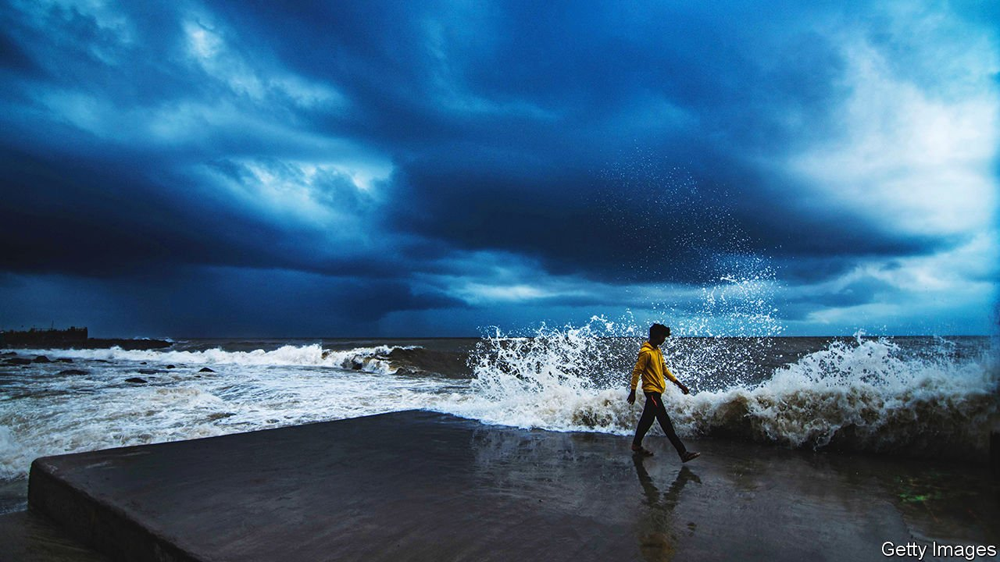

###### Perfect storm

# Sea Group faces choppier waters 

##### After a period of smooth sailing, conditions have turned against South-East Asia’s super-app 

 

> Feb 26th 2022 

THROUGHOUT MOST of the pandemic Sea Group, a Singaporean super-app, had wind in its sails. Both its e-commerce business, Shopee, and its gaming unit, Garena, were thriving thanks to growing appetite for all things digital. In October Sea’s stockmarket value surpassed $200bn, making it the first South-East Asian stock in history to break into the exclusive ranks of the world’s mega-cap companies.

Since then the weather has turned, wiping more than $130bn from Sea’s market capitalisation. The global tech sell-off is only part of the story. Investors also harbour fears that are specific to the company. In January Tencent, a Chinese internet giant, trimmed its stake in Sea from 21.3% to 18.7%. Tencent had earlier reduced its holding from nearly 40% at the time of Sea’s listing in 2017 and gave no explanation for the latest divestment. Whatever the reason, the market didn’t like it, perhaps fearing that Tencent’s retreat implies doubts over Sea’s prospects.


This month those prospects took another knock. On February 14th Sea’s stock price tumbled again, after Garena’s flagship mobile game, “Free Fire”, was abruptly made unavailable on app stores in India. Indian media reported that the government had banned “Free Fire”, along with 53 Chinese apps. Sea’s association with Tencent may again have played a role.

Sea is Singaporean, and India has no obvious beef with the city state. But it does have one with China. Tensions between the two nuclear-armed giants have been rising. In the past year the two countries’ soldiers have clashed, sometimes violently, at their Himalayan border. This has led India’s government to impose restrictions against hundreds of Chinese apps—or, it now appears, ones with perceived links to China. Sea says it complies with Indian laws and does not transfer any Indian user data to China or store them there.

Many existing users in India appear able to keep playing the game. But the loss of new Indian players is a huge blow to Sea. Indians are avid mobile gamers, and there are lots of them. India downloads more gaming apps than any other country, according to App Annie, an analytics firm. In the latest earnings call, Sea’s founder and chief executive, Forrest Li, trumpeted the fact that “Free Fire” was the highest-grossing mobile game in India (as well as in South-East Asia and Latin America, where his firm has been expanding its operations). Sea does not publish a breakdown of Garena’s earnings by country, but some analysts believe that Indian sales may account for around a tenth of the Sea’s digital-entertainment revenue.

Lost in the Indian ocean

It would thus be bad enough for Sea if its Indian troubles remained confined to the “Free Fire” saga. Worse, Shopee could be in trouble, too. The e-commerce platform’s rapid ascent up the rankings of Indian apps since a quiet launch last year has apparently irritated the Confederation of All India Traders (CAIT), a lobby group representing small businesses. CAIT has called for Shopee to be banned along with “Free Fire”, claiming in a letter sent on February 15th to India’s minister of commerce and industry that Sea is controlled by Tencent. The fact that CAIT’s claim is patently false may not matter to the Indian government, if the prohibition on “Free Fire” is a guide.

Sea’s troubles in India could spell similar problems for South-East Asia’s other super-apps as they try to expand beyond their region. Grab (which in November merged with a special-purpose acquisition company in a $40bn deal that was the largest ever of its kind) and GoTo (the result of a merger between two Indonesian online groups that is likewise eyeing a listing) have also received Chinese investments. Both are focusing primarily on business closer to home for the time being. But as those markets become saturated, India’s 1.4bn consumers would be the obvious next target—not least with China sequestered behind the Great Firewall and the West largely spoken for by America’s technology giants.

Despite the recent battering, Sea’s share price is still around three times what it was before the pandemic, outperforming many other technology bets. The Singaporean star remains South-East Asia’s most valuable listed company. Unlike many youngish tech darlings, parts of Sea make money. In the third quarter of 2021 its digital-entertainment arm raked in around $715m in adjusted gross operating profits.

That cash, combined with ready access to capital afforded by its size and prominence, allows Sea to cross-subsidise loss-making divisions such as Shopee (which lost $684m in that period on the same measure) or SeaMoney, a fast-growing financial-services unit consolidated in 2019. As the stock suffered in the wake of the Indian “Free Fire” ban, ARK Next Generation Internet exchange-traded fund, a vehicle run by Cathie Wood, a high-profile tech stockpicker, loaded up on Sea shares. Still, investors will need Ms Wood’s famously strong stomach to weather the increasingly choppy waters Sea finds itself in. ■


