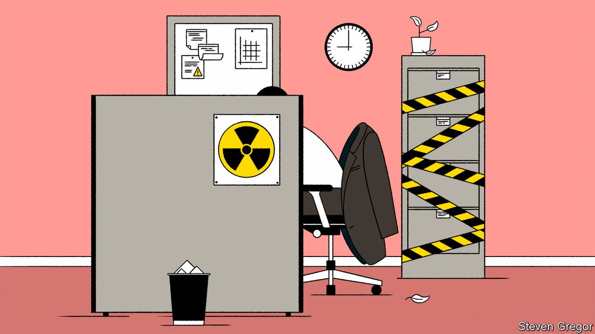

###### Bartleby

# The unseen costs of dirty work 

##### Work confers dignity. But some jobs are also a source of stigma 

 

> Feb 26th 2022 

THE TERM “dirty work” was coined by Everett Hughes, an American sociologist, to capture the attitudes of ordinary Germans to the atrocities of the Nazi regime. Hughes used it to convey the idea of something immoral but conveniently distant, activities that were tacitly endorsed by the public but that could also be disavowed by them. The term has since come to embrace a wide array of jobs, in particular those that are essential but stigmatised, both crucial to society and kept at arm’s length from it.

In an insightful new book of the same name, Eyal Press, a journalist, reports unflinchingly on occupations in America that carry the taint of stigma. Among others, he interviews prison guards in Florida and slaughterhouse workers in Texas. The pandemic has changed people’s awareness of some essential work: meat-processing plants were designated as critical infrastructure by the Trump administration in 2020, for example. But these jobs remain largely hidden from view; many are in physically isolated locations. People do not know what these workplaces are like and do not care to.


Dirty jobs often pay better than other openings. But they impose unseen costs. They usually involve inflicting harm on others (or on the environment), and they ask emotionally and morally compromising questions of the people who perform them. What is it like to work day in and day out as a “knocker” or a “live hanger” on a slaughterhouse kill floor? Should a prison guard risk her livelihood to speak up about the violence routinely meted out to inmates by her colleagues? Mr Press does not exculpate individuals who behave badly in these jobs. But by forcing readers to confront the context in which they operate, he makes it harder to condemn them as bad apples.

The boundaries of dirty work can be drawn too loosely. Some sociologists include firefighting, on the ground that it exposes people to danger on behalf of others, yet it is difficult to think of jobs that are less morally compromised. Indeed, exposure to danger can be the thing that cleanses work. Mr Press also meets operators of military drones at an air-force base in Nevada. Although drone warfare is a more precise form of combat than many others, operators often struggle with the idea of taking life without taking risk. The personal danger that soldiers on the ground face is what separates an unfair video-game from an exercise in valour.

The definition of dirty work can also be too rigid. Although the dirtiest work often lies at a remove and is concentrated among the low-paid, white-collar organisations have their own types of grubby jobs. Think of the difference between engineers who build social-media platforms in the name of connectedness and the content moderators who monitor the effluvia that result. The very language of decarbonisation points to emerging fractures within energy-firm workforces, between employees developing the clean energies of the future and those pumping the dirty fossil fuels of the past.

Individual roles can also break into dirtier and cleaner tasks. A piece of research in 2012 found that animal-shelter workers who were involved in putting animals to sleep were less likely to talk to outsiders about their work. “All The News That’s Fit To Click”, a new book by Caitlin Petre, a professor of journalism at Rutgers University, examines the effect that performance metrics are having on newsrooms. As she interviewed people for the book, Ms Petre noticed the frequency with which journalists used metaphors of pollution and contamination to describe the risk that chasing eyeballs might compromise the integrity of their editorial judgments.

Journalists tend to be good at telling stories, however. Ms Petre describes how many of them have drawn symbolic mental boundaries as a way of mitigating this risk. Analysing audience data to work out how to present their work is a “clean” use of metrics; using data to make decisions on content is impure and to be avoided. Criminal lawyers use a different but deep-rooted narrative to make sense of their own unpleasant tasks. They often defend people who have committed appalling crimes, for example, but because they do so in service of a noble ideal—everyone’s right to a fair trial—they are far less likely to feel morally compromised.

The idea of dirty work should not obscure the fact that having a job is a source of dignity. But some roles exact a hidden toll. To draw the sting of stigma, employers have to persuade their workers and the public that such jobs are not just essential, but also worthy of respect.

For more expert analysis of the biggest stories in economics, business and markets, , our weekly newsletter.

Read more from Bartleby, our columnist on management and work:

 (Feb 19th)

 (Feb 12th) (Feb 5th)

