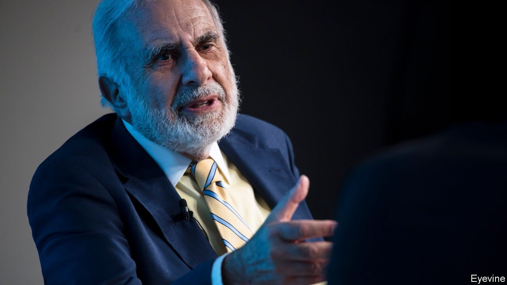
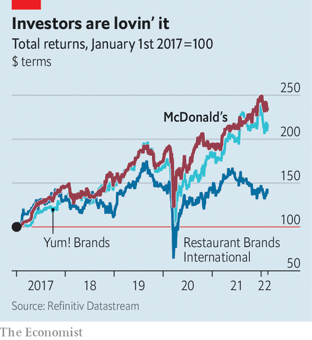

###### Burger flip-out

# What is Carl Icahn’s beef with McDonald’s? 

##### It isn’t about shareholder value 

 

> Feb 26th 2022 

FOR MOST of his life Carl Icahn was vilified for his abrasive personality and his activism as an investor. His mother said he had the spirit of Genghis Khan. Oliver Stone based Gordon Gekko, a fictional predator-in-chief of the junk-bond boom, in part on Mr Icahn. Bill Ackman, no softie, called him a bully who is not used to someone standing up to him, when the two pugilistic financiers fought over Herbalife, a nutritional-supplements business. He is most chief executives’ worst nightmare.

Late in life the 86-year-old Mr Icahn seems to be showing his milder side. This month HBO, a TV network, launched “The Restless Billionaire”, a largely sympathetic documentary that tracks his rise from modest beginnings in Queens to one of Wall Street’s titans. And on February 20th Mr Icahn launched a proxy fight for two board seats of McDonald’s to press the fast-food behemoth to require its suppliers to improve their treatment of pregnant pigs. “Animals are one of the things I feel really emotional about,” he told the Wall Street Journal. He reserves especial affection for pigs, which are unusually clever.


Mr Icahn’s activist strategy typically involves buying sizeable stakes in under valued companies and seeking to shift the management’s focus to cost-cutting. If managers refuse his demands, he stirs up a shareholder revolt, launches aggressive campaigns on social media to win over public opinion and pushes his own line-up of board members. Such methods have boosted the target’s share price often enough to earn a moniker, the “Icahn lift”, and let Mr Icahn sell out at a juicy profit.

All this makes his McDonald’s manoeuvre look out of character. He owns only 200 of the $186bn company’s shares, worth some $50,000. And McDonald’s has heeded his demands for better treatment of pigs, which he first made ten years ago. In 2012 it pledged to stop buying pork for its McRib and breakfast sandwiches by 2022 from producers who use cramped crates to constrain sows for all 16 weeks of pregnancy. McDonald’s concedes that it has not quite fulfilled its pledge, which it blames on delays caused by the covid-19 pandemic and outbreaks of swine disease. Yet by the end of 2022 it expects to source 85-90% of its American pork from sows not housed in gestation crates during pregnancy. By the end of 2024 all of its American pork will come from pigs housed in larger group enclosures when they are with piglet.

Mr Icahn’s campaign is also unusual in that McDonald’s is in rude health. Most shareholders are happy with the chief executive, Chris Kempczinski. The company is reporting “some of the highest margins ever”, notes Sara Senatore of Bank of America. Mr Kempczinski, who took over as CEO months before covid-19 spread around the world, has enjoyed tailwinds from the pandemic, which increased McDonald’s online orders and business at its drive-throughs. He has also jazzed up the brand, by teaming up with celebrities such as BTS, a South Korean boy band, Travis Scott, an American rapper and J. Balvin, a Colombian singer. For a limited time, star-struck clients could order a BTS meal (Chicken McNuggets, a medium packet of chips and a medium Coke) or a Travis Scott one (a medium Sprite, a quarter-pounder with bacon and chips with barbecue sauce).

 


Seemingly underpowered activists have notched up several surprise victories against managements of late. Most notably, a year ago Engine No.1, an activist hedge fund with a stake of just 0.02% in ExxonMobil, secured three seats on the oil giant’s board for climate-friendly shareholder representatives. That made large companies think again about dismissing small activist investors as unserious, especially on environmental or social issues that other shareholders may also see as worthy causes. But the ExxonMobil coup took place when the company was underperforming its rivals like Chevron. McDonald’s, by contrast, is running onion rings around its competitors (see chart).

Mr Icahn’s nominees are Leslie Samuelrich, an asset manager focused on sustainability, and Maisie Ganzler, an executive at Bon Appétit, a restaurant company. Shareholders will vote on the board’s composition at their annual meeting this spring. The wily Mr Icahn may not get his way, for once. Even if he does, any Icahn lift he cashes in on would scarcely pay for one dinner at the higher-end restaurants he normally frequents. ■


