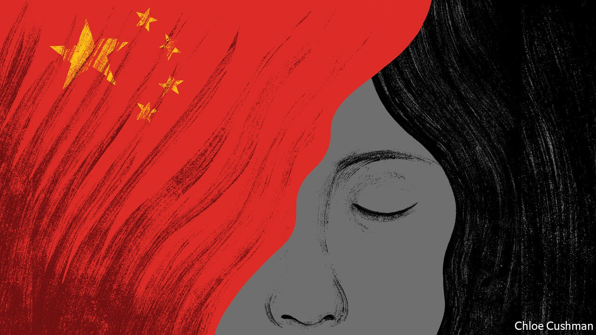

###### Chaguan

# A story of a trafficked bride shocks China 

##### A supposedly all-knowing state either failed to see horrors, or looked away 

 

> Feb 26th 2022 

IF ALL GOES to plan for Communist Party leaders, the year 2022 should show the world that China represents the future. State television kicked off the lunar new year with greetings from the crew of the country’s first space station, the Tiangong, beamed to over a billion viewers. February saw the capital, Beijing, safely host a Winter Olympics during a global pandemic. Athletes were secluded in high-technology quarantine bubbles, before competing on slopes of artificial snow. In a sign of the country’s allure as a sporting power, a freestyle-ski champion born and raised in America, 18-year-old Eileen Gu, chose to compete for China, her mother’s homeland, earning two gold medals and one silver.

Yet news of confidence and modernity has had competition in these opening weeks of the year. Since late January, millions of Chinese have dodged online censors to follow a different story, involving horrors that seem transported from another age. The news broke when a video blogger filmed a mother-of-eight, who showed signs of mental illness, chained by the neck in a freezing village outhouse in the eastern province of Jiangsu. Nationwide public outrage reached levels not seen since the chaotic first weeks of the covid-19 pandemic in 2020. It peaked as local officials issued a series of defensive, contradictory statements about the woman and how she reached their rural county near the city of Xuzhou. Eventually admitting that she had been sold into marriage, their openness went only so far. Guards sealed the woman’s village against outsiders. Two concerned citizens were detained after trying to visit the hospital where she is now confined after a diagnosis of schizophrenia. Censors deleted many reports about the case, taking special pains to suppress news of a collective action: a petition signed by graduates of elite Chinese universities, demanding an investigation into human trafficking nationwide.


Under pressure, Jiangsu’s provincial leaders finally launched a formal investigation. A report published on February 23rd declared that the woman, Yang Qingxia, also known as Xiao Huamei, or “Little Plum Blossom”, was 44 years old and came from a beautiful but deprived area of Yunnan, a south-western province. She was trafficked at least twice before being sold and married to Dong Zhimin, a farmer who had eight children with her. Mr Dong and at least two traffickers have been arrested, and 17 officials sacked or disciplined, almost all of them of county-level rank or below. Striving to end on a positive note, the report announced a campaign to protect the rights of women, children, the mentally ill and disabled. Public reactions to the report are distinctly mixed, with evidence of critical comments being heavily censored.

The widespread anger inspired by Ms Yang’s plight is revealing. That brides and children are trafficked is sadly no surprise. An ancient scourge, it is given new life today by wildly skewed gender ratios, especially in rural areas where a preference for sons has combined with decades of strict family-planning controls and sex-selective abortions to leave tens of millions of women missing from the population. Demographers estimate that around one in five Chinese men has no chance of finding a Chinese bride. In 2015 an ethnographer from Shandong Women’s University, Chen Yeqiang, published a study of migrant brides from Ms Yang’s home region in Yunnan. Typically aged 15-20, a dismaying number were tricked or abducted before being sold. Many later fled, some leaving children behind so that in-laws would not pursue them.

Those with disabilities are at high-risk of being trafficked. In 2021 Xiong Wanru of Princeton University published a survey of 1,215 bride-trafficking cases that reached Chinese courts between 2010 and 2018. A third of female victims were mentally or physically disabled, fetching prices 30% below the average as a result. Half of all the women were foreign, often from Vietnam. Many buyers were older men who lacked the education or skills to leave their village and work in a city. Sometimes parents bought a bride for disabled or mentally challenged sons, seeking grandsons to carry on the family line. A dismaying number of local officials are sympathetic to such traditionalist arguments. In a recent report the China Economic Weekly, a party-run magazine, described how judges in Feng County, Ms Yang’s place of captivity, denied divorces to several trafficked women, urging them to think of their children and try harder to reconcile with their husbands.

For party and patriarchy

It is striking how many women have written online about seeing images of Ms Yang and imagining themselves in her place, notes Ma Zhiying of the University of Chicago, who has studied mental illness and illegal marriage in China. To Ms Ma, that reflects wider fears of young, urban women when they hear the government calling for them to marry and have more babies for the nation’s sake.

It should worry party leaders that, as netizens tried to comprehend Ms Yang’s story, many shared memes from or copies of “Blind Mountain”, a film set in 1990s China, depicting a young college graduate tricked into marrying a poor villager. The bleak plot sees the village chief and local elders colluding to thwart the woman’s attempts to escape. In contrast, today’s leaders claim to have eliminated dark, hidden corners where cries for help go unheard and corruption is unchecked. The party boasts of building good roads to even the remotest villages and of sending upright officials to eliminate graft. With surveillance cameras in every hamlet and identity-card scanners at every railway station, police brag that no criminal can hide for long.

Such boasts explain public shock over Ms Yang’s case. A supposedly modern, all-knowing, all-seeing state failed to notice her suffering—or worse, chose to look away in the name of local social stability. Some netizens wonder how much has changed since the time of “Blind Mountain”, when it comes to officials’ priorities. China’s rulers, a socially conservative bunch, talk a lot about the future. But their system protects horrors with roots in the past. ■

 (Feb 19th)

 (Feb 12th)

 (Feb 5th)

Dig deeper

All our stories relating to the pandemic can be found on our . You can also find trackers showing ,  and the virus’s spread across .

