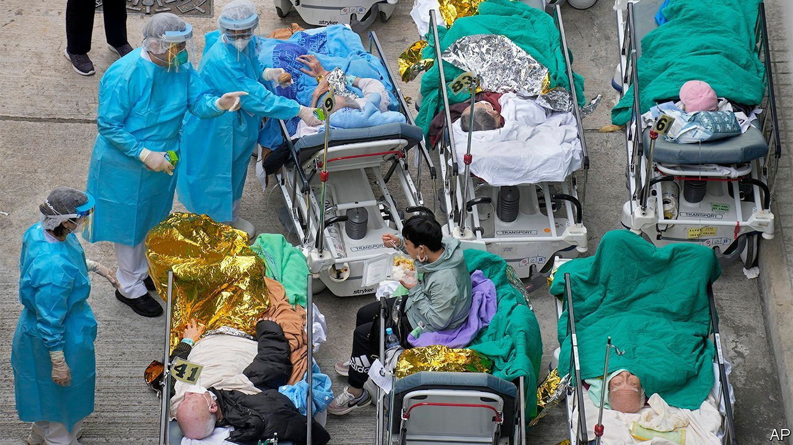

###### Clinging to zero

# Hong Kong’s refusal to live with covid-19 is causing chaos 

##### The authorities plan to test all 7.4m residents and shove the infected in disused tower blocks 

 

> Feb 25th 2022 

HONG KONG in the past week has been under greater stress from covid-19 than ever before. First came the shocking photographs of elderly patients on beds, lined up in the cold in the car parks of overflowing hospitals. Then the reports of foreign domestic helpers—who are forced by law to live in their employers’ houses—being abandoned to the streets after testing positive. Next, a raft of announcements: schools are to be closed to become testing venues, while disused tower blocks are to be converted into isolation centres. Having managed to keep the virus at bay for two years, the territory—struggling to replicate the mainland’s “zero-covid” approach—has been badly exposed.

The government reported more than 8,000 new cases on February 23rd—compared with 100 a month ago. The chaos on the wards has, in part, been caused by the insistence that anyone contracting the disease, even with no symptoms, must be placed in hospital or a government isolation centre.


This is unwise, says David Owens, a professor of family medicine at the University of Hong Kong (HKU). “In a covid pandemic the last place we want infectious people is in hospitals, unless they really need treatment.” Modelling by HKU suggests there could be 180,000 daily cases within the next couple of weeks.

Hong Kong has been complacent “at all levels”, says one public-health expert, who does not want to be named. Officials have been proud of previously effective policies, but they have squandered the success, failing to improve health facilities, stockpile tests or sufficiently increase testing capacity. Many pensioners are unvaccinated.

China’s president, Xi Jinping, has ordered that the wave be halted through “all necessary measures”. But Carrie Lam, Hong Kong’s chief executive, has repeatedly said there will be no full lockdown. China has sent epidemiologists (and, less usefully, 150,000 batches of traditional Chinese medicine). The mainland will also provide kit for a full month of mass testing. During March each of Hong Kong’s 7.4m inhabitants will be required to take three tests at a government facility, as well as taking daily tests at home. The infected will be sent to isolation centres. Even young children may be separated from their families. Some 50,000 more places will be made available in new quarantine facilities, but they may prove insufficient.

This is unlikely to halt the Omicron wave. But the variant may naturally burn through the population within a few months, reaching a level at which it becomes plausible to reintroduce a test, trace and quarantine system to quash local outbreaks. This could eventually allow a re-opening of the border with the mainland, one of the government’s main aims.

That plan will disappoint those who were hoping the city might move towards a policy of living with the virus, as its arch-rival, Singapore, has done. Instead, the dogged pursuit of zero covid is proving the final straw for many expatriates who have stuck it out so far. “We are fleeing,” admits one executive. “The fact that we risk having our ten-year-old daughter being taken away from us, means we are looking at flights now.” ■

Dig deeper

All our stories relating to the pandemic can be found on our . You can also find trackers showing ,  and the virus’s spread across .

