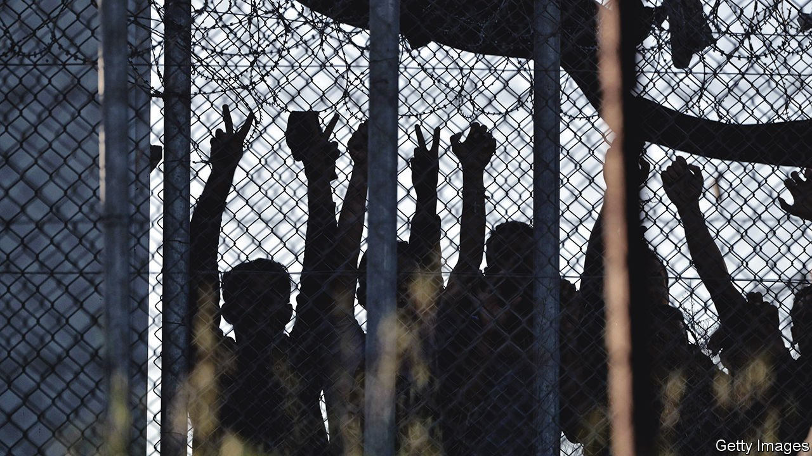

###### Refugees and reportage

# A journalist joins his Afghan friend’s odyssey to Europe 

##### Matthieu Aikins chronicles their journey in “The Naked Don’t Fear the Water” 

 

> Feb 26th 2022 

The Naked Don’t Fear the Water. By Matthieu Aikins. Harper; 336 pages; $27.99. Fitzcarraldo Editions; £12.99

IN THE AUTUMN of 2016 two young men were deposited in Moria refugee camp (pictured), a notorious detention centre on the Greek island of Lesbos. They had just braved a dangerous crossing in a dinghy from Turkey, on their way from Afghanistan to Europe. But the pair were not quite what they seemed. One was Afghan; the other was an undercover Canadian journalist, who was accompanying his friend on his perilous journey to a new life.


Both were shocked by the squalor they encountered, the result of a fire that had gutted the camp the previous week. As well as the grim conditions, the men had to contend with souring attitudes towards newcomers across Europe. More than a million migrants and refugees reached the continent by sea in 2015, but, a year on, countries were increasingly putting up fences and closing their borders. With public hostility outstripping sympathy, the road to asylum became more difficult, as the swelling number of detainees at the camp on Lesbos demonstrated.

Matthieu Aikins, a journalist partly of Japanese descent, had been working in Afghanistan or seven years when he agreed to make the trip with Omar, his pseudonymous companion. They had developed a close friendship during assignments on which Omar served as Mr Aikins’s fixer-cum-driver. But they came from drastically different worlds. As a child, Mr Aikins played ice hockey in a Canadian suburb; Omar grew up in exile in Iran and Pakistan. From a young age he had shined shoes, picked pistachios and taken construction jobs in the Iranian city of Shiraz to support his parents. His family moved back to Afghanistan soon after the American invasion of 2001.

By the time Omar left Kabul with Mr Aikins in 2016, his mother and father had already fled their war-torn country for a second time. Some of his siblings were already living in Europe; the rest of his close relatives were in Turkey, hoping to go west. His own trip had been delayed after he fell in love. He eventually sold his prized car, a gold Corolla, and steeled himself for the trials ahead.

“The Naked Don’t Fear the Water”—the title is a Dari proverb—is a chronicle of the two men’s odysseys. Omar entrusts himself to smugglers and risks his life to cross mountains and seas; Mr Aikins, who assumes the name Habib as part of his disguise, is his companion for some, but not all, of the voyage. Unlike his friend, he does not enter Turkey from Iran. Instead, he attempts to fly in from Italy, but is denied entry at a time of heightened tension after an attempted coup. So Mr Aikins travels by bus to Bulgaria before illegally slipping across the Turkish border.

The hazards they share mask the gulf in their circumstances—up to a point. Mr Aikins, who passes as Afghan because of his “black hair” and “wiry beard”, knows that, when push comes to shove, his friend must rely only on his luck, while he can always fall back on his Western citizenship. The question of who has the right to travel across borders looms large in his courageous reporting. So do the dangers some people are obliged and willing to take along the smuggler’s route into Europe. Boys stow away in lorries, families board unseaworthy inflatable boats, men and women cross deserts. As they near their destination, a border guard’s snap decision can determine their future “in a heartbeat”.

Mr Aikins’s wanderings were undertaken as a journalist’s project. Omar’s were not. The author confesses that he initially treated the trip “like another assignment where I was in charge”; but his sense of authority quickly fades. His role turns passive, as he awaits his friend’s decisions and documents their stories and those of the folk they meet. The result is a devastatingly intimate insight into the refugee crisis. ■

