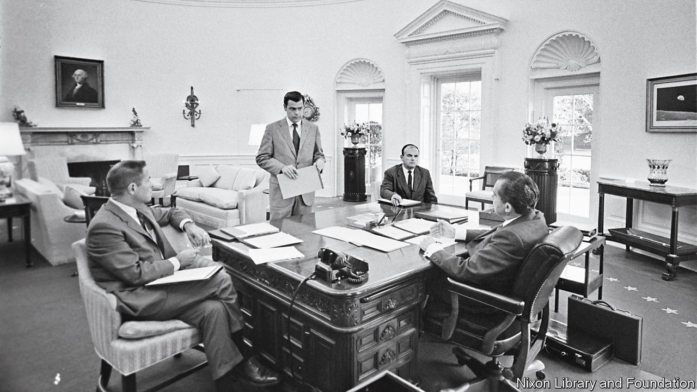

###### The Nixon presidency

# In his memoir, an aide to Richard Nixon recalls him fondly 

##### Dwight Chapin is loyal to his former boss in “The President’s Man” 

 

> Feb 26th 2022 

The President’s Man. By Dwight Chapin. William Morrow; 480 pages; $29.99 and £20

FIFTY YEARS ago this month, Richard Nixon embarked on his historic trip to China. Nixon loved planning it, recalls Dwight Chapin, an aide who helped prepare the visit. Mr Chapin’s ghostwritten memoir captures the excitement of the mission, as well as his awe at the president’s strategic vision. “We are going to China”, Nixon said at the time, “because in 50 years we will be adversaries and we must be able to talk to one another.”


Those were heady days for Mr Chapin, brought up on a farm in Kansas and now witnessing great-power politics, being served duck brain at a banquet with Zhou Enlai and, at just 30, impressing the Chinese premier with his youth. Thanks to his loyalty and organisational flair, he had progressed from working as an advance man on Nixon’s failed bid for California’s governorship in 1962 to occupying an office next to the president’s. His secret-service codename was “Watchdog”. As Nixon’s appointments secretary, he kept his daily schedule, “working with five of the most impressive words in the English language: ‘The White House is calling’.”

After China came Russia. Mr Chapin helped organise the first trip by an American president to Moscow, where Nixon signed the Strategic Arms Limitation Treaty and his aide found himself admiring the beauty of the American ambassador’s residence. Mr Chapin began to harbour plausible thoughts of himself one day becoming an ambassador in a place like this.

Then it all came crashing down. In December 1972 Mr Chapin was abruptly fired from the White House in an effort to kill a growing scandal. He would become the first official to be indicted—on four counts of perjury—in the Watergate affair. As he is at pains to point out, he had nothing to do with the burglary at the Watergate building and played no part in its cover-up. But he had hired a former college roommate to carry out dirty tricks on Democrats (he calls them “political pranks”), at the suggestion of Nixon and Mr Chapin’s mentor, the chief of staff, Bob Haldeman. A court decided he had lied about the shenanigans to a grand jury. He spent nine months in Lompoc penitentiary in California.

Looking back, Mr Chapin has no regrets. He considers himself to have been a political prisoner, the victim of a campaign by the liberal media and by Democrats, who had double standards over dirty tricks. He disparages the incriminating leaks from the FBI’s Mark Felt (better known as “Deep Throat”), and, he suspects, from Al Haig, a future secretary of state. But the real villain, in this telling, was John Dean, the White House counsel who co-operated with the prosecution and, maintains Mr Chapin, was the true “cancer” on the presidency. “The conventional assumption that Richard Nixon represented evil and John Dean honour or integrity is unquestionably a myth.”

As for Nixon, his resignation was an “extraordinary unfairness”. Mr Chapin describes a leader who was not only notoriously complex and brooding but also decent, sensitive and caring. As president, Mr Chapin argues, he accomplished far more than history gives him credit for, at home as well as abroad. What of the nastiness exposed in the White House tapes? Those remarks were taken out of context and gave a false impression of the man Mr Chapin knew so well.

Mr Chapin went on to have a career in public relations and consulting. But at heart, it seems, he has never stopped being Nixon’s advance man. He is still preparing the ground, attending to every detail, trying to make his boss look as good as possible—this time not for a campaign stop or foreign foray, but for posterity. ■

