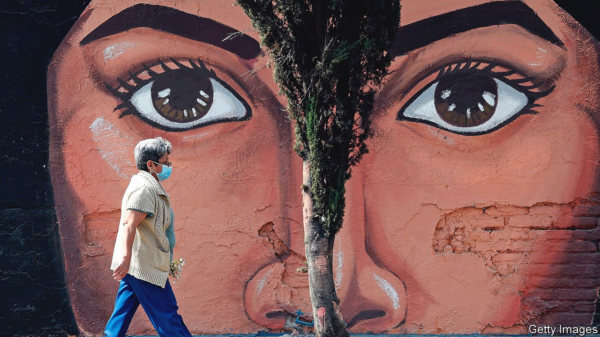

###### Art and regeneration

# Mexico revives a tradition of painting murals with a purpose 

##### Iztapalapa, a teeming neighbourhood on the outskirts of Mexico City, is the heart of the trend 

 

> Feb 26th 2022 

IZTAPALAPA, A TEEMING neighbourhood on the outskirts of Mexico City, is largely a sprawl of grey concrete. But look down from the cable car that soars above it—a city initiative that helps densely packed residents get around—and the aerial view is punctuated by brightly painted rooftops. Down here, a likeness of Mercedes Hernández, an actor. Over there, a boy and a girl at play, beneath the slogan: “We are equal”. On the ground, pedestrians navigate streets lined with portraits of locals, past and present, or pictures of crops formerly grown in this once-rural area.

Muralism has a long history in Mexico—from wall paintings by the Olmecs, the first major civilisation in the region, to colonial frescoes painted by the Spanish to dramatise Bible stories. Another mural movement took off in the 1920s. After the Mexican revolution, the government sought to foster a sense of identity in a country of numerous languages and ethnicities, whose citizens had fought to end the old dictatorship for varying reasons. The population was still mainly illiterate, so the new rulers recruited artists, including Diego Rivera, to paint murals showing scenes and events from Mexican life. The artists drew on the country’s heritage by, for example, incorporating Mayan motifs.


Today tourists flock to the works of the “big three” muralists of that era—Rivera, David Alfaro Siqueiros and José Clemente Orozco. “Dream of a Sunday Afternoon in Alameda Park”, a lively depiction of some of Mexico’s best-known historical figures, was painted by Rivera for a hotel restaurant in 1946-47; now in a museum devoted to the artist, it is a regular pit stop in Mexico City. In Guadalajara, on the ceiling of a former hospice (also now a museum), Orozco painted “The Man of Fire”, which shows a twisted body emerging from flames, a startling image of rebirth.

From the 1960s, murals became a private enthusiasm rather than a public project. They can be seen from the walls of schools in rural Oaxaca in the country’s south, to Monterrey, the business capital, in the north. Now, after a period of decline, the art is being revived with gusto, and as it was practised after the revolution—with a social purpose and paid for by the authorities. Iztapalapa, where some 7,500 new works have been commissioned since 2018, is the heart of the trend.

There is plenty of beauty in the bright colours and bold images on display in the neighbourhood. But the aim is not purely aesthetic. Officials in Iztapalapa want to make it a safer place to live. Mexico’s second-most-populous municipality with 2m people, it is known as one of the most dangerous, in which residents feel most unsafe. Iztapalapa has long been the “backyard” of the capital, says Clara Brugada, its mayor. “Prisons, that was the investment we received,” she says.

Eyes of the tiger

Some of the murals carry slogans exhorting better behaviour, such as “No to violence!” Others portray the faces of women, many of them local, such as Lupita Bautista, a world-champion boxer, and Eva Bracamontes, herself a street artist. Indeed, the whole project grew out of a push to improve the lot of women in this patriarchal bit of a male-dominated country, where the killing of women remains tragically common. Initially the murals were part of a programme designed to create streets where women felt safe walking alone; but they took on a life of their own. At first, says Ms Brugada, people were sceptical about having paintings on their houses and shops. Now they request them.

To critics of the scheme, the fact that Iztapalapa’s authorities pay for the artworks undercuts their authenticity. Enthusiasts point out that Mexico’s education ministry paid Rivera and his contemporaries in muralism’s heyday. Then, as now, individual artists had distinct styles, as well as leeway to decide the content of their murals.

Rivera, for instance, romanticised the time before the Spanish conquest and represented the conquistadors as greedy and barbaric; Orozco was softer on them and the Catholic church. “I connect with the place and people,” says a contemporary muralist who paints as Andre amx. “I don’t just put out my message.” She often explores feminist themes and subjects, such as prehispanic goddesses. Her murals in Iztapalapa include a huge tiger whose striking eyes stare out from a green wall.

Historians think the post-revolutionary murals did help to forge a cohesive, modern country. They shaped both how Mexicans saw themselves and how foreigners saw them, reckons Barbara Haskell of the Whitney Museum of American Art in New York. (The big three went on to paint influential murals in the United States.) An example of their impact lies in the way Mexico celebrates mestizaje, the mixing of Spanish and indigenous peoples. One of the country’s best-loved murals, by Orozco, is in the Colegio de San Ildefonso, a former school in Mexico City. It depicts Hernán Cortés, the conquistador, and Malinche, his indigenous interpreter and later lover, who gave birth to a child considered one of the first mestizos.

Can murals in places like Iztapalapa have a comparable impact now? Since 2018 some crimes, such as those involving firearms, have declined there. Rapes of women have fallen, too. Other aspects of the regeneration drive, such as improved lighting and better maintained streets, have contributed. But officials are convinced that the art has helped.

Whatever their effect on crime, the murals are popular. “They are motivating people, especially girls, who think, ‘I could appear there’,” says Ms Bautista, the boxer. Her face is plastered on a bright red background accompanied by the words “Proudly from Iztapalapa”. Residents who used to conceal where they come from no longer do. Slowly, outsiders may come to see Iztapalapa in the same way. ■

