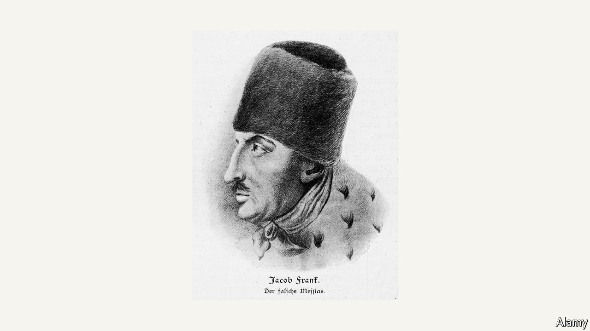

###### Novel-prizewinning fiction

# Olga Tokarczuk’s “The Books of Jacob” is a wild, unruly saga 

##### It takes readers on a “fantastic journey across seven borders, five languages and three major religions” 

 

> Feb 26th 2022 

The Books of Jacob. By Olga Tokarczuk. Translated by Jennifer Croft. Riverhead Books; 992 pages; $35. Fitzcarraldo Editions; £20

THE NOVEL that earned Olga Tokarczuk the Nobel prize in literature for 2018, now published in English, is a wild, unruly beast—not just because it is more than 900 pages long. Divided into seven books, it begins one foggy morning in October 1752.


Horsemen, merchants, peasants and priests jostle along a muddy road in central Poland on their way to market. The air is scented with the sweet smell of malt from nearby breweries. Vodka and mead are also on offer, Ms Tokarczuk writes, as well as wine from Hungary and the Rhineland. The fog is so dense, though, that the crowd can only navigate by the burble of a river, a metaphor for readers who will also find themselves, as the Polish author says, on a “fantastic journey across seven borders, five languages and three major religions, not counting the minor sects”.

At the centre of “The Books of Jacob” is a large group of Jews from Podolia, in what is now south-western Ukraine, adherents of a real-life Kabbalist rabbi and self-proclaimed Messiah called Sabbatai Tzvi. In the mid-18th century they become followers of his heir, Jacob Frank, also based on a real figure (pictured), a tall, charismatic merchant who always dresses in a long coat and a high Turkish hat. As the author herself has commented, Frank is an ambivalent figure, “ruthless yet sensitive, unpredictable but attentive”, practical if somewhat eccentric. “He’s a trickster—a charmer and a fraud.”

A one-time convert to Islam, Frank persuades the group to be baptised as Catholics—and to experiment with incest and other forms of sexual licence—all in a bid for intellectual and emotional freedom. He is accused of heresy and imprisoned for 13 years in a Polish fortress that also serves as a shrine to the Virgin Mary. Liberated by Russian troops, he makes his way to Brno in Moravia, where he is befriended by Emperor Joseph II and his mother, Maria Theresa. Later his group move to Offenbach am Main in Germany, where they create a huge court and religious centre. Eventually they return to Poland, where Frank dies and his followers join the growing bourgeoisie.

“The Books of Jacob” conjures up a society flooded with the new thinking that emerged from the Enlightenment and the French revolution. Its central question—the answer to which remains tantalisingly out of reach—is why people believe in the likes of Frank. In the living, breathing, mysterious world he and his followers inhabit, Ms Tokarczuk shows how ideas, along with fables, myths and delusions, made the society in which he flourished, which in turn led to the world of today.

Jennifer Croft’s translation brilliantly captures the onward rush of Ms Tokarczuk’s writing. Of the novel’s many other stories, two stand out. The first concerns a challenge that Father Benedykt Chmielowski, a diligent priest, sets himself: to write down all the knowledge humanity has accumulated. The other revolves around a magnificent character called Yente, introduced as a sickly old lady at a wedding in the mid-18th century and still around in 1944, so ancient she is almost translucent.

Five families descended from Frank’s followers have taken refuge in a cave; Yente is among them. Someone throws in a bottle in which is “a piece of paper that says, in a clumsy hand, ‘Germans gone’.” Over the decades, Yente waits and watches, proffering advice, asides and rich observations—much like Ms Tokarczuk herself. ■

