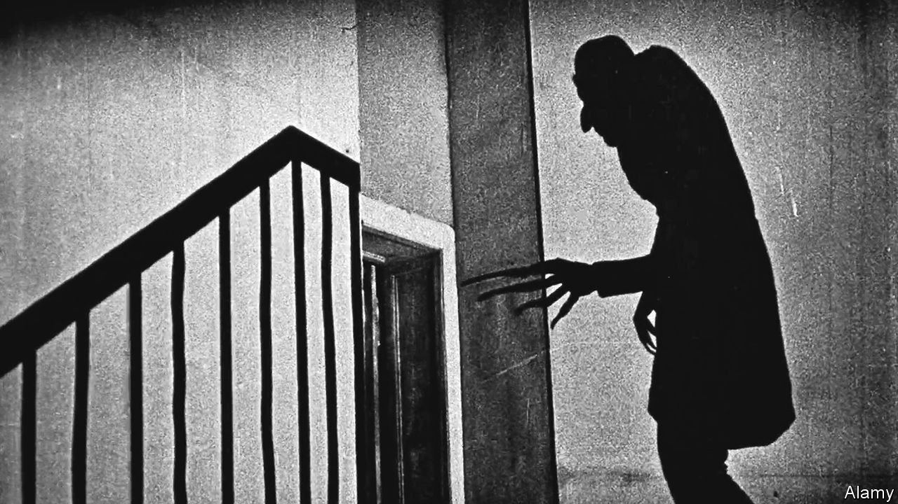

###### Home Entertainment

# “Nosferatu” and the birth of the undead 

##### On screen, killing monsters has always been a job for women 

 

> Feb 26th 2022 

ONE HUNDRED years ago, in March 1922, the first major film adaptation of Bram Stoker’s “Dracula” had its premiere in Berlin. Not that it was called “Dracula”. The film-makers hadn’t asked for permission to adapt the famous vampire novel of 1897, so they changed the characters’ names. Jonathan Harker, the estate agent who ventures to Transylvania, was renamed Thomas Hutter (and played by Gustav von Wangenheim). Harker’s fiancée, Mina, became Hutter’s wife Ellen (Greta Schröder). Count Dracula is Count Orlok (Max Schreck). And the film, directed by F.W. Murnau, luxuriated in the shiver-inducing title “Nosferatu: A Symphony of Horror”.

No one was fooled. Stoker’s dogged widow, Florence, sued the producers for copyright infringement, and the courts ordered all copies of the film and negatives to be destroyed. If it weren’t for a stray print that turned up in Paris, one of the masterpieces of Weimar cinema would have been lost for ever. (Today viewers can stream it on Shudder, a service dedicated to horror and thriller titles.)


A century on, “Nosferatu” is still revered for its experimental techniques—shooting on rugged locations as well as in a studio; using stop-motion animation and fast-motion footage—and for the glut of horror-movie conventions it established. The film includes villagers in a tavern who warn the hero not to proceed, and the conceit that vampires are burnt to ash by sunlight. It is the archetypal “Dracula” film. And yet its most strikingly modern aspects are those that leave Stoker’s novel behind.

One departure from the source material is that when Orlok travels from Transylvania to Germany, he brings along a swarm of plague-carrying rats. Crosses are chalked on doors in the fictional town of Wisborg; a line of coffins is carried down the main street. After the influenza epidemic that began in 1918, these images would have chilled audiences as much as did the grisly count. They remain chilling today.

Another change is the omission of Stoker’s macho band of vampire-slayers. While the men in “Nosferatu” bustle around, achieving nothing, it is Ellen who consults a book of undead lore, against her husband’s instructions, and she who sacrifices herself to defeat Orlok and save the town. Ellen even shoos the useless Hutter out of the house so he won’t get wind of her plan.

The producer, Albin Grau, wrote an article in 1921 describing the first world war as a “cosmic vampire”, and some critics see “Nosferatu” as a response to the wartime slaughter that helped push women into the workplace. Whatever the reason for Ellen’s courage, this feminist twist on Stoker’s story established another horror-movie staple—the woman who deals with a heinous villain single-handedly.

Think of Ridley Scott’s interstellar vampire film “Alien” (1979). After the male crew members unwittingly invite a toothy predator into their spaceship, ignoring the objections of Ripley (Sigourney Weaver), it is up to her to destroy the thing herself. It may be a coincidence that Ripley’s first name is Ellen, too. But these two heroines, decades apart, are united by a core belief: monster-hunting is women’s work. ■

