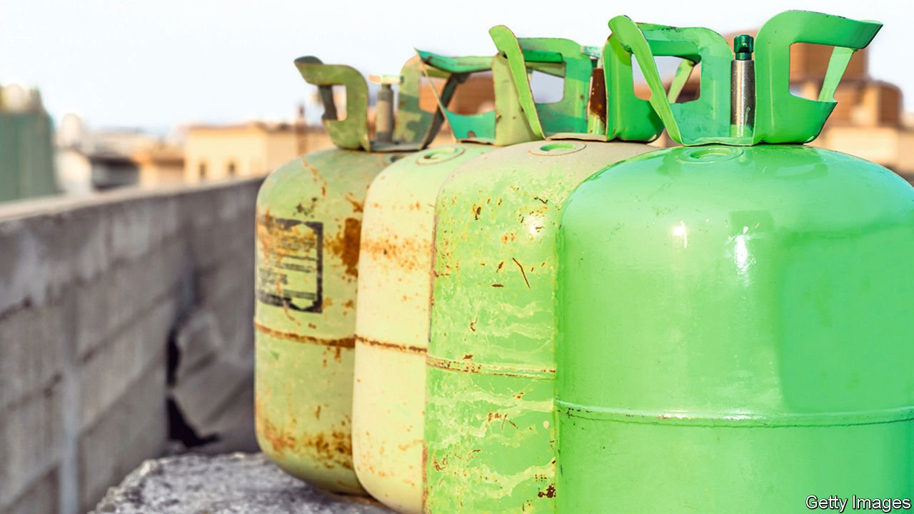

###### Free as air

# An EU scheme to limit the use of dangerous gases runs into problems 

##### Controlling the flow of hydrofluorocarbons turns out to be tricky 

 

> Feb 25th 2022 

FOR A WHILE it looked as if all was going to plan. In a move cheered by climate activists, the European Union began in 2015 to restrict the production and import of gases known as hydrofluorocarbons (HFCs). HFCs are widely used in refrigeration, air-conditioning and manufacturing, but they are also potent greenhouse gases. The first big shortages hit in early 2018. Prices across Europe multiplied sixfold or even more. The EU wanted to push HFC users to adopt pricey, climate-friendlier alternatives. It thought that the engineered shortage would do the trick.

But officials were soon scratching their heads. The high prices unexpectedly plummeted. And even though the EU tightened caps on HFCs again a year ago, prices are still not much higher than before the crunch. The reason: HFCs were being smuggled into the EU. The trafficking is still going on. The Environmental Investigation Agency, a watchdog based in London that has dispatched researchers to pose as buyers in Romania, estimates that a quarter of all HFCs in the EU are contraband. A body formed by chemical companies, the European FluoroCarbons Technical Committee (EFCTC), says the proportion may be as high as a third.


Such estimates are rough. But they have not been plucked from thin air. Much can be inferred, for example, by examining officially registered trade flows. Data from Turkish sources show that in 2020 more than four times as much HFC tonnage left Turkey bound for the EU than the latter reported as imported. This suggests that plenty of tanks and canisters holding HFCs enter on the sly.

The smuggling has hit some firms particularly hard. To supply greener alternatives to HFCs, Chemours, an American firm, spent around $500m on R&amp;D and production facilities. But with illegal imports continuing to hold down HFC prices, demand for alternatives has been “stagnating” and even declining, laments Murli Sukhwani of Chemour’s European HQ in Geneva. Mr Sukhwani, who also leads the EFCTC’s investigation into the black market, says climate-friendly alternative gases cost at least twice as much as the compounds they are supposed to replace.

This has miffed America. In a report last year on barriers to trade, Katherine Tai, the American trade representative, wrote that the EU’s “insufficient oversight and enforcement” of its HFC caps is hurting American chemical firms, not to mention the climate. European officials, for their part, point to the difficulty of preventing profitable contraband from crossing the bloc’s long borders.

Consider the potential earnings, says Marco Buoni, president of an association of European refrigeration and air-conditioning contractors called AREA. When prices first soared, a car boot could be filled in Ukraine with canisters of an HFC blend called R404A that would sell, hours later, for ten times as much in Poland. Margins have since shrunk as legions have got in on the action. But contraband HFCs are still so valuable that canisters are sometimes given space on boats trafficking migrants from north Africa to Europe.

Some trafficking is carried out by moonlighters who make border runs in their cars or hide canisters in luggage stowed on passenger coaches. But the black market is now dominated by crime syndicates that move large volumes, says the European Anti-Fraud Office (OLAF). Most of the contraband seems to come from China, Russia, Turkey and Ukraine.

One trick is to mislabel with stickers that are later peeled off. To detect the practice, which became widespread in 2019, expensive gas-analysis equipment is needed, says an OLAF investigator. Another approach is to falsely declare that a shipment of HFCs will be subsequently exported out of the EU. These “transiting” goods are not subject to EU limits on imports, but the stuff often disappears, the investigator says, into “a very, very difficult to track” succession of warehouses across Europe. Trafficking has been exacerbated by generally light penalties. Fines of a few thousand euros have been common.

The EFCTC is trying to improve enforcement. It has hired Kroll, an American firm, to gather intelligence on potential smuggling and pass it along to authorities. The team, which is based in London, uses network-analysis software to unearth hidden relationships between entities in myriad sources of data. In one success, the software drew attention to a lorry driver hauling gas from Turkey into the EU. In a video posted online, he unwisely mentioned his “friends at the border”. He was later nabbed. Recent months have seen “a lot of arrests and a lot of action”, especially involving Romania and Turkey, says Benedict Hamilton, leader of the Kroll team.

But the outlook nonetheless remains grim, according to Marius Appenzeller, refrigerants manager at Westfalen Group, a gases distributor based in Münster, Germany. The firm expects trafficking to increase as the EU continues, every three years until 2030, to shrink HFC quotas. A report in December from the European Environment Agency acknowledged that HFC use had begun to grow, even without taking into account “alleged” smuggling. ■

For more coverage of climate change, register for , our fortnightly newsletter, or visit our 

