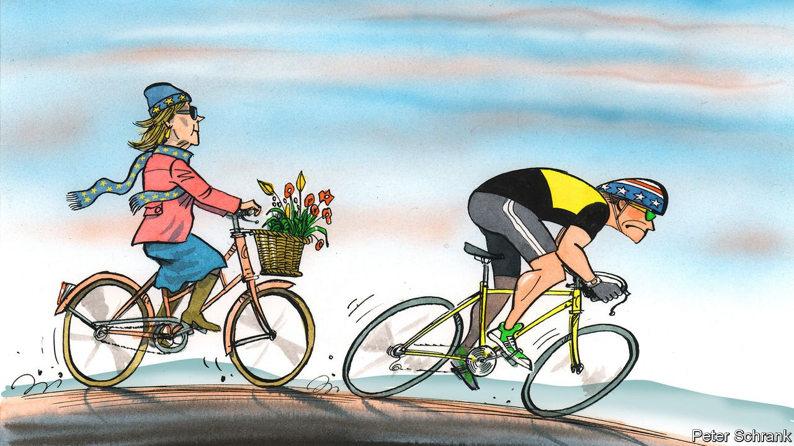

###### Charlemagne

# Europe is the free-rider continent 

##### Why lead when you can follow instead? 

 

> Feb 26th 2022 

CLEVER ROAD cyclists who run out of puff keep up the pace by discreetly tucking themselves behind faster riders. Carried by this slipstream, it is easy to get comfortable, if not outright lazy. Why expend the effort needed to forge ahead if you can get away with this dolce vita? Occasionally laggards have to soothe the tired (and increasingly irate) front-runner with a vague pledge to “pull their weight”. That seems like a small price to pay. Only much later, perhaps ensconced in the comfort of a peloton, does the realisation dawn that staying too long in the rear means blindly following someone else down a road not necessarily of your choosing.

Europe is the free-rider continent. For decades its defence has been underpinned by America—leaving it in a supporting role even as war breaks out on its own borders. Economically it has piggybacked on innovation from elsewhere, keeping up with rivals, not forging ahead. Even the feel-good environmental ambitions crafted in Brussels are made possible in part by importing from afar the products once made in carbon-spewing factories Europe shut down long ago. How clever it seems to some. All this money saved and effort outsourced has made it possible to live a fine life while working 35-hour weeks and retiring in one’s prime.


Defence is where criticism of Europe’s ways has been loudest—and where it is currently being most acutely felt. The combined military spending in the 34 European countries that are part of either NATO or the EU is less than half that of America’s, despite a bigger economic output and nearly twice the population. Europeans in NATO spend only 1.7% of GDP on their armed forces, well short of the 2% NATO target and the 3.5% America splurges. Big countries like Germany (1.5%), Italy (1.4%) and Spain (just 1%) slink away when the subject comes up. That is despite a swell of new military spending following America indicating it was pivoting to Asia a decade ago, not to mention the terrifying prospect of having Donald Trump be the guarantor of anything important.

Worse, when it comes to gauging the ability of an army to do anything beyond its borders, a lot of Europe’s spending is wasted on dozens of redundant national schemes. Too much goes on pensions rather than on advanced kit. The run-up to the war in Ukraine demonstrated these shortcomings. It was overwhelmingly America that undertook basic military tasks such as surveillance flights. Europe was left to whinge about whether it got sufficient access to the intelligence it did little to produce.

All the money not spent on guns makes for more butter. Europe could have invested the savings in pioneering innovation. But there also it has preferred to stay tucked in behind others. EU countries spend a third less on research and development than America or Japan, as a share of GDP, and are out-invested even by China nowadays. Economic theory dictates that poorer countries converge with richer ones as they learn to mimic their ways. One bit of the world persistently defies the possibilities of this “catch-up” growth: western Europeans were a quarter poorer than Americans in 1990, and remain a quarter poorer today. They work less, and enjoy the slipstream of those who toil harder.

Et alors?, Europeans might ask. Plenty of them scoff at America’s cut-throat capitalist model, not to mention the Chinese one. But economists, including Daron Acemoglu, point out that such winner-takes-all systems create the conditions for innovation that Europe then adopts on the cheap. And indeed the cuddly form of capitalism embraced in Europe has markedly failed to create world-beating companies. Big tech firms are all American or, increasingly, Asian. Pharmaceutical breakthroughs are financed by the high prices paid by American patients (and backed by abundant venture capital); government-run health systems in Europe then bulk-buy the same drugs for much less. Europe has had some successes—German companies were among those pioneering mRNA vaccines—but most of the cutting-edge research in science and technology is done at universities and companies elsewhere.

Even the EU’s efforts to cut its carbon footprint depend on the work done by others. The pledge by the bloc to reach “net zero” by 2050 is a fine ambition. But part of the progress already made is an illusion. Per capita emissions in Denmark, say, have fallen by about half since 2000. But the pollution it imports—in goods that used to be made there, but whose manufacturing is now outsourced to China and other places—has surged in the same period. Take the extra carbon its imports have generated in other countries into account and Danish emissions are down by just one-third, according to data from the Global Carbon Project, a research outfit. A scheme has been mooted to tax carbon emissions embedded in products brought into the bloc, but is yet to be agreed.

Stuck in the wheel with you

It is the foot-dragging on defence that is garnering the most attention now. The evacuation debacle in Afghanistan in August was a reminder of Europe’s inability to do much without America. But the outbreak of war in Ukraine brings the point home, literally. It was America that took the lead in sounding the alarm, not the EU. It was also America that shuffled troops around the continent in a vain attempt to deter Russia. Emmanuel Macron of France provocatively alluded to the impending “brain death” of NATO in 2019 to spur Europeans into taking responsibility for their own defence. The French president should be thankful that the alliance seems to have snapped back to life. For all his pining for “strategic autonomy”—the idea that Europe should be able to forge its own way in the world—America is firmly in the lead, and the Europeans are united in following.

Europe realises that being in the peloton has its limitations. But to be a leader requires resources and purpose. Mr Putin’s decision to go to war has stirred a sense of unity among a bundle of rival polities more often squabbling within an imperfect union. Being a follower might not seem so bad after all. ■

Read more from Charlemagne, our columnist on European politics: (Feb 19th)

 (Feb 12th)

 (Feb 5th)

