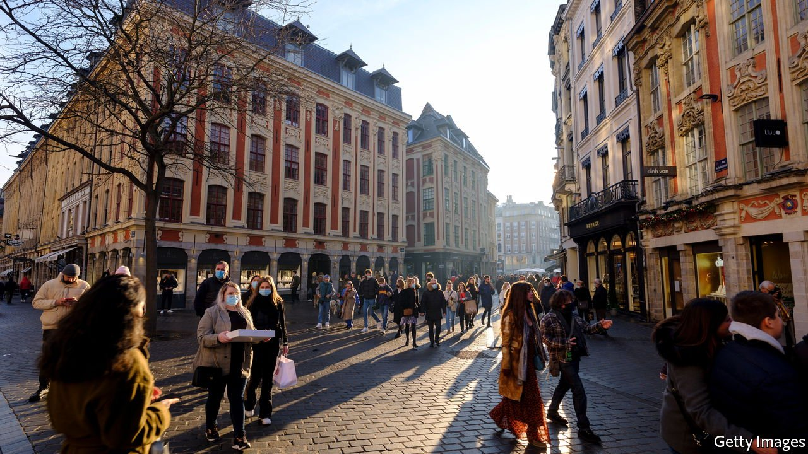
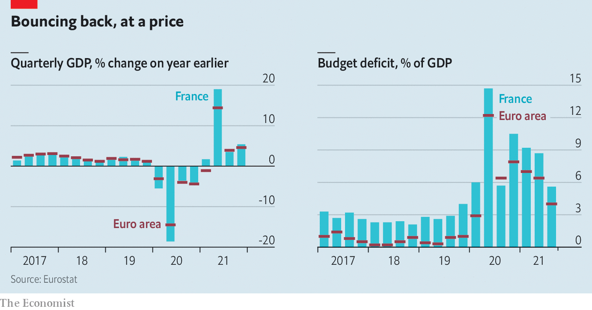

###### Bills to pay

# Money matters take centre-stage in France’s election 

##### The economy is healthy, the public finances are less so 

 

> Feb 25th 2022 

FOR THE past few months, rivals in April’s French presidential election have dwelt to excess on questions of national identity and immigration. This should soon shift. Emmanuel Macron, a former economy minister and one-time investment banker, is expected shortly to confirm officially that he is running for re-election. This is likely to turn the focus to the economy. Voters will be judging not only Mr Macron’s economic management since he took office in 2017, but how he and his rivals plan to improve competitiveness, job creation and incomes.

As the French economy rebounds, growth has exceeded expectations. After a contraction of 8% in 2020, GDP recovered to pre-pandemic levels last autumn. Growth in 2021 reached 7%, its fastest rate for over half a century, and brisker than in Germany, Italy and Spain. This was partly thanks to generous government support to keep businesses going, people in jobs and incomes protected. The injection of €100bn ($113bn), or 4% of GDP, partly from the EU’s recovery plan, has also helped.


On Mr Macron’s watch, France has also become a lot more business-friendly. He has cut taxes on businesses, replaced the wealth tax with a narrower property tax, introduced a flat tax on financial income and courted foreign investors. For the past five years he has stuck to the same fiscal policy and the same finance minister: Bruno Le Maire has been in the job longer than anyone since Valéry Giscard d’Estaing in 1969-74. In 2019 Mr Macron promised that by 2025 there would be 25 French “unicorns”, or tech firms valued at over $1bn. That figure was reached three years early, in January this year.

 


Perhaps most surprising, the French job market is doing relatively well too. Unemployment in the fourth quarter of 2021 fell to 7.2%, down from 9.2% when Mr Macron took office. This is not principally owing to government support: the number of people on furlough schemes has fallen from 8.4m in April 2020 to 420,000 in December last year. It largely reflects the strength of private-sector job creation. One reason, says Philippe Martin, of the Council of Economic Analysis, an independent advisory body, is past labour-market reforms, particularly those in 2017. Among other things these capped the cost to employers of redundancy payments. Instead of prompting more lay-offs, as some economists had feared, this has made firms more willing to hire staff on permanent contracts.

The government has also invested heavily in training. The number of apprenticeships has risen from 290,000 in 2017 to a record 720,000 in 2021. The employment rate of 15-64-year-olds actually increased during the pandemic. Even older workers now stay at their desks for longer. For the 50-64-year-olds, the employment rate is at its highest level since the national statistics body started measuring it in 1975.

Yet there are two weak points to Mr Macron’s economic record. The first is the state of public finances. When the pandemic took hold, he vowed to do “whatever it costs”, and he did. The government’s budget deficit was still 7% in 2021, and the level of public debt reached 115% of GDP, according to official estimates. France now belongs to the group of the most indebted countries in the euro zone, alongside Belgium, Greece, Italy, Portugal and Spain.

France has no difficulty servicing its debt. But Mr Macron has yet to show that he has a plan to reduce it. Valérie Pécresse, the centre-right Republicans’ candidate and his most credible critic on the economy, has accused him of “burning through cash”. She promises to restore fiscal discipline and cut a net 150,000 jobs from the 5.6m-strong civil service.

The other weakness is pension reform. The average effective age of retirement for men in France is 60 years, well below the 63 years in Germany and 64 years in Britain. Yet at the start of the pandemic Mr Macron shelved his ambitious plan to merge the country’s sprawling 42 pension schemes, and to raise the retirement age. The next president will have little choice but to take on this reform.

Mrs Pécresse vows to raise the pension age from 62 to 65, and the far-right Eric Zemmour wants to increase it to 64. But this is not a message many French voters want to hear. Pension reform is the one policy almost guaranteed to prompt strikes and protests. Indeed most candidates on the left, including the radical Jean-Luc Mélenchon, as well as the nationalist-populist Marine Le Pen, promise instead to bring the pension age down.

In the short time left to him to campaign, Mr Macron will be able to defend a reasonably good economic record. But elections are seldom won on past achievements. Voters remain sceptical about the effect on their own purses, even though average incomes grew on his watch, and they are worried about the rising cost of living and energy bills. If Mr Macron is serious about reviving the reformist spirit of his campaign in 2017, he will need to present both credible pension reform and a decent plan to fix public finances. This means telling French voters some uncomfortable truths, whatever it costs. ■

For more coverage of the French election, visit our dedicated 

