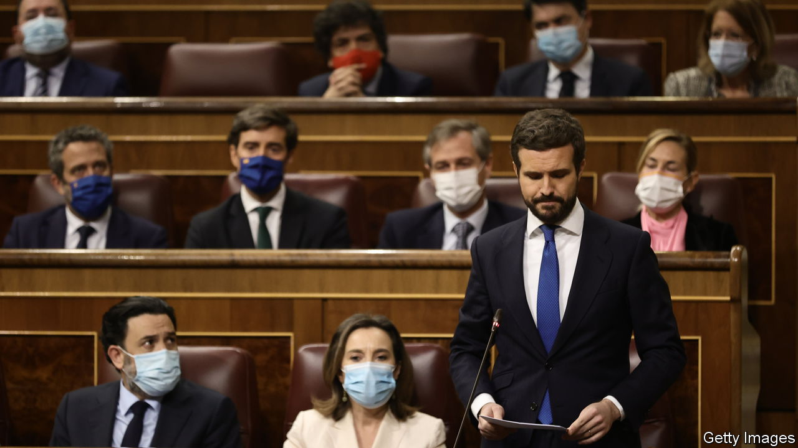

###### Thunder on the right

# The leader of Spain’s main opposition party is ousted 

##### Pablo Casado will depart at an emergency party congress 

 

> Feb 26th 2022 

BELEAGUERED AND almost alone in his party’s headquarters, abandoned by its powerbrokers and most of its MPs, a bemused Pablo Casado this week suffered the implosion of his leadership of the People’s Party (PP), Spain’s mainstream conservative opposition. At a meeting that lasted into the early hours of February 24th, the party’s regional barons allowed him to save face by staying on as a figurehead until an emergency party congress on April 2nd. In return he agreed to back as his successor Alberto Núñez Feijóo, the experienced president of the region of Galicia who is the consensus choice. A smooth transition matters not just to the PP but to Spain. Vox, a newish hard-right outfit, is snapping at the PP’s heels in polls, largely because of Mr Casado’s ineffectual leadership.

Two things precipitated Mr Casado’s fall. The first was his decision to force an early regional election in Castilla and León. Far from a hoped-for absolute majority, the PP achieved only a pyrrhic victory; the big winner was Vox. Then Mr Casado rounded on Isabel Díaz Ayuso, the president of Madrid’s regional government and a former protégé-turned-rival. He and his abrasive deputy, Teodoro García Egea, accused Ms Ayuso of corruption over a €1.5m ($1.7m) contract for face masks early in the pandemic from which her brother earned €56,000. She said she was not involved in the contract and her brother had long worked in health procurement. A prosecutor has opened an investigation.


Although Ms Ayuso was damaged by the revelation, Mr Casado had declared a war he could not win. The leader of the party’s libertarian wing, she is the party’s popular darling, having handsomely won a snap regional election last year. Several thousand of her fans demonstrated outside PP headquarters. After angry meetings Mr Casado sacrificed Mr Egea, an apparatchik widely hated in the party. But it was not enough for his critics. “I don’t know why I have to go,” Mr Casado reportedly told a colleague. “I have done nothing.” That only went to show his lack of political awareness.

Mr Casado became leader at the age of just 37 when he won a party primary in 2018. An eloquent orator and an amiable man with no experience in government, he has never seemed up to the job. Instead of setting out an alternative to Pedro Sánchez’s left-wing coalition, he merely sniped at it while steering an erratic course of his own. That left Vox to benefit from widespread discontent with Mr Sánchez’s handling of the pandemic and the slowness of the economic recovery. Vox’s support has climbed to 21% in the latest polls, which give the PP 22%.

Mr Feijóo is a conciliatory centrist. He has won four consecutive absolute majorities in Galicia, keeping Vox out of the regional parliament there. Many expected him to stand for the leadership in 2018, but he apparently considered the party too divided. Spanish political leaders tend to cling on despite defeat. The Socialists went through a similar bloodletting in 2016, with Mr Sánchez being ousted and then winning back his job. But there will almost certainly be no way back for Mr Casado. His parting gift to the PP has been to unite it, against himself. ■

