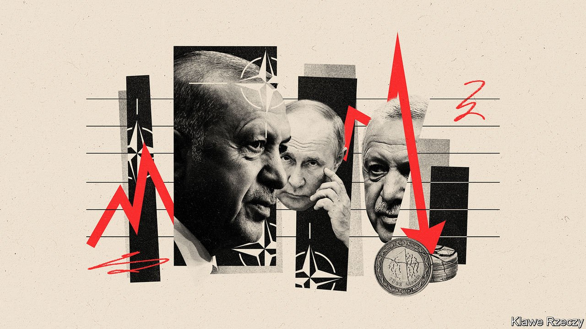

###### Frenemies

# Turkey’s rapprochement with Russia may not survive the war in Ukraine 

##### It’s not easy being a member of NATO and a friend of Vladimir Putin 

 

> Feb 24th 2022 

TRAFFIC ON THE Bosporus, the waterway that splits Istanbul and connects the Marmara and Black seas, has been busier than usual of late, and more dangerous. Making their way past supertankers, passenger ferries and the occasional pod of dolphins are Russian warships heading north towards Ukraine. Since the start of February, at least six Russian amphibious assault ships, as well as a Kilo-class submarine, have passed through. Russia now has four such submarines in the Black sea, each armed with missiles capable of striking targets anywhere in Ukraine.

Few countries are watching the war for which these weapons were deployed as anxiously as Turkey. Its government, headed by President Recep Tayyip Erdogan, is eager to preserve a recent rapprochement with Russia. “We cannot give up” on either Russia or Ukraine, Mr Erdogan said on February 23rd. But Russia’s actions may end up forcing his hand. The following day, as Russian bombs began falling on Ukraine, Turkey’s foreign ministry called the invasion “unacceptable” and “a grave violation of international law”. It had already denounced Russia’s recognition of separatist enclaves in Ukraine. The war will test the relationship, possibly to destruction.


Turkey’s most immediate concern is its economy. Mr Erdogan, who has helped drive inflation to over 48% and maimed his currency with ill-judged interest-rate cuts, is eager for lots of foreign cash from a busy tourism season, lower energy prices and some measure of regional stability. Russia’s actions in Ukraine seem to have torpedoed such prospects. Russians and Ukrainians accounted for over a quarter of foreign visitors to Turkey last year. This summer, presumably, far fewer will show up. Western sanctions against Russia, one of Turkey’s main trading partners and its main supplier of natural gas, will deal the economy a separate blow. The war has already sent shudders through Turkish markets. On February 24th the lira was headed for its worst day this year.

Turkey does not want to antagonise Russia. The last time it did so, by shooting down a Russian warplane near the border with Syria in 2015, the Russian response, a mix of sanctions and threats, was robust enough to force a rare apology and a range of concessions from Mr Erdogan. What followed was a thaw in relations, marked by new energy deals, co-operation in Syria, and Turkey’s purchase of an S-400 air defence system from Russia. Russia has since tried to peel away Turkey from NATO, while Turkey, estranged from its Western partners, has looked to Russia to advance its regional interests.

Remarkably, the rapprochement has survived the assassination of Russia’s ambassador to Turkey, as well as wars in Libya, Syria and Azerbaijan in which Turkey’s proxies have squared off against Russia’s. The two powers co-operate whenever possible and confront each other where necessary, though almost never directly. “It’s like capoeira,” says a European diplomat, referring to a stylised Brazilian martial art. “Each side is doing its dance, sizing up the other, but there’s always the danger they will come to blows.” When they do, one of them (usually Turkey) finds a way to scale back. When a Russian airstrike killed dozens of Turkish troops stationed in Syria in 2020, Mr Erdogan ordered a bombing campaign against Syrian regime forces, but not Russian positions. Turkey has also been silent about Russia’s antics in Belarus.

But Turkey considers Ukraine a strategic partner. It opposed Russia’s annexation of Crimea, backed Ukraine’s plans to join NATO, and shared its concerns about Russia’s naval build-up in the Black sea. Turkey also sold Ukraine dozens of armed drones, vexing Mr Putin. Earlier this year, Mr Erdogan and Volodymyr Zelensky, Ukraine’s president, signed a new defence co-operation agreement. The war will make it difficult for Turkey to balance its commitments as a member of NATO and its warm relations with Russia, says Alper Coskun of the Carnegie Endowment for International Peace, a think-tank in America.

Turkey’s backing for Ukraine has already helped the country buff its tarnished NATO credentials. American diplomats, used to taking Turkey to task for its human-rights record, are praising its stance on Ukraine. It helps that Turkey has begun to mend fences with the UAE, Egypt and Israel, all of them American allies.

Russia has ways of tempering Turkey’s support for Ukraine, however. Nowhere is this as clear as in Idlib, a province in north-east Syria packed with over 3m civilians and controlled by Islamic extremists. Two years ago, Turkey, which backs the insurgents, and Russia, which backs the Syrian regime, agreed to a ceasefire. That stopped a regime offensive that would have pushed the insurgents and millions of refugees towards Turkey’s border. Since the start of the crisis in Ukraine, ceasefire violations have picked up, officials in Ankara say. This is not a coincidence. They believe Russia is weaponising the refugees against Turkey. “The Russians see Idlib as a soft spot for Turkey,” says one official. “They’re sending a message, that if we do something they don’t like [in Ukraine], they can make our lives difficult.”

Mr Erdogan said earlier this year that Turkey would do whatever is necessary as a NATO member in the event of a Russian invasion. But in practice there is only so much Turkey is prepared to do for Ukraine. Recently one of the prime minister’s top advisers suggested that Turkey would not align with foreign sanctions against Russia, calling them “useless”. Instead Turkey had tried to position itself as a possible mediator between Russian and Ukraine—a notion that now seems naive. Mr Erdogan would have loved to preserve cosy ties with Russia, but the war in Ukraine is likely to prove the end of the affair. ■

