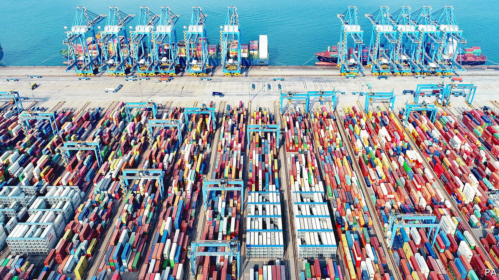
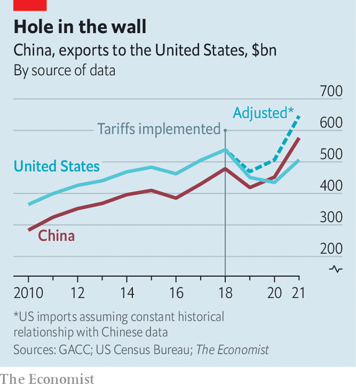

###### Artful dodging

# America’s tariff wall on Chinese imports looks increasingly like Swiss cheese 

##### As avoidance booms, so does the trade deficit 

 

> Feb 26th 2022 

“AN EASY WAY to avoid Tariffs? Make or produce your goods and products in the good old USA. It’s very simple!” In the days when Twitter was the main medium for presidential proclamations, that was what Donald Trump recommended to companies using China as a manufacturing base. He was half right: avoiding tariffs has proved to be quite simple. What he failed to see, though, was that avoidance is an eminently viable strategy for companies staying put in China.

The scale of avoidance is, to use a non-technical term, huge. A giant discrepancy that has opened up between Chinese and American trade data provides a window onto the tariff-dodging that has occurred over the past three years since  on Chinese products. Much of it involves importers taking advantage of legal loopholes; some of it appears to be outright evasion, with companies lying to customs inspectors.


The numbers add up quickly: the total value of made-in-China goods entering America and dodging tariffs may have surpassed $100bn in 2021, according to calculations by The Economist. Taken alone, these goods would be equivalent to America’s fourth-largest source of imports, even outstripping its purchases from Japan and Germany. Moreover, if all these goods were counted properly, America’s bilateral goods-trade deficit with China would have smashed its annual record in 2021—a damning indictment of the use of tariffs as a way to narrow the trade gap with China.

To understand the discrepancy, start with the official American trade data. According to figures released on February 8th, America bought $506bn of goods from China last year. That was up by 16% from 2020 (a reflection of America’s booming consumption) but still below its import peak reached in 2018. The Chinese trade data are starkly different. They show that America bought $576bn of goods from China last year, up by nearly 30% from 2020, far and away the most on record.

This gap is particularly striking because the historical pattern is for China to systematically underestimate its exports to America by roughly 18%. (One reason for the historical underestimate is that China classifies many products shipped via Hong Kong as exports to Hong Kong, whereas America counts them as imports from China.) If the 18% underestimate rule of thumb still applies, China’s exports to America may have reached as much as $680bn last year, $174bn more than reported by America.

The obvious question to ask is why anyone should privilege China’s data, with its reputation for manipulation, over American data. In other words, perhaps America has counted its purchases from China correctly, while China has overstated its sales to America. Last year two economists then with the Federal Reserve, Hunter Clark and Anna Wong, explored this possibility, trying to account for the data discrepancy.

Part of the problem, they found, did indeed stem from the Chinese side. To blunt the impact of the trade war with America, China dramatically increased tax rebates for its exports, which in turn encouraged exporters to declare more overseas shipments. But in working through the trade data for 2020, their conclusion was that the tax changes explained just about 14% of the discrepancy, while tariff avoidance explained 62% (it was hard to pin down a specific reason for the remainder). If the same proportions applied to the trade data for 2021, tariff avoidance would have reached $108bn, nearly double the amount in 2020. And there is reason to think it may be even higher: in 2021 China actually decreased some of its tax rebates for exporters, whereas those trying to get around America’s tariffs will only have become more adept at doing so.

 


What are the tricks of the trade? One approach is to exploit what is known as the “de minimis” rule. According to this, countries neither charge duties on nor collect full data on imports below a certain value. Most developed countries set the threshold at around $200. In 2016, eager to focus scarce customs resources on high-value shipments, America lifted its bar to $800, providing importers with ample scope to avoid tariffs. Over the 12 months to September 2021, American customs officials counted that 771.5m de minimis packages entered the country—a fifth more than during the previous period—with no estimate of their actual value. Some logistics companies now offer services to American importers, letting them make bulk shipments to Mexico or Canada and then break them into smaller packages for tariff-free entry into America.

Some firms may also be evading tariffs by presenting false information to customs inspectors. In their paper, Mr Clark and Ms Wong noted that American importers could use “low-ball invoices supplied by their Chinese suppliers”. There also appears to have been an increase in goods produced in China but falsely labelled as originating from other countries. Since 2016 the Customs and Border Protection, a federal agency, has published a record of its investigations into potential evasions of anti-dumping duties. Over the past two years it has launched 37 such investigations, up from 24 over the previous three years. Virtually all have targeted products from China. In January, for example, customs investigators determined that Simpli Home, a furniture company, had imported quartz products from China but incorrectly claimed they were from Vietnam. In December they found that A&amp;A Pharmachem, a supplier of drug ingredients, had trans-shipped China-produced xanthan gum through India to avoid tariffs.

With tighter rules and closer checks at the border, America could stop some of this tariff avoidance. Earl Blumenauer, a Democratic congressman from Oregon, introduced a bill last month—aimed squarely at China—that would prevent companies from non-market economies from using the de minimis loophole. If customs agents were to open more shipping containers and sift through them carefully, they might identify more understated invoices and more mislabelled countries of origin. But doing so would require expertise and time—all the more difficult when ports are suffering from backlogs. Officials want to speed shipments up, not slow them down with yet more inspections.

Indeed, America can be at least somewhat grateful for all of the tariff avoidance. Duties at the border ultimately  on American consumers, pushing up prices for imported products. At a time when inflation is running high, tariff-dodging helps to keep costs down. ■

For more expert analysis of the biggest stories in economics, business and markets, , our weekly newsletter.

