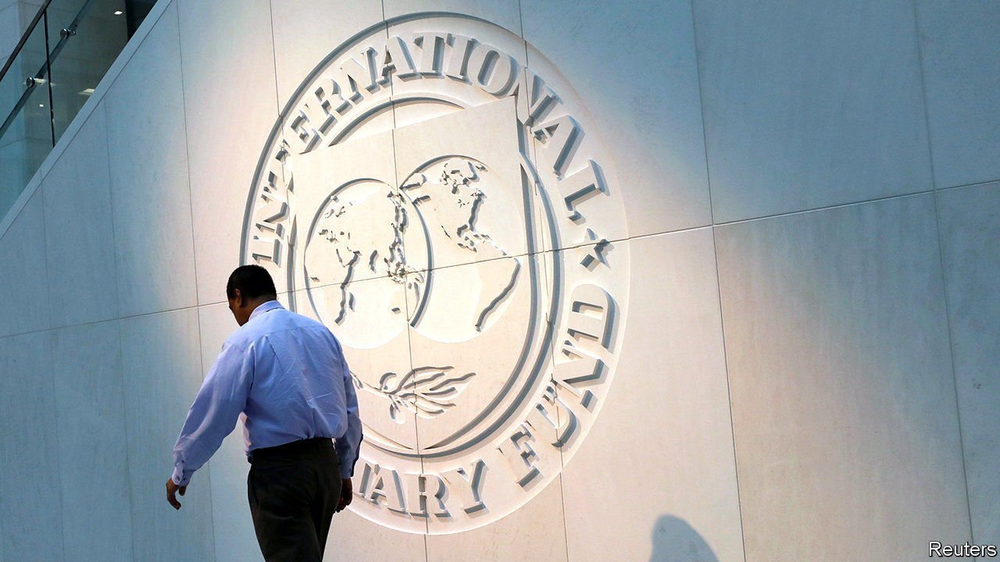
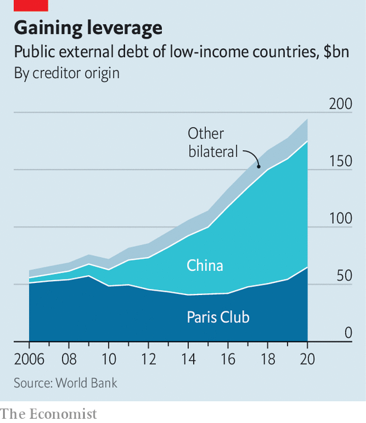

###### Lost and fund

# Despite bulging debt everywhere, the IMF is struggling to be helpful 

##### The world’s lender of last resort is hampered by geopolitical tensions 

 

> Feb 26th 2022 

IN THE ONCE-BUSTLING streets around the IMF’S headquarters in Washington, DC, you can hardly spot a soul these days. Soul-searching is also keeping officials busy inside the building. With government debt ballooning everywhere, many continue to criss-cross the globe, talking with countries that can still borrow and coaxing creditors into granting relief to those who cannot. But the world’s lender of last resort is hampered by conflict between its members—just as rising interest rates threaten to cause a big bang of defaults.

Two years of pandemic-fighting and on-off lockdowns have turbocharged global debt, both public and private. In 2020 alone it soared by 28 percentage points, to 256% of GDP—the largest one-year rise in borrowing since the second world war. In recent months, as central banks have raised interest rates to combat inflation, the cost of servicing it has increased, raising demand for the fund’s assistance. In most large emerging markets the pain is manageable, for now. Soaring inflation and sinking currencies have not yet pushed the likes of Brazil or India towards crisis.


Instead a quieter crisis is breaking out in smaller countries devoid of hard currency. Sri Lanka, Tunisia, Lebanon and Ghana are all candidates for loan programmes from the IMF. On February 23rd the fund said it would start talks with Ukraine over a possible $700m debt tranche. Among the world’s 60-odd poorest countries, more than half carry debt loads which may need to be restructured. That may be an underestimate: a recent World Bank report found that 40% of low-income countries have not published any data about their sovereign debt since 2020.

The IMF has enough firepower to help solvent countries. Its resources were increased after the global financial crisis, boosting its lending capacity to $1trn today, up from $400bn in 2010. It has also responded creatively to members’ difficulties since the start of the pandemic. When markets melted down in early 2020, it launched a short-term liquidity facility through which countries facing cash squeezes could borrow cheaply. It also lent $170bn through rapid credit facilities similar to its standard loan programmes, but with fewer strings attached.

 


Last August it also doled out $650bn-worth of new special drawing rights (SDRs), a quasi-currency used to augment countries’ foreign-exchange reserves, to all its members. Because SDRs are allocated based on what each member contributes to the fund, most of the issuance went to well-off countries. Just $21bn was allotted to those that really needed it. But the fund is working to create a trust through which some of the SDRs allocated to richer members might be available for long-term lending to poorer ones. Though the G20 promised last year to pony up $100bn for the trust, only $60bn has been pledged so far.

Such programmes have helped to tide over many solvent countries when markets have dried up. But lending, no matter how easy or cheap, is of little help to countries that are nearly bankrupt. At least a dozen countries today owe more than they can hope to repay. Given the fragile outlook for growth—clouded by tighter monetary policy, a weak Chinese economy and geopolitical tensions—more may join their ranks. Without debt relief, many will only use IMF loans to repay other creditors, leaving the fund with an ever-growing share of the tab.

In the past the IMF used its convening power to cajole richer members into forgoing some of the money they were owed. In 2020 its efforts yielded the Debt Service Suspension Initiative, through which 73 low-income countries became eligible for a temporary moratorium on debt payments. By the end of the programme in December last year nearly 50 countries had opted to make use of it, freeing some $10bn they could use to meet urgent needs. Separately, the IMF also suspended some debt payment on loans it had made itself to 29 very poor countries.

But such suspensions do not make underlying debt loads more sustainable, because the delayed principal and interest payments remain due. Thus a new G20 initiative, referred to as the “common framework”, was rolled out in November 2020. Its utter failure to gain traction—so far only three countries have sought relief under its auspices, and none has completed the process—illustrate the new political pickle the IMF finds itself in.

The framework was intended to provide a broad set of principles which could be applied to individual countries in need of debt relief. Crucially, it was meant to extend beyond lenders from the “Paris Club”—rich-world governments which have long co-operated in cases of sovereign insolvency—to include private creditors and countries like China, India and Saudi Arabia. These, however, have largely refused to play ball. That is a big problem. Whereas a decade ago Paris Club members still provided the bulk of credit to poor-country governments, China is increasingly bankrolling them: its disclosed lending (which probably understates the true total) amounts to roughly half the money they owe to other governments.

Restructuring such debt is extremely hard. Views differ within China as to whether and how much debt relief to provide to overextended borrowers. Many different Chinese institutions are involved in foreign lending, not all of which are keen to help. And many poor countries are reluctant to seek relief from China, lest they cut themselves off from future access to Chinese financing or otherwise antagonise the Chinese government.

Yet without participation from other lenders, the IMF is in a bind: under pressure from rich-world politicians to do more to help struggling economies, yet often unable to provide programmes that put countries on a path towards stable finances. Some critics suspect that the fund, squeezed in this way, has occasionally indulged in excessive optimism about countries’ prospects in order to justify its lending. In January Kenneth Rogoff, a former chief economist of the IMF, wrote that the fund’s permissiveness risked transforming the institution into an aid agency. A recent, tentative agreement between the IMF and Argentina, to refinance $45bn owed to the fund, drew widespread criticism for the vagueness of the path it sketched for eventual repayment of the loan.

The fund lacks good alternatives. Failure to reach a deal with Argentina might well have meant financial disaster for that country and lost the IMF billions. Its leaders could perhaps be more vocal in calling for China to be more lenient. But the West’s reluctance to increase the country’s 6% voting share at the IMF, to a figure matching its new economic might, has made China less willing to listen. And the window for getting China deeper into the tent has probably closed, because its relations with the West have deteriorated so much.

In the 1990s the IMF and the World Bank, capitalising on a moment of international bonhomie, marshalled the Heavily Indebted Poor Countries Initiative, through which lumps of debt owed by 37 economies were forgiven—with most of the funding coming from creditor countries. The sums needed today are not huge, but getting the world’s big countries to agree on anything seems ever harder. On February 18th a G20 meeting ended with no firm commitment to expand debt relief. That bodes ill for the IMF. Without global co-operation, it is fast becoming a shadow of its former self—just like the eerily quiet district where its offices stand. ■

