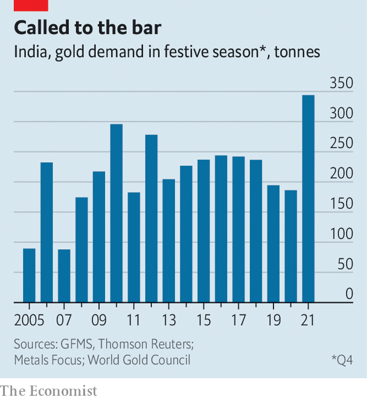

###### Karat and stick

# Gold demand has surged in India 

##### Despite the government’s efforts, Indians are rushing to stash metal under the mattress 

 

> Feb 26th 2022 

COVID-19 HIT India hard, leaving millions jobless and struggling to get by. Yet Sachin Rana, who runs a jewellery stall in New Delhi’s Malviya Nagar market, says sales have been booming since lockdowns ended. After months in isolation, consumers were keen for a blowout during Diwali, a festival in November. A bumper wedding season has followed, creating plenty of occasions to wear jewellery or give it as a gift.

The pandemic has proven that “Indians will never stop buying gold”, says Mr Rana. Pent-up demand for pendants and parties pushed bullion sales to the highest on record in the last quarter of 2021, reckons the World Gold Council, an industry body that has tracked consumption since 2005. Indians picked up around 340 tonnes of gold over the period, equivalent to the weight of five healthy Indian elephants every week.


India’s special relationship with gold predates covid-19, of course. It is the world’s second-largest market for the yellow metal, behind China, though it produces almost none at home. This is partly driven by tradition. Brides are given jewellery as part of their dowry and it is deemed auspicious to buy bullion around certain religious festivals. It is a handy store of undeclared wealth, too, often stashed in wardrobes or under the mattress.

 


But the pandemic has also affirmed an investment advice passed on over generations: park savings in gold as a rainy-day fund. In the past two years many families have made ends meet by selling jewellery, ornaments, bars and coins at pawn shops and informal markets. Others have borrowed against the stuff. The three largest non-bank financial companies offering gold loans saw their assets jump by 32%, 25% and 61% year on year, respectively, in 2020. Gold’s appeal as a safe haven is only rising: as tensions escalate in Ukraine, its price is approaching records.

This insatiable appetite is a worry for policymakers. Vast gold imports can destabilise the economy. During the 2013 “taper tantrum”, when India’s foreign-exchange reserves were lower than they are now, a rush of gold imports helped push the current-account deficit to 4.8% of GDP and fuelled worries of a currency crisis.

Savings stashed away as idle gold could be put to more productive use elsewhere. Indian households hold 22,500 tonnes of the physical metal—five times the stock in America’s bullion depository at Fort Knox and worth $1.4trn at current prices. The average family has 11% of its wealth in gold (against 5% in financial assets).

The government has tried using sticks to push people away from bullion. Import duties hover around 10%, even after cuts in last year’s budget aimed at keeping smuggling in check.

It is also experimenting with carrots that lure savers away from physical gold. The central bank has ramped up issuance of sovereign gold bonds, which are denominated in grams of gold. Of the 86 tonnes’ worth issued since 2015, about 60% were sold after the pandemic began. And the gold monetisation scheme, which allows households to hand gold over to a bank and earn interest, was revamped last year to reduce limits on the size of deposits.

Lockdowns inadvertently helped the state’s agenda. Researchers at the Indian Institute of Management in Ahmedabad found that when shops shut and sales of physical gold ground to a halt, some Indians turned to online alternatives. Mobile payments platforms like PhonePe and Google Pay reported rising appetite for digital gold, which is sold online and stored by the seller. Money also rushed into gold exchange-traded funds (ETFs). Their assets hit 184bn rupees ($2.5bn) in December, a 30% rise in a year.

Still, only a sliver of the population, mostly well-off urban types and millennials, invest in complex financial products. A large part of India’s demand for physical gold comes from rural areas, where it seems in no danger of losing its lustre. Those in far-flung villages don’t always have a bank account or a smartphone, making it hard to buy gold online. Nor could they easily show off digital metal to the neighbours or lend their daughter an ETF to wear on her big day. ■


