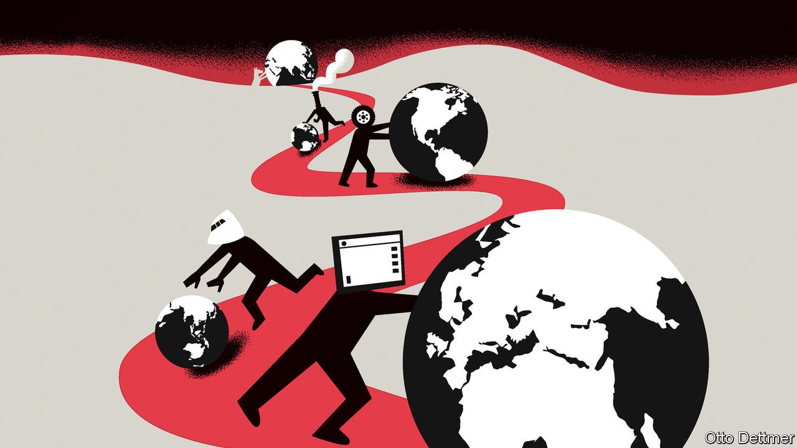

###### Free exchange

# How to avoid a fatal backlash against globalisation 

##### Studying how the first era ended could help preserve the second 

 

> Feb 26th 2022 

IN 1920 JOHN MAYNARD KEYNES reflected on the Britain he knew before the outbreak of the first world war. “The inhabitant of London”, he wrote, “could order by telephone, sipping his morning tea in bed, the various products of the whole earth.” Keynes’s Londoner “regarded this state of affairs as normal, certain and permanent”, and not long ago the globalisation of the present age seemed a similarly inexorable force. A new world war remains unlikely, but the uncomfortable echoes of the past in recent history suggest that a closer look at the rise and retreat of 19th-century globalisation might yield valuable lessons.

A work of economic history published in 1999 provides a great starting point. “Globalisation and History”, by Kevin O’Rourke and Jeffrey Williamson, hit shelves at a time of growing unease about the effects of deepening economic integration. Then, anti-trade activists swarmed meetings of the World Trade Organisation, while a few economists began to draw attention to the occasionally troubling distributional effects of globalisation. It roared on nonetheless over the first decade after the book’s publication. But in the years since, economic nationalism has become a potent political force, and the book has come to seem eerily prescient.


Nineteenth-century integration began in earnest around mid-century, after decades of instability and insularity. Liberalised trade rules helped; Britain repealed its Corn Laws—tariffs on imported grain—in 1846. But the integration of markets was supercharged by improvements in communication and transport technologies which allowed for faster, cheaper and more reliable movement of people, goods and information. The telegraph, steamships and railways brought the economies of Europe and the Americas into close contact, with profound consequences. In the new world, land was abundant and cheap, and wages were high. The reverse was true in Europe, where workers were plentiful and landowners collected fat rents. As these markets integrated, prices converged. In 1870 British wheat prices were 60% above those in America; by 1890 the gap had mostly closed. When telegraph cables connected distant financial markets, differences in the pricing of various securities vanished almost immediately.

Simple trade theory predicts that as differences in the prices of traded goods shrink, the cost of factors of production like land and labour should likewise converge. Experience in the 19th century bore this out. As waves of American grain spilled into European ports, land prices in Europe tumbled toward those across the pond. In America, the real price of land tripled between 1870 and 1913, while in Britain, it dropped by nearly 60%. Real wages converged as well, although the authors note this owed more to migration than trade. Nineteenth-century migrant flows were unlike anything in recent memory. Between 1870 and 1910 they reduced Sweden’s labour force by 20% relative to what it otherwise would have been, and increased America’s by 24%. These flows transformed labour markets. Real wages earned by unskilled labourers in Ireland rose from roughly 60% of the British level in the 1840s to 90% in 1914, thanks entirely to Irish emigration.

How much can really be learned from such a different world? Today, migration matters much less than it did in the 19th century. Skilled workers account for a far larger share of rich-world workforces, and are protected by modern regulations and social safety-nets. Trade consists not only of bulk commodity shipments, but of components imported and exported multiple times along complex supply chains. Forget telegraphs; in meetings today people chat face-to-face with colleagues on other continents.

Yet a number of lessons appear relevant. Start with the issue of convergence in incomes across countries. Much of modern theorising about convergence focuses on the role of capital accumulation and technological progress. Poor countries grow rich, in these models, because they invest more and adopt more sophisticated technologies. But in the 19th century the integration of markets drove convergence: a force which has also been at work in recent decades. The narrowing gap between American and Chinese wages is in part a story of Chinese technological progress. Yet it is also one in which hundreds of millions of Chinese workers began participating in a global economy, making low-skilled labour more abundant globally and contributing to weaker blue-collar wage growth and higher inequality in rich countries.

Second, people in the 19th century generally understood the effects that trade and migration had on their economies, and those on the losing end sought political solutions to their troubles. Then, as now, training and education were touted as answers to the problems of unhappy workers. But moves to improve schooling were accompanied by a broad shift towards protectionism. From the 1870s European economies, with the notable exception of Britain, began raising tariff rates. Over the same period, migration policy in the Americas became ever more restrictive.

Don’t spoil the ending

So it has gone this time, too. Work by David Autor of the Massachusetts Institute of Technology and three co-authors found that American counties which were more exposed to imports from China became more likely to vote Republican in presidential elections, for example: a shift which in 2016 helped to elect a trade-warring president.

And yet third and most important, it was not higher tariff barriers or restrictions on migration which plunged the world into the deep and destructive insularity that took hold after 1914; it was war. But for war, the retreat of globalisation a century ago may have remained modest and short-lived. The same may be true today. If inattention to the distributional effects of trade can prompt a backlash, then a greater commitment to sharing the bounty generated by openness might permit a renewal of economic integration—if the world remains willing to learn from the past. ■

Read more from Free Exchange, our column on economics: (Feb 19th) (Feb 12th) (Feb 5th)


