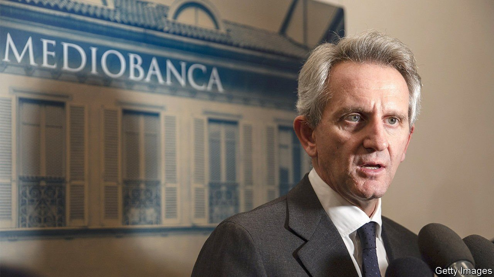

###### The future of Generali

# The battle to modernise Italy's corporate governance 

##### A bank fights billionaires over the fate of the country's largest insurance firms 

 

> Feb 25th 2022 

TWENTY YEARS ago Mediobanca was the epicentre of the salotto buono (the “fine drawing room”), a group of old-fashioned firms whose web of cross-connections dominated Italian business. Times have changed. Today the Milanese bank is in the modernising camp in a fight with two super-seniors over the future of 190-year-old Generali, Italy’s biggest insurer. Its outcome could decide whether Italy’s corporate governance is at last thrust into the 21st century.

The power struggle pits Alberto Nagel, boss of Mediobanca, against Leonardo Del Vecchio, the 86-year-old founder of Luxottica, an eyewear giant, and Francesco Gaetano Caltagirone, a 78-year-old construction tycoon. Both sides own big stakes in Generali: Mediobanca controls 17%, while the pair together own 14%. At stake is the future direction and governance of one of Italy’s biggest firms. Mr Nagel thinks Generali is on the right path under the stewardship of Philippe Donnet, the group’s French CEO whose mandate is up for renewal at the annual general meeting (AGM) in April. Messrs Del Vecchio and Caltagirone are agitating for regime change at the venerable Trieste-based insurer.


Exactly why is not clear. They have not come up with a business plan or an alternative candidate for CEO. They seem unhappy with Generali’s mergers-and-acquisitions strategy, which they consider too timid. The firm’s recent takeover of Cattolica, a parochial rival, was not the kind of deal they want to see, which is big and international. They complain that Generali should do more to digitise its operations.

In fact Mr Donnet seems to have done a good job at Generali. He has strengthened its capital position through the sale of peripheral businesses and improvements in profitability. He has lowered its debt burden and changed its business mix away from products that eat up too much capital, such as guaranteed life-insurance contracts, to fee-paying ones, such as property and casualty policies. In recent months he has led acquisitions that increased Generali’s share in core European markets. And Generali has pioneered software that writes insurance contracts on its own.

What’s more, Generali has become a cash machine that makes institutional investors happy, says Andrew Ritchie of Autonomous Research. When Mr Donnet presented his three-year plan in December he promised cumulative dividends of almost €6bn ($6.8bn), forecast an annual rise in earnings per share of 6% to 8% and announced a €500m buyback.

So what motivates the dissident duo? A loss of influence, perhaps. In the old days of the salotto the CEO of Generali would dine with important shareholders before announcing strategic decisions or new board members. Those days are gone as the insurer continues to bring its governance in line with European norms. Under rules Mr Donnet introduced in 2020, the outgoing board last month recommended new directors for the ten-strong body—as is the case at some continental blue-chips. The duo dislike the new rules.

On the face of it they scored a victory on February 18th, when Gabriele Galateri di Genola, Generali’s chairman, said he would step down at the end of his third term in April. But Mr Galateri did not leave because the duo pushed him out. He left because he supports Mr Donnet’s drive to modernise Generali: under the new governance rules, three terms is the maximum.

It is likely, in fact, that Mr Donnet will still be in his job after the AGM on April 29th. Analysts assume that Mr Nagel and investors who represent 35% of shares will prevail. This may upset the silver-haired rebels—but there is a silver lining, too. As top shareholders, they stand to pocket giant dividends in the coming years. ■

