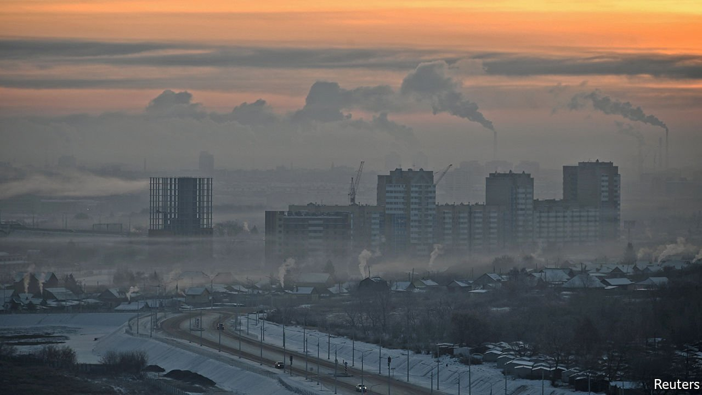

###### Trading with the enemy

# The economic consequences of the war in Ukraine 

##### Expect higher inflation, lower growth and some disruption to financial markets 

 

> Feb 25th 2022 

OVER THE past decade intensifying geopolitical risk has been a constant feature of world politics, yet the world economy and financial markets have shrugged it off. From the contest between China and America to the rise of populist rulers in Latin America and tensions in the Middle East, firms and investors have carried on regardless, judging that the economic consequences will be contained.

Russia’s invasion of Ukraine is likely to break this pattern, because it will result in the isolation of the world’s 11th-largest economy and one of its largest commodity producers. The immediate global implications will be higher inflation, lower growth and some disruption to financial markets as deeper sanctions take hold. The longer-term fallout will be a further debilitation of the system of globalised supply chains and integrated financial markets that has dominated the world economy since the Soviet Union collapsed in 1991.


Start with the commodity shock. As well as being the dominant supplier of gas to Europe, Russia is one of the world’s largest oil producers and a key supplier of industrial metals such as nickel, aluminium and palladium. Both Russia and Ukraine are major wheat exporters, while Russia and Belarus (a Russian proxy) are big in potash, an input into fertilisers. The prices of these commodities have been rising this year and are now likely to rise further. Amid reports of explosions across Ukraine, the price of Brent oil breached $100 per barrel on the morning of February 24th and European gas prices rose by 30%.

The supply of commodities could be damaged in one of two ways. Their delivery might be disrupted if physical infrastructure such as pipelines or Black Sea ports are destroyed. Alternatively, deeper sanctions on Russia’s commodity complex could prevent Western customers from buying from it. Up until now both sides have been wary about weaponising the trade in energy and commodities, which continued throughout the cold war. Sanctions after the invasion of Crimea did not prevent BP, ExxonMobil or Shell from investing in Russia, while American penalties on Rusal, a Russian metals firm, in 2018 were short-lived. Germany’s decision to mothball the Nord Stream 2 gas pipeline on February 22nd was largely symbolic since it does not yet carry gas from Russia to the West.

Nonetheless the prospect now is of more Western restrictions on Russia’s natural-resources industry that curtail global supply. Russia may retaliate by deliberately creating bottlenecks that raise prices. America may lean on Saudi Arabia to increase oil production and prod its domestic shale firms to ramp up output.

The second shock relates to tech and the global financial system. While the trade in natural resources is an area of mutual dependency between the West and Russia, in finance and tech the balance of economic power is more one-sided. America is thus likely to put much tougher Huawei-style sanctions on Russian tech firms, limiting their access to cutting-edge semiconductors and software, and also blacklist Russia’s largest two banks, Sberbank and VTB, or seek to cut Russia off from the SWIFT messaging system that is used for cross-border bank transfers.

The tech measures will act as a drag on Russia’s growth over time and annoy its consumers. The banking restrictions will bite immediately, causing a funding crunch and impeding financial flows in and out of the country. Russia has sought to insulate its economy from precisely this: the share of its invoices denominated in dollars has slumped since its invasion of Crimea in 2014, and it has built up foreign-exchange reserves. Still, it will hurt. Russia will turn to China for its financial needs. Already trade between the two countries has been insulated from Western sanctions, with only 33% of payments from China to Russia now taking place in dollars, down from 97% in 2014.

Western banks appear to have fairly low exposure to Russia. Nonetheless, since the modern era of globalisation began in the 1990s no major economy has been cut off from the global financial system, and the risk of broader contagion across markets, while apparently low, cannot be ruled out.

What does all this mean for the global economy? Russia faces a serious but not fatal economic shock as its financial system is isolated. For the global economy the prospect is of higher inflation as natural-resource prices rise, intensifying the dilemma that central banks face, and a possible muting of corporate investment as jittery markets dampen confidence.

The longer-term impact will be to accelerate the division of the world into economic blocs. Russia will be forced to tilt east, relying more on trade and financial links with China. In the West more politicians and firms will ask if a key tenet of globalisation—that you should trade with everyone, not just your geopolitical allies—is still valid, not just for Russia but other autocracies. China will look at Western sanctions on Russia and conclude that it needs to intensify its campaign of self-sufficiency. The invasion of Ukraine might not cause a global economic crisis today but it will change how the world economy operates for decades to come. ■

For more expert analysis of the biggest stories in economics, business and markets, , our weekly newsletter.

Our recent coverage of the Ukraine crisis can be found 

