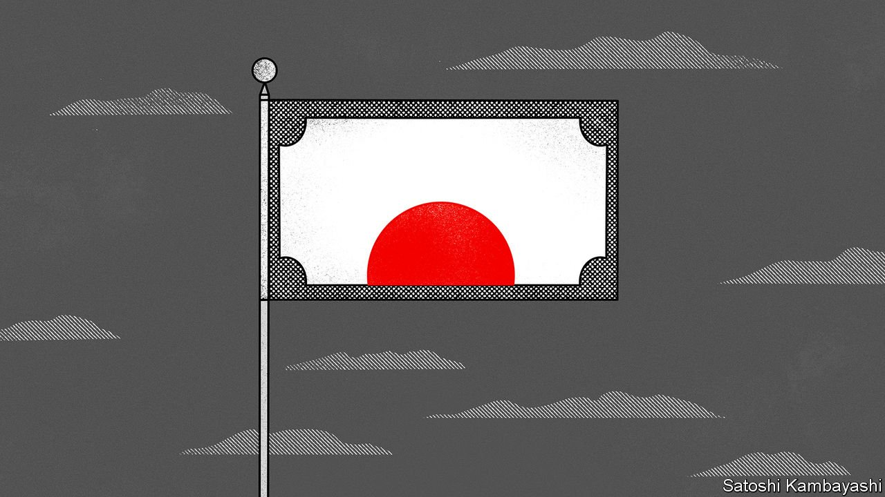

###### Buttonwood

# The many virtues of the yen, the rich world’s cheapest currency 

##### Japan has low inflation, cheap stocks and a strong international balance-sheet 

 

> Feb 26th 2022 

THE LAST shall be first, and the first, last. An emerging theme in capital markets is that securities that generated bumper returns in the era of low inflation, sluggish demand and zero interest rates—think American tech stocks—are under pressure, while assets that fared horribly in the 2010s (oil, mining and bank stocks) are holding up well. If it is cheap, inflation-proof and formerly unloved, capital is now increasingly drawn to it.

This brings us to the yen, the forgotten currency of the least inflation-prone big economy, Japan.


It once had a solid reputation as a haven, like the Swiss franc or the American dollar. Whenever a storm blew up, the yen rallied. But not recently. In the volatile weeks since the start of 2022, the yen has mostly moved sideways against the dollar. Even Russia’s invasion of Ukraine did not immediately change its course. The yen is a cheap currency that keeps on getting cheaper. Its cheapness now looks like an obvious virtue.

Japan remains the world’s largest creditor. Its net foreign assets—what its residents own abroad minus what they owe to foreigners—amount to around $3.5trn, almost 70% of Japan’s annual GDP. Some of those assets are fixed investments, such as factories and office buildings. But a chunk is held in bank deposits, and in shares and bonds, which can be liquidated quickly.

In past periods of high stress, such as during the global financial crisis of 2007-09, capital was pulled back into Japan by nervous investors. The upshot was an appreciating yen. In some instances, the effect was dramatic. In October 1998, as the crisis surrounding LTCM, a busted hedge fund, came to a head, the yen appreciated from 136 to 112 against the dollar in a matter of days. It is rallies such as this that gave the yen its safe-haven reputation. When trouble struck, you followed the Japanese money.

This has not worked so reliably lately. An important change came with the re-election of Abe Shinzo as prime minister, in December 2012, and the subsequent appointment of Kuroda Haruhiko as governor of Japan’s central bank. A key goal of “Abenomics” was to banish Japan’s chronic deflation through the use of radical monetary policy, including huge central-bank purchases of bonds and equities. A result of all the sustained money-printing was a much weaker yen, but not much stronger inflation. The yen’s safe-haven status wore off, says Peter Tasker, a seasoned observer of Japan’s economy and markets.

Might it be restored? In a world in which inflation is a serious concern, there is a lot to be said for a currency which holds its purchasing power. The yen is now very cheap in real terms against a broad basket of other currencies. On a measure calculated by the Bank for International Settlements, the yen is now more competitive than at any time since the series began in 1994. The Economist’s , a light-hearted gauge of purchasing power, tells a similar story. The exchange rate required to equalise the price of a Big Mac in Tokyo and New York is 67; but the yen currently trades at 115 to the dollar. On this basis, the yen is undervalued by 42%. Even if the yen continues to trade sideways, it is likely to become cheaper in real terms. Japan’s inflation rate is currently just 0.5%. America’s is 7.5%.

In the near term, risk aversion and rising interest rates in America will support the dollar. But the more the Federal Reserve has to do to contain inflation, the greater the risk of a hard landing for America’s economy. The dollar might eventually find itself at the centre of a storm. In such a scenario, the yen would rally strongly. Kit Juckes of Société Générale, a French bank, sees a risk that dollar-yen falls below 100 in the next year or two. Traders might wait for signs of trouble in America’s economy before buying. For those who want exposure now, Japan’s stockmarket has appeal. It, too, is cheap: it trades on 13.6 times expected earnings. And for cautious souls looking for a cheap segment of a cheap market in a cheap currency, Japan’s banks offer a dividend yield of 4% and trade on a single-digit multiple of expected earnings.

The tides are shifting. Not so long ago many investors were fearful of “Japanification”, in which economies got stuck in too low a gear to stop prices and bond yields from falling. But now inflation is roaring back and interest rates are on the rise. In a world turning upside-down, the yen’s old-fashioned virtues ought to jog the memory.

Read more from Buttonwood, our columnist on financial markets:

 (Feb 19th)

 (Feb 12th)

 (Feb 5th)

For more expert analysis of the biggest stories in economics, business and markets, , our weekly newsletter.

