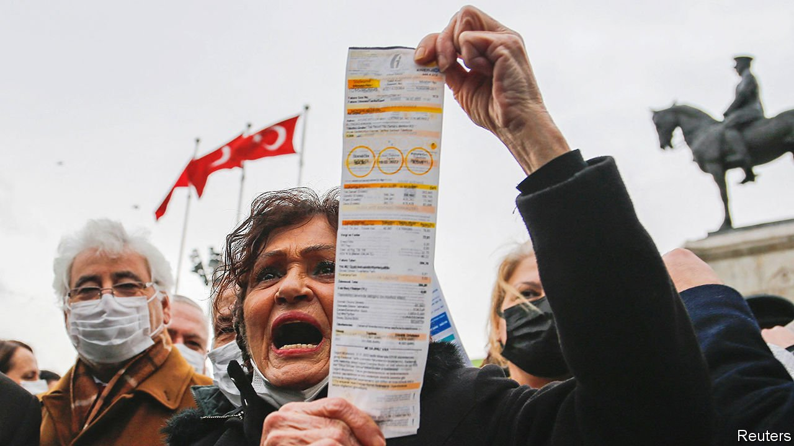

###### Getting sticky

# With maverick policies, Turkey cannot hope to bring down prices 

##### Stabilising the lira will not be enough to stave off inflation 

 

> Feb 25th 2022 

AT LEAST BY comparison with last year’s disaster, when it crashed by 44% against the dollar, Turkey’s lira has had a good run of late. Since January the currency has lost only 4% of its dollar value. Part of the reason is a scheme to protect lira deposits against swings in the exchange rate, which the government introduced in December, and which has suppressed demand for hard currency. Another factor is a series of interventions in currency markets by Turkey’s central bank. The latest of these came on February 22nd, when the bank reportedly sold about $1bn in foreign reserves, helping the currency absorb some of the shock waves from the run-up to Russia’s invasion of Ukraine.

The lira may have recovered its footing. But the spike in inflation set off by the currency’s collapse last year is here to stay. The officially reported inflation rate rocketed to a ghastly 48.7% year-on-year in January. Forecasts see the rate peaking in the spring, and finishing the year well above 30%, thanks largely to base effects. Surging energy prices, as well as widespread fears that the government has been massaging the inflation data, have sparked protests in parts of the country. The leader of Turkey’s main opposition party has announced he will not pay his electricity bills unless President Recep Tayyip Erdogan’s government reverses recent price rises.


Unfortunately for Turks, who are quickly becoming used to stockpiling non-perishables and basic necessities, stabilising the exchange rate will not be enough to bring inflation under control. Inflation is bound to remain high because of rising wages (Turkey recently increased the minimum wage by 50%), strong retail demand and continuing increases in energy and commodity prices.

Most problematic is Turkey’s insistence on keeping interest rates low. After a series of cuts last year, the central bank’s benchmark rate is 14%, a whopping 35 percentage points below the rate of inflation. Down the line, Turks may question the wisdom of keeping their money in the banks when the interest on their deposits, even those protected from currency shocks, is so much lower than inflation, says Selva Demiralp, an economics professor at Istanbul’s Koc University. They may instead decide to spend on consumer durables or property, further fuelling price growth.

Reining in inflation is hard enough with orthodox monetary-policy settings. (Ask Brazil, where inflation is into the double digits despite a number of interest-rate rises.) With Turkey’s, it is impossible. This will not change soon. Obsessed with growth and convinced, wrongly, that the way to tackle inflation is by cutting rates, Mr Erdogan has sworn to keep borrowing cheap. “We cannot sacrifice the growth rate,” acknowledges Cevdet Yilmaz, a ruling-party lawmaker.

This does not mean that hyperinflation is on the cards. Price increases of the kind Turkey expects to see over the coming months tend to push down demand, says Gizem Oztok Altinsac, chief economist at Tusiad, the country’s biggest business association. This creates a buffer preventing inflation from reaching triple digits, she says. But with persistent structural problems, and the central bank’s credibility shattered, bringing it back down to the single digits, or even below 20%, will probably take years. ■


