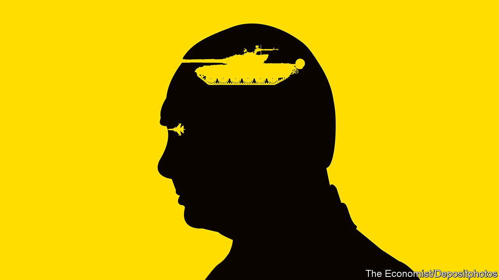

###### Where will he stop?

# History will judge Vladimir Putin harshly for his war 

##### Russia’s president has launched an unprovoked assault on his neighbour 

 

> Feb 25th 2022 

BY THE TIME it began, early on a gloomy grey morning on February 24th, the  ordered by Russia’s president, Vladimir Putin, had acquired a sickening inevitability. Yet nothing about this war was inevitable. It is a conflict entirely of his own making. In the fighting and the misery that is to come, much Ukrainian and Russian blood will be spilled. Every drop of it will be splattered on Mr Putin’s hands.

For months, while Mr Putin had remained in seclusion, amassing roughly 190,000 Russian troops on the borders with Ukraine, the question had been: what does this man want? Now that it is clear he craves war, the question is: where will he stop?


To hear Mr Putin on the eve of the invasion, he would like the world to believe that he will stop at nothing. In his battle speech, recorded on February 21st and released as he unleashed the first volleys of cruise missiles against his fellow Slavs, Russia’s president railed against “the empire of lies” that is the West. Crowing over his nuclear arsenal, he  any country that stood in his way.

Early reports, some unconfirmed, only underlined the scale of his ambition. There had been speculation that Russia’s president might be satisfied with control over , regions of eastern Ukraine containing small, Russian-backed enclaves that were the object of last-minute diplomacy. But all that has crumpled in the face of a vast assault.

The reports said that Russian land forces had crossed from the east, heading for Kharkiv, Ukraine’s second city; from the south, heading from Crimea towards Kherson; and from Belarus to the north, heading for Kyiv, the capital. It was unclear in what strength they were moving. But Mr Putin seemingly covets all of Ukraine, just as American and British intelligence reports had claimed all along. In acting, he has set aside the everyday calculus of political risks and benefits. Instead he is driven by the dangerous, delusional idea that he has an appointment with history.

That is why, should Mr Putin seize a large swathe of Ukraine, the gatherer of the lands will not stop to make peace at its borders. He may not invade the NATO countries that were once in the Soviet empire, at least not at first. But, bloated by victory, he will subject them to the  and information warfare that fall short of the threshold of conflict.

Mr Putin will threaten  in this way, because he has come to believe that NATO threatens Russia and its people. Speaking earlier this week, he raged at the alliance’s eastward expansion. Later, he decried a fictitious “genocide” that he says the West is sponsoring in Ukraine. Mr Putin can’t tell his people that his army is fighting against their Ukrainian brothers and sisters who gained freedom. So he is telling them that Russia is at war with America, NATO and its proxies.

The abominable truth is that Mr Putin has launched an unprovoked assault on the sovereign country next door. He is obsessed with the defensive alliance to its west. And he is trampling the principles that underpin peace in the 21st century. That is why the world must inflict a heavy price for his aggression.

This starts with massive punitive sanctions against Russia’s financial system, its high-tech industries and its moneyed elite. Just before the invasion, when Russia recognised the two republics, the West had imposed only modest sanctions. It must not hesitate now. Even though Russia has set out to build a fortress economy, the country is still connected to the world and, as the initial 45%  suggests, it will suffer.

True, sanctions will harm the West, too. Oil prices soared above $100 a barrel on the invasion. Russia is Europe’s main supplier of gas. It exports metals like nickel and palladium and along with Ukraine it exports wheat. All of that will present problems at a time when the world economy is struggling with inflation and supply-chain glitches. And yet, by the same measure, the fact that the West is prepared to suffer for sanctions sends Mr Putin the message that it cares about his transgressions.

A second task is to reinforce NATO’s eastern flank. Until now, the alliance has sought to live within the pact signed with Russia in 1997, which limits NATO operations in the former Soviet bloc. NATO should rip it up and use the freedoms that creates to garrison troops in the east. That will take time. Meanwhile NATO should prove its unity and intent by immediately deploying its 40,000-strong rapid-reaction force to the frontline states. These troops will add credibility to its doctrine that an attack on one member is an attack on all. They will also signal to Mr Putin that the further he pushes in Ukraine, the more likely he is to end up strengthening NATO’s presence on its border—the very opposite of what he intends.

And the world should help Ukraine defend itself and its people. They will bear the burden of the suffering. Only hours into the war came the first reports of military and civilian deaths. Volodymyr Zelensky, the president, called on his compatriots . They must choose how and where to repel Mr Putin and his armies and proxies, should he install a puppet government in Kyiv. NATO is not about to deploy troops to Ukraine—rightly so, for fear of a confrontation between nuclear powers. But its members should give Ukraine assistance by providing arms, money and shelter to refugees and, if need be, a government in exile.

Some will say that it is too risky to challenge Mr Putin in these ways—because he has lost touch with reality, or because he will escalate, miscalculate or . That would itself be a miscalculation. After 22 years at the top, even a dictator with an overdeveloped sense of his own destiny has a nose for survival and the ebb and flow of power. Many Russians, unclear about a crisis that has come from nowhere, may be unenthusiastic about waging a deadly war against their brothers and sisters in Ukraine. That is something the West can exploit.

Accommodating Mr Putin in the hope that he will start to behave nicely would be more dangerous still. Even China should see that a man who rampages across frontiers is a threat to the stability it seeks. The freer Mr Putin is to advance today, the more determined he will be to impose his vision tomorrow. And the more blood will be spilled in finally getting him to stop. ■

For subscribers only: to see how we design each week’s cover, sign up to our weekly 

All of our recent coverage of the Ukraine crisis can be found 

