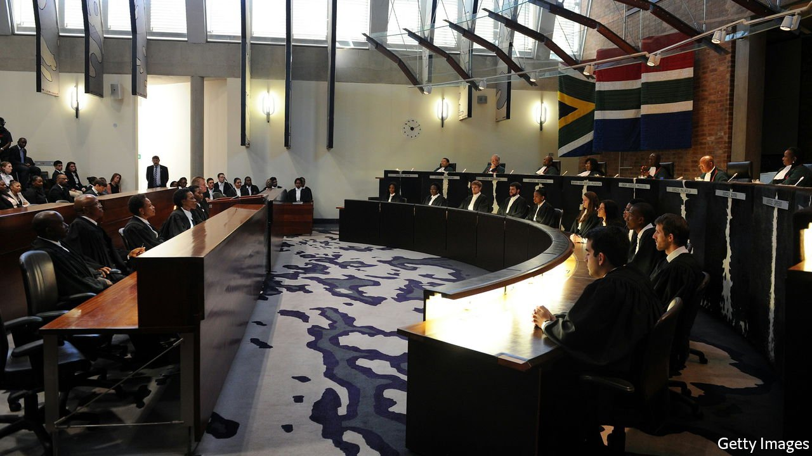

###### Courting trouble

# South Africa must protect its judges 

##### Nelson Mandela warned about the weakening of the judiciary. He was right 

 

> Feb 26th 2022 

WHEN NELSON MANDELA opened South Africa’s Constitutional Court in 1995, he said it would determine “the future of our democracy”. The first president of the democratic era argued that the court was as important to the new constitution as the parliament and presidency. Judges should be “creative and independent” in ensuring that, in contrast to apartheid, no person was above the law, regardless of their race, power or wealth.

By and large, the judges have done their job. The Constitutional Court has defended citizens failed by a callous state, for instance by ordering the government of Thabo Mbeki to provide anti retroviral drugs to people with HIV. It has challenged abuses of power by Jacob Zuma, whose presidency in 2009-18 was defined by widespread looting. Last year the highest court sent Mr Zuma to prison after he disobeyed an order to appear at an official inquiry into corruption during his tenure.


Yet the . Populist politicians who loathe the rule of law want to see pliant judges appointed who will bend to their will. Those who believe in the constitutional principles set out by Mandela, including the president, Cyril Ramaphosa, are not doing enough to safeguard his legacy. The mix of relentless attack and pusillanimous defence bodes ill for South African democracy.

Critics accuse judges of overstepping their boundaries and usurping legislation. It is true that the judicial branch has become involved in politically rancorous disputes. But this reflects the failure of the other branches of government to do their jobs. The more politicians from the ruling African National Congress (ANC) have abused their privileges, and the more abject their failure to improve the lot of ordinary South Africans, the more NGOs and opposition parties ask the courts to hold them to account. As Dikgang Moseneke, a retired justice, puts it, “Judges don’t look for cases; rather cases look for judges.”

What is more, the courts’ critics do not really care about the separation of powers. For ANC politicians such as Lindiwe Sisulu, who recently blamed “house negroes” on court benches for South Africa’s ills, attacks are a shameless effort to pass the blame. Ms Sisulu has spent more than two decades as a consistently ineffective minister. In other cases cynical self-interest is masquerading as legal criticism. Many spewing vitriol, including Mr Zuma, who has compared judges to apartheid-era rulers, are either facing criminal charges or fear they soon might.

The courts have been weakened from within as well as without. The chief justice helps manage the court system in addition to making rulings. But under Mogoeng Mogoeng, who retired last year, the bench was rarely at its full complement. Cases piled up. The Judicial Services Commission (JSC), a body made up of lawyers and political appointees that advises on court picks, has become a political pantomime dominated by the Economic Freedom Fighters (EFF), a hard-left party. The JSC has rejected strong white candidates for jobs at the highest court. Candidates of all races are increasingly at risk of personal attacks.

Mr Ramaphosa needs to get a grip. He must choose a chief justice who unmistakably adheres to the principles of the constitution. The president could further boost public confidence in the broader criminal-justice system if he sacked the hopeless police chief and police minister, overhauled the dilapidated lower courts and gave prosecutors the resources to go after graft.

South Africa is in a fragile state. The failings of the post-apartheid era are leading ever more of its citizens to question the virtues of democracy. Populists like Julius Malema of the EFF and Herman Mashaba of Action SA are attracting converts. The simplistic remedies they peddle are alluring. A poll last year suggested that two-thirds of the country would forgo elections if an authoritarian leader could curb crime and hardship.

Mandela’s warning

It is therefore vital to protect the Constitutional Court as the last line of defence for democracy. At its inauguration, Mandela warned the country “to stand on guard not only against direct assault on the principles of the constitution, but against insidious corrosion”. Both now menace the courts. South Africa must heed his words before it is too late. ■

