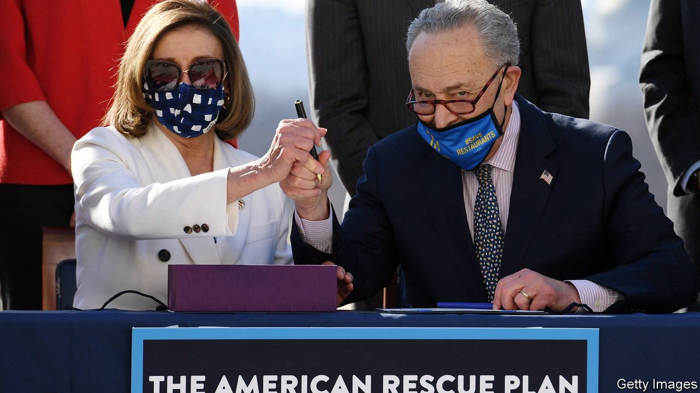
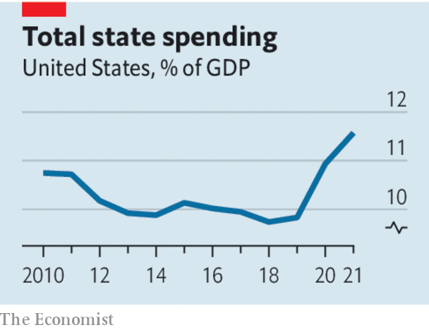

###### Spending the federal bonanza

# The right way for America’s states to use federal largesse 

##### America’s states have more green stuff than grey matter 

 

> Feb 25th 2022 

NEARLY A YEAR has passed since Congress approved the American Rescue Plan Act (ARPA), promising spending of $1.9trn, equivalent to 9% of GDP. Many, including this newspaper, worried that such federal largesse looked excessive. Those fears have been borne out. ARPA helped create a surge of demand that contributed to the inflation that is plaguing America and which is higher than in other advanced economies. It also gave states and local-government agencies over $650bn—more than they knew what to do with.

They are keen to spend it, one way or another. Outgoings from the states reached an all-time high in 2021, and will probably break the record again this year. Some  is going on sensible investments and into rainy-day funds that will help states weather the next recession. But too many states are lavishing federal dollars on dodgy projects that look better in a campaign ad than on a balance-sheet.


State legislators in Massachusetts are fond of diverting money intended to help schools reopen towards building new football pitches instead. More worrying are the efforts to enact new tax cuts and social programmes. Iowa plans to ditch a progressive income tax in favour of a flat tax, while exempting retirement incomes. California’s governor, Gavin Newsom, has proposed expanding the state’s health-insurance programme to undocumented immigrants—for an additional $2.2bn a year. These initiatives are creating big liabilities that may prove unsustainable in the years to come, as the funds from Washington ebb and America’s economy returns to its tamer, pre-pandemic rate of growth.

 


When that tide goes out it will become painfully clear that states are facing structural problems. Although the federal government has picked up much of the tab during the pandemic for spending on Medicaid, the public health-insurance scheme for the poor, the programme’s costs take up an ever-rising share of state budgets. Increasing fuel efficiency has reduced revenues from the petrol tax, the primary means states have of financing transport infrastructure. Many states in the Midwest and Northeast are losing people, leaving them with infrastructure that is too costly and too extensive for those who are left.

All the more important, therefore, that state governments use the federal windfall to make their economies more competitive. A few principles should guide them. First, they should favour one-time investments over enduring commitments. Cleaning up pollution and upgrading ancient computer systems are limited projects that will bring benefits for years to come. Many states also have big infrastructure-maintenance backlogs that they would do well to reduce. Second, any new long-term projects should be chosen with an eye to enhancing productivity in a post-pandemic world. Broadband internet, particularly in ill-served rural areas, is a prime example.

Lastly, the temptation of tax cuts and social programmes must be restrained by a regard for the future. Conservative forecasts of tax-revenue growth should be grounded in economic trends rather than the surge in income- and sales-tax receipts during the pandemic. To avoid sudden budget shortfalls, tax cuts can be designed to kick in only above a threshold of revenues, as in North Carolina in the past. And states would do well to pilot social programmes before charging ahead—unlike Colorado, which is spending $13m this year to build the bureaucracy for a universal preschool programme that does not yet exist and whose benefits are unproven.

ARPA is only part of the states’ federal bonanza. Still more money from Washington is set to come their way as the $1.2trn Infrastructure Investment and Jobs Act, passed in November 2021, is implemented. Ambitious governors and state legislators are eager to spend their way to re-election. Alas, they risk leaving a fiscal time-bomb for future policymakers to defuse. ■

For more coverage of Joe Biden’s presidency, visit our dedicated  and follow along as we track shifts in his . For exclusive insight and reading recommendations from our correspondents in America, , our weekly newsletter.

