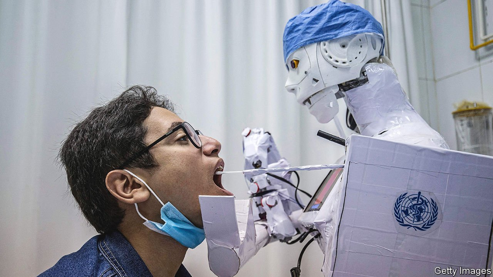

###### Automation

# The world should welcome the rise of the robots 

##### Concerns over mass unemployment are unfounded 

 

> Feb 26th 2022 

THE WORD “robot” was coined in 1920 by the Czech playwright Karel Capek. In “R.U.R.” (“Rossum’s Universal Robots”) Capek imagined artificial, fully functional servants. For most of their history, however, robots have been dumb, inelegant mechanical devices sitting out of sight in factories.

Things are starting to change, however. Robots have benefited from rapid innovations in smartphones, which brought cheap cameras and sensors, fast wireless communications and powerful, smaller computer chips. More recent advances in machine learning have added software to make robots better informed about their surroundings and equipped them to make wiser decisions.  are leaving carefully managed industrial settings for everyday life and, in the coming years, will increasingly work in supermarkets, clinics, social care and much more.


They could not be coming at a better time. Many industries are facing a shortage of labour—the demand for workers has recovered much faster than expected from the pandemic and some people have left the workforce, particularly in America. Warehousing has grown rapidly thanks to the e-commerce boom. Robots are now indispensable, picking items off shelves and helping people pack an exponentially rising numbers of boxes. They are even beginning to trundle slowly along some pavements, delivering goods or food right to people’s doors. In a pandemic-ravaged world, short of workers but with lots of elderly folk to look after, having more robots to boost productivity would be a good thing.

And yet many people fear that robots will destroy jobs. A paper in 2013 by economists at Oxford University was widely misinterpreted as meaning that 47% of American jobs were at risk of being automated.

In fact, concerns about mass unemployment are overblown. The evidence suggests robots will be disruptive but ultimately beneficial for labour markets. Japan and South Korea have the highest robot penetration but very strong workforces. A Yale University study that looked at Japanese manufacturing between 1978 and 2017 found that an increase of one robot unit per 1,000 workers boosted a company’s employment by 2.2%. Research from the Bank of Korea found that robotisation moved jobs away from manufacturing into other sectors, but that there was no decrease in overall vacancies. Another study, by researchers at the Massachusetts Institute of Technology and colleagues elsewhere, looked at Finnish firms and concluded that their use of advanced technologies led to increases in hiring.

For all that, the march of the robots will bring big changes to workplaces. The skills and firms that are rewarded will shift, too. But that need not be the disaster many fear. One supposed example of “bad automation” is self-service checkouts in supermarkets, because they displace human workers. —robots could perform work, such as butchering, that is unpleasant or stigmatised. Checkout staff who retrain to help customers pick items from aisles may well find that dealing with people in need is more rewarding than spending all day swiping barcodes in front of lasers.

Inevitably, some people will be on the losing end of change even as the robots make society as a whole better off. One lesson from the  of the 1990s and 2000s is that the growth in trade that was overwhelmingly beneficial triggered a political backlash, because the losers felt left behind. That is one more reason why firms and governments would do well to recognise the value of retraining and lifelong learning. As jobs change, workers should be helped to acquire new skills, including how to work with and manage the robots that will increasingly be their colleagues.

The potential gains from the robot revolution are huge. In Capek’s play, the robots revolt against their human masters and cause mass unemployment and worse. The beginnings of the world’s real robots have not matched Capek’s satire. There is no reason to think that their future needs to either. ■

