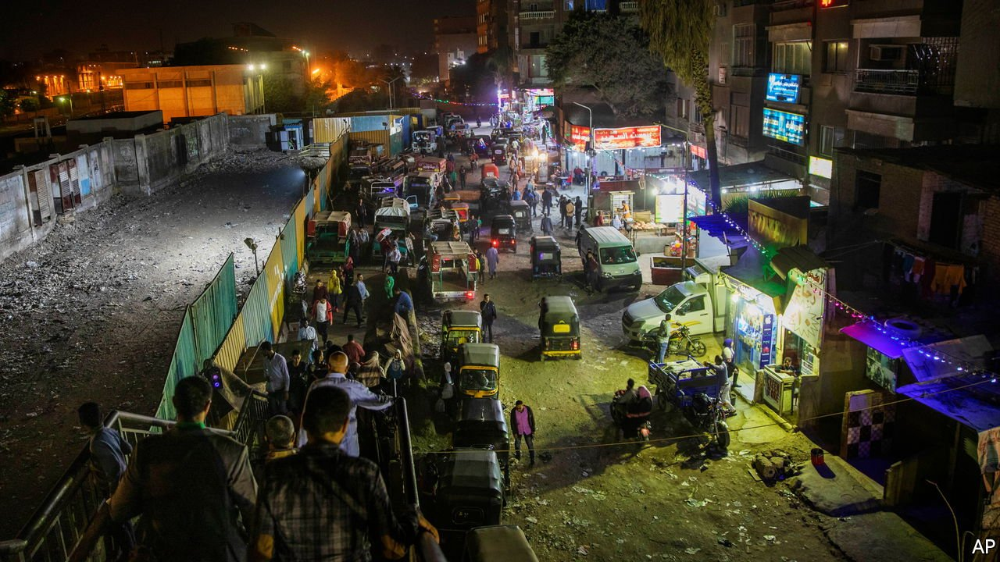

###### A ban on the van

# Are Cairo’s menacing minibuses on their way out? 

##### How the government is rethinking transportation in the congested capital 

 

> Feb 26th 2022 

WEAVING IN AND out of traffic, the minibuses on Cairo’s ring road seem to be racing. In a sense, they are. The white minivans compete to pick up passengers and faster trips mean more fares. Since a ride costs as little as five Egyptian pounds ($0.32), quantity is key. So drivers speed along the motorway, exploiting every little gap in the traffic. Some are intoxicated by tramadol, an opioid that has a reputation for improving alertness (and male sexual stamina), two claims your correspondent preferred not to test.

The privately run minibuses are a fixture in the capital. But locals do not exactly like them. Start with the erratic drivers, who contribute to the city’s dreadful record on road safety. Traffic in Cairo, already a nightmare, is made worse when they stop to pick up and offload passengers. The vans, which run on cheap diesel, belch noxious fumes into the air. For the government they are an embarrassment, a loud reminder of its failure to provide adequate public transport in greater Cairo, home to about 20m people.


That helps explain why officials said that minibuses would be banned from the ring road by the end of last year. Taking their place would be a new bus rapid transit (BRT) system operating in dedicated lanes. Green types are pleased (Egypt will host the COP27 climate conference this year). But don’t be fooled: the minibuses will still be around for a while.

Fifty years ago Cairo had an enviable network of trams and buses, which was used by most residents. A metro system, opened in 1987, was the first of its kind in Africa. But the trams are all gone and even officials are unsure how many buses remain in operation or where exactly they go. The metro has a different problem. Though it covers a limited area, it is often packed, reportedly carrying the highest number of passengers per kilometre of any metro in the world. Rather than braving the crush, Egyptians who can afford them buy cars instead. Fuel is subsidised, which aggravates both pollution and congestion.

Most other folk rely on the minibuses. Poor planning and even poorer policies are partly to blame. The government has built satellite cities around the capital in an attempt to alleviate overcrowding. Most of these are connected to Cairo via the ring road. But until recently there was little public transport between them because the government wanted Cairenes to move to the new cities, not commute to or from them. The minibuses, which connect the various settlements, filled the void. (Similarly belching tuk-tuks, which the government sporadically threatens to curb, squeeze down narrow alleys and through gaps in the traffic.)

Analysts think the BRT will eventually offer relief but that the ban on minibuses is premature. The first phase of the BRT would cover much less ground than the minibuses, which ply the ring road on many of their routes. Analysts propose waiting until more of the new public-transport system is in place. That could take a while. The first phase of the BRT was supposed to open at the end of last year. Delays in construction have pushed it back. So the minibuses are still flying down the ring road. ■

