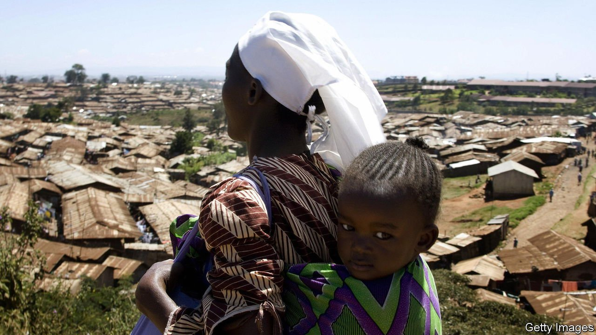

###### Here comes Trouble

# Names in southern Africa are both creative and revealing 

##### They illuminate the past as well as aspirations for the future 

 

> Feb 26th 2022 

IF HE IS in a tight spot, says Trouble Kalua, people mention his name, asking, “What do you expect?” Shortly before his birth in Malawi, his father had lost his job as a bus conductor, impoverishing the family. Then the baby nearly died. “This boy is trouble,” his father said. “His name is Trouble.”

Across Africa names can have a story behind them. Yewande, for instance, is a Yoruba name meaning “mother has paid me a visit”, given when an older female relative dies just before a girl is born. Kiptanui may hint at a difficult birth for mothers who speak one of the Kalenjin group of languages in Kenya.


But southern Africa stands out for nominative creativity, at least when it comes to English names. Ask Zimbabweans about their school friends and you will hear an eclectic register: Lovemore, Hopewell, Innocence, Tedious, Patience, Knowledge, Fortune, Brilliant, God Knows. A Malawian (himself Golden) lists friends named Goodfriday, Wisdom, Iron and BoyBoy.

Names illuminate power and oppression. Under apartheid in South Africa many black people took on English names, some under pressure from bosses too lazy to pronounce their real ones; others to avoid standing out in a system designed to strip black people of their history, dignity and identity. In his memoir, “Born A Crime”, Trevor Noah, a comedian, says that since African names were used at home, English ones often received little thought. He recalls the example of his friend Hitler, who was named because the original Hitler “was so powerful that…black people had to go and help white people fight against him”.

In Zimbabwe children were long given African names with meaning. This practice switched after British colonisation, when having an English name was seen as a way of getting ahead. Names may refer to circumstances around the birth, a quality parents see in the child, an aspiration for them—or even for the country. Under white rule some children were called Democracy, Freedom or, allegedly, Polling Station. Other names suggested progress. One venture capitalist recalls school friends named Computer and, unless he was winding your correspondent up, Crankshaft.

Do names shape character? Zimbabweans wryly noted that one Reward Marufu, a late brother-in-law of Robert Mugabe, did well out of his relative’s corrupt regime. But Mr Kalua says he is Trouble by name, not by nature. “Great sense of humour, friendly, patient, kind, loving. Nothing like trouble at all!”

Names, and the language they are in, reflect changing times, too. In Zimbabwe, whose economy is collapsing, one comes across people named No Money. In many places African names are supplanting English ones. In recent years in South Africa, Enzokuhle (“to do good” in Xhosa), has become one of the most popular names, perhaps inspired by a popular song, “Enzo”.

It may be that names such as Salad Nthenda will become relics. The Malawian, whose mother ate lots of vegetables when pregnant, says his “name felt good from day one”. He loves the “uniqueness”. Although he is teased at times, he does not give a toss.

