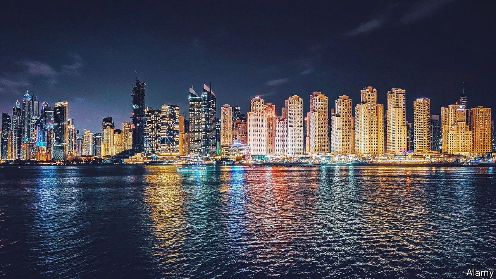

###### Cleaning up the laundromat

# The UAE tries to crack down on dirty money 

##### Luxury homes and a thriving gold trade have been a magnet for corruption 

 

> Feb 26th 2022 

DIRTY MONEY has long been an open secret in the United Arab Emirates (UAE). Oligarchs and foreign officials would fly in with stacks of cash, buy houses under their own names and showcase their lives of luxury on social media. Guests at a hotel in downtown Dubai last year might have shared a lift with a Turkish mob boss who had moved in for a while. With its beach-front villas, luxury hotels and fine dining, the UAE’s glitzy business hub is a magnet for money, licit and otherwise.

Two years ago the Financial Action Task Force (FATF), the world’s main anti-money-laundering body, urged the UAE to make “fundamental and major reforms” to crack down on financial crime. In the coming days it will decide whether the country has made enough progress. If not, it may be added to a “grey list” of problematic ones. A decision is expected by March 4th.


The list currently includes 23 countries. Being on it carries no penalties, but would probably mean extra paperwork and costs for banks. It would also dent the UAE’s reputation as a well-run financial hub.

Emirati officials acknowledge the problem. They scored well on what the FATF calls “technical compliance”: the country has plenty of relevant laws and regulators. But these are rarely used. From 2013 to 2018 there were just 50 prosecutions and 33 convictions for money-laundering.

Part of the problem is the UAE’s tangled web of jurisdictions. A federation of seven emirates, it also has dozens of free zones that allow foreigners to hold full ownership of companies (until last year locals had to own a majority of firms incorporated elsewhere in the UAE). The FATF counted 39 different corporate registries in 2020. Some did only cursory checks on firms under their jurisdiction. At the federal level, agencies did not work closely with each other or their foreign counterparts. “We needed a platform to integrate everything in the country,” says Khaled Balama, the governor of the central bank.

The government has made progress towards building one. A federal corporate registry now collects data across emirates and free zones. Ahmed al-Sayegh, a minister of state at the foreign ministry, says 92% of firms have declared information about beneficial ownership.

Enforcement is up: from 2019 to 2021 the UAE prosecuted 254 money-laundering cases, with 220 convictions (another 15 are still pending). The government confiscated assets worth $625m last year. Staffing at the central bank’s financial-crimes division has more than doubled. Officials point to some recent high-profile arrests, such as that of an Emirati man detained in London in December on charges of moving £100m ($136m) between Britain and Dubai.

The deeper problem, though, is the country’s business model. With little oil, Dubai (one of the seven emirates) was forced to diversify its economy decades before its neighbours did. It happened to focus on industries that attract dirty money, such as construction and property, which account for 15-20% of GDP. Core, a research firm, estimates that Dubai alone added 251,000 homes from 2011 to 2021, including 37,000 last year. The pace of new construction far exceeds population growth.

For criminals, this is a convenient way to launder money. High-end brokers all have stories of clients like the Afghan officials who bought $2m villas on Palm Jumeirah, an artificial island in Dubai. Leaked property records released in 2018 by C4ADS, a British NGO, featured a host of unsavoury characters, including a former Nigerian oil minister convicted of corruption in France and several war profiteers close to Bashar al-Assad, Syria’s dictator. At least seven people under sanctions by Western countries for drug-trafficking, financing terrorism and the like owned homes in the emirate.

Another risky industry is gold. In 2019 the glittery stuff was the UAE’s largest import and its largest export bar oil. Much of it is hand-carried on commercial flights and sold in Dubai’s gold souk. So-called “artisanal” gold is often smuggled out of foreign countries, depriving governments of royalties; sometimes it is linked to conflict or child labour. Once sold in Dubai, it can be re-exported as Emirati gold.

Again, the government has adopted some meaningful reforms. Until recently, only financial institutions had to report suspicious transactions. Around 12,500 non-financial firms have now been added to the central bank’s reporting system. “The entire country, not just financial institutions but also real estate, the gold sector, it’s now part of the anti-money-laundering system,” says Mr Sayegh. Traders in precious metals and jewels must report cash transactions above 55,000 dirhams ($14,974); the authorities are discussing a similar requirement for property-brokers.

If other countries have similar problems, the UAE has some unique ones as well. The line between the public and private sectors is blurry. The same royal families that run politics and pick regulators also control vast business holdings. State-run banks and exchange houses have been linked to big money-laundering schemes. Iranian money-laundering and sanctions-busting in Dubai is not just lucrative for the emirate. It also serves as what one diplomat calls “an insurance policy”, helping to shield Dubai from tensions in the Gulf.

If the FATF shrugs off the reforms the UAE has undertaken and puts the country on its naughty list, as many expect, the impact will probably be limited. The central bank says confidence in the financial industry “remains high”. Bankers agree, calling a designation more a nuisance than a knockout blow. Dubai will remain a magnet for money. The question is whether much of it will continue to be dirty. ■

