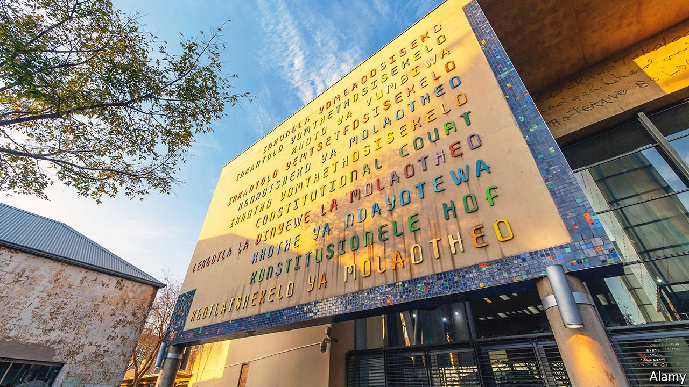

###### Judging judges

# The enemies of South African democracy have the judiciary in their sights 

##### What the attack on judicial independence says about the country’s future 

 

> Feb 26th 2022 

THERE ARE few more poignant locations for a country’s supreme judicial body than that of South Africa’s Constitutional Court, in central Johannesburg. The building lies within the walls of the Old Fort prison complex where, during the colonial era and under apartheid, black inmates were given less food, fewer blankets and more abuse than white ones. Many who struggled against white rule were held there, including Mahatma Gandhi, Archbishop  (briefly), Albert Luthuli and Nelson Mandela. The last three all won the Nobel peace prize; not many countries can boast more individual laureates than the Old Fort complex can.

South Africa’s courts have generally honoured their legacy. The constitution, a blend of liberal ideas such as the separation of powers, and progressive rights to social services, has shielded the country from the worst excesses of power. Yet as President Cyril Ramaphosa prepares to appoint a new Chief Justice, the judiciary is under unprecedented attack from the enemies of constitutional democracy.


There has long been tension between the courts and the other branches of government. , president from 1999 to 2008, believed a crank theory that the human immunodeficiency virus (HIV) does not cause AIDS. In 2002, much to his chagrin, the Constitutional Court told his government to provide South Africans with anti-HIV drugs.

The relationship deteriorated further under the presidency of Jacob Zuma (2009-18). In 2015 a judge ordered that the government must bar Omar al-Bashir from leaving South Africa after the Sudanese dictator, who was wanted by the International Criminal Court, flew in for a summit. The Zuma administration disobeyed him. The next year the Constitutional Court found that the president and parliament had failed to uphold the constitution by ignoring findings of corruption against Mr Zuma by Thuli Madonsela, then the country’s Public Protector, a legal ombudsman.

Such decisions riled Mr Zuma and others in his government. The then president told tribal chiefs that they would be better off resolving disputes “in an African way” (without elaborating on what this might mean), instead of through the courts which “deal with cold facts”. Blade Nzimande, a minister, warned of “judicial dictatorship”. Gwede Mantashe, another minister, reportedly called judges “counter-revolutionary forces”.

Yet 2021 “was arguably the court’s most turbulent year”, argues Pierre de Vos of the University of Cape Town (UCT). Mr Zuma accused the highest court of being “exactly like the apartheid government” by ordering him to appear before an inquiry into corruption during his reign. He was briefly imprisoned for contempt of court after he ignored the order. Jessie Duarte, an ally of Mr Zuma, said the inquiry was “an onslaught on the people”. Lindiwe Sisulu, a cabinet minister, recently called some black judges “mentally colonised Africans” and “house negroes”.

Tirades from a faction of the African National Congress (ANC) have been echoed by the Economic Freedom Fighters (EFF), an opposition party led by Julius Malema, a race-baiting former head of the ANC‘s youth wing. His calls to grab land from white farmers influence the left of the ruling party. Mr Malema has described judges as “traumatised old people”. An EFF MP called the country’s chief prosecutor, Shamila Batohi, a “renowned Indian racist”.

Why the increase in vitriol? One reason is what Hugh Corder, also of UCT, calls “the burgeoning scourge of ‘Lawfare’”. As the presidency and parliament have proven inept, and as politics has become more fractious, courts have been asked to step in. Dikgang Moseneke, who retired from the Constitutional Court in 2016, notes that, towards the end of his tenure, “our democratic system appeared to have lost the capacity to mediate conflict at sites other than the courts of law”. When one side loses they attack the referee. Mr Moseneke adds that political elites have every reason to fight their battles in court because taxpayers cover their legal costs.

Yet complaints about overbearing courts are often cloaks for self-interest. Mr Zuma is already  for fraud and bribery, on charges dating back to the 2000s. He and his allies may face prosecution for graft during his presidency. Senior figures in and close to the EFF are alleged by South African journalists to have been involved in defrauding a bank (the party denies wrongdoing). Such people are naturally keen to weaken a legal system that may decide their fate.

It would help if those meant to defend the courts did a better job. The recently retired chief justice, Mogoeng Mogoeng, was absent for much of the past year, in part because he was spreading the gospel as a lay preacher. He did a poor job of chairing the Judicial Services Commission (JSC), a body of lawyers and political appointees that advises on judicial appointment. In recent years the highest court has rarely been at its full complement of 11 judges. It currently has three vacancies. None of the white candidates were shortlisted, seemingly because of their race. Interviews of potential successors to Mr Mogoeng became disgraceful political theatre led by Mr Malema and Dali Mpofu, a former chair of the EFF and lawyer for Mr Zuma. One judge was accused without evidence of being a sexual predator; another of being too political.

Mr Ramaphosa, who helped draft the constitution in the 1990s, should be doing more to defend the judiciary. He ought to have fired Ms Sisulu, who took an oath to defend the constitution she now attacks. He has dawdled over picking a new chief justice, whom he can appoint without a recommendation from the JSC (by law he just needs to consult the body).

Nicole Fritz of the Helen Suzman Foundation, an NGO, worries that difficulties faced by whites and those of Indian origin in getting senior judicial jobs, and the personal attacks on judges of all races, mean that good candidates will stop applying. She fears the “long but irreversible decline of the judiciary”. Mr de Vos frets that South Africa may become like India, where a judiciary once lauded for progressive judgments has been undermined by politicians with authoritarian tendencies.

For a while the courts were one of the few institutions that retained the confidence of the rainbow nation. No longer. In 2006 no less than 69% of South Africans said they trusted courts “a lot” or “somewhat”, according to Afrobarometer, a pollster. Today just 42% say they do. It is a finding that should worry liberals—and cheer Mr Zuma and Mr Malema. ■

