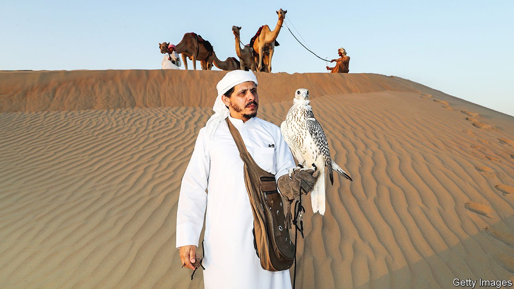

###### Beak demand

# The market for falcons is soaring as wild populations decline 

##### Gulf royals risk killing a sport they love 

 

> Feb 24th 2022 

THOUGH ITS eyes are covered, the falcon looks frightened in the video. It sits frozen on its perch as a dozen excited men bid for the creature. The scene plays out in the Libyan city of Tobruk. But the bidders, phones in hand, are relaying prices to traders in the Gulf. When the offers top 1m dinars ($220,000) those in the room yell Allahu akbar (God is great). Finally the bird is sold to a man in a camouflage jacket for 2.25m dinars, making it one of the most expensive falcons in the world.

Falcons have long inspired passion among Arabs. The Bedouin used them to hunt and still recite poems extolling them. Medieval caliphs led parties into the bush to watch their falcons swoop down on game. Today Gulf royals spare no expense on such outings. With prey at home dwindling, they have began hunting abroad, in such countries as Mongolia, Morocco and Pakistan. Some call it “falcon diplomacy”.


Lately a craze for falcon-racing and beauty contests has increased demand for the birds. Falcon clubs have opened across the Arabian peninsula, some offering courses to children as young as five. Airlines in the Middle East sell seats for the birds. (A Saudi prince once filled most of a commercial jet with his flock.) Falcon ownership has tripled in the Gulf over the past decade, says Karim Rousselon of the International Association for Falconry. The finest birds cost more per gram than gold.

But even at such heady prices, there are not enough wild falcons to satisfy the demand. The saker falcon, as a favoured local species in the Gulf is known, is already endangered. In the Arabian peninsula wild ones are all but extinct. Many countries have banned trade in them. But buyers and sellers have found ways around the rules.

In lawless Libya traders sometimes stitch closed the eyelids of captured specimens to keep them from flying away. Poachers in Pakistan pin prey to sticks in order to capture migrating falcons. Places like Britain also contribute to the problem, says Guy Shorrock of the Royal Society for the Protection of Birds. Recent changes to the law have made it harder to trace falcons and their eggs leaving the country. “We’re part of the global business to supply the Arab demand for hunting and falcon racing,” says Mr Shorrock.

It is not just falcons that this situation harms. The houbara bustard is big and fast, but also rather dumb. Falcons love to hunt it, leading to a mostly illegal trade in the bustard that has put it on the road to extinction. To help it recover without curbing hunting, the United Arab Emirates (UAE) has opened bustard-breeding farms at home and abroad. One in Morocco, where the UAE’s crown prince, Muhammad bin Zayed, likes to hunt, has bred almost 300,000 bustards since opening in 1995.

The UAE has also promoted the use of farmed falcons, not least by banning imports of all wild-caught birds. “A decade ago 90% of the UAE’s falcons were wild,” claims Mr Rousselon. “Now 90% are captive-bred.” But other Gulf countries lag behind the UAE in terms of regulation. And many falconers prefer wild birds to those bred on a farm. In the UAE the ban has caused prices to spike—but failed to stop the trade in falcons. Senior officials set a bad example by obtaining waivers. Their appetite for wild falcons risks killing the sport they love. ■

