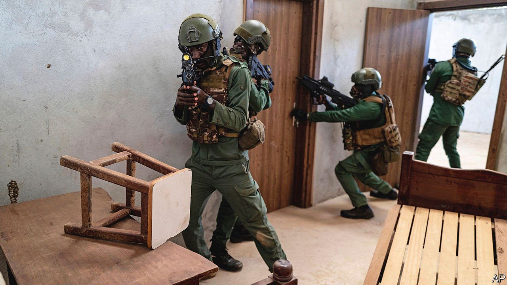
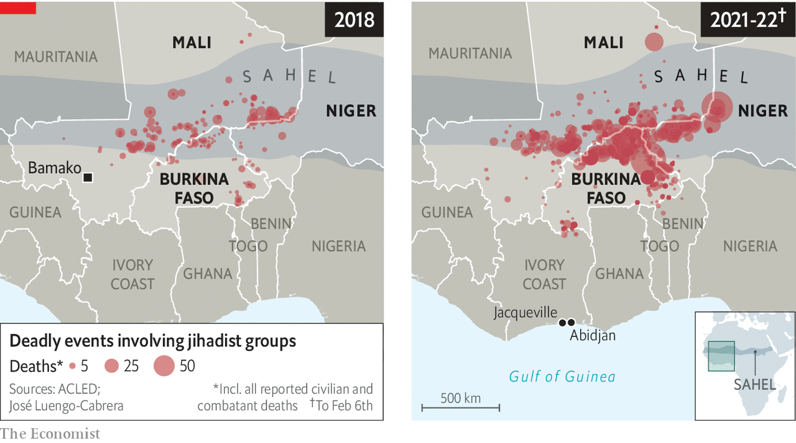

###### Lines in the sand

# West Africa’s coastal states are bracing for a jihadist storm 

##### With French troops leaving Mali, its neighbours are at risk 

 

> Feb 24th 2022 

A DRONE WHIRS overhead as Ivorian special forces creep out of the undergrowth towards a mock village. French trainers watch closely. Nearby, Ghanaian commandos roar down a dusty road before an explosion sends them retreating under the gaze of British soldiers. Operation Flintlock, an annual counter-terrorism training exercise, appears to be going just as it should: regional forces learning from grizzled Western commandos.

Yet Flintlock also encapsulates some of the weaknesses undermining the West’s efforts to train local armies to defeat the jihadists who have overrun large parts of Burkina Faso, Mali and Niger and are now attacking places to the south (see map). These include a lack of leadership by countries in the region, a troubling retreat from democracy and failed efforts to win the support of disgruntled populations.


Flintlock is meant to be African-led. It is anything but. It has been largely Western troops, rather than forces from the region, that have shaped strategies to fight the jihadists in the Sahel. Meanwhile troops from the two worst-hit countries—Burkina Faso and Mali—did not attend Flintlock. This is because in both countries colonels (who had attended previous Flintlock exercises) have booted out the elected governments in coups.

 


What is more, Flintlock is a good example of a broad failure to communicate with local populations, something the commandos running the exercise repeatedly say is the key to defeating insurgencies. Foreign correspondents were free to hang around during the exercises, but local journalists were only allowed to attend the opening ceremony.

Such weaknesses have grave consequences. Take Mali, which is losing its battle against the jihadists. After its elected government failed to stem the violence, army officers cheered on by protesters booted it out. Unable to do a better job, the junta has instead deflected blame for its failure onto France and welcomed Russian mercenaries. On February 17th France and its European allies said they would pull their troops out of Mali, which seems to have been largely lost to the insurgency. Rear Admiral Jamie Sands, the head of American special forces in Africa, concedes that jihadists are already able to move around most of the country unimpeded.

With Mali all but written off, the front lines are shifting. In Burkina Faso, where last year more people were killed than in Mali, many hope the junta will be more effective at fighting jihadists than the elected government it displaced. To the east Mohamed Bazoum, Niger’s president, worries that without French troops in Mali, his border with it will be “even more infested and that terrorists groups will strengthen”. A special-forces commander from Niger laments that his men are “not winning”. Neither, he says, are the terrorists. A rising toll of civilians suggests otherwise.

Mr Bazoum is counting on France moving many of its troops to Niger, but some Nigeriens worry that hosting more foreign troops will fuel anti-French sentiment, of which there are already signs. In November two people were killed in a clash with French forces trying to extricate a convoy that had been blocked by protesters.

Governments across the region are trying to tread a fine line. Their soldiers often want foreign help to fight terrorists, yet many of their fellow citizens do not. As France considers where to deploy soldiers in the region “we must be sure that the presence of foreign units will be welcomed by the local population,” says Colonel Pascal Ianni, the French army spokesman. Where that might be “is not so obvious”.

A widening of the war will force hard choices. Jihadists are “moving south at a rate that is alarming”, says Brigadier General Felicia Twum-Barima, the Ghanaian defence attaché in Ivory Coast. “They are looking to get to the coast.” Since 2020 jihadists have attacked Ivory Coast about 16 times, killing at least 22 members of the security forces. In Benin attacks are accelerating. Ghana has thus far avoided violence but jihadist groups have reportedly established cells there and Ghanaian militants have claimed attacks in Mali.

Ghana has moved troops to its north and created its first special-forces unit. In 2020 Ivory Coast doubled to about 3,000 the number of soldiers deployed in its northern frontier regions. Yet poor soldiering was evident among even elite troops at Flintlock. Many did not know how to check a pulse or apply a tourniquet, says an American medic. Civilian engagement and building trust with locals “is quite new for them”, admits one Dutch trainer. Units earmarked for winning over locals often exist “only on paper”, says another.

Troops are only part of the solution. “We have learnt lessons from Mali and Burkina,” says Mamadou Touré, the Ivorian minister of youth. “They did not have a social response, the state was absent.” In January Patrick Achi, the prime minister, announced about $55m of spending to help young people in the north, insisting that they would be “neither neglected nor forgotten”. This is part of a plan to spend $5.5bn on social programmes around the country over the next three years, in part to build resilience against jihadism. The region’s Western allies should also pitch in, says a senior Ivorian defence official, adding that poverty, not ideology, drives the extremists’ recruitment.

Worryingly, coastal countries may be repeating mistakes made in the Sahel where members of the Fulani ethnic group (many of whom are herders) are frequently blamed for jihadist attacks. This has fuelled violent ethnic clashes and deepened cleavages that the jihadists can exploit. In Ivory Coast the defence minister recently blamed attacks on the “Fulani of Burkina”. In Ghana the authorities regularly kill animals belonging to herders. Sometimes herders themselves are killed. That is exactly the sort of approach that propagates, rather than quells, jihadist attacks. ■

