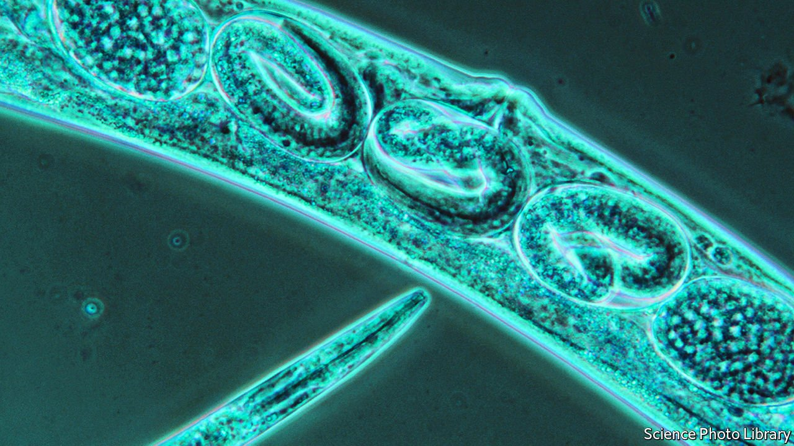

###### Epigenetic inheritance

# A strange case of intergenerational memory 

##### Nematode progeny “remember” bacteria encountered by a parent 

 

> Feb 26th 2022 

CHARLES DARWIN did not invent the idea of evolution. But he did come up with the currently accepted explanation, natural selection, in which heritable characteristics arise by chance and are retained if competition shows them to be useful. Natural selection’s success overthrew an earlier idea proposed by Jean-Baptiste Lamarck, a French natural historian. Lamarck had suggested that characteristics acquired by experience during an organism’s lifetime might somehow become heritable.

Modern genetics has no place for Lamarckism as a long-term mechanism, because it would involve writing the recipe for such environmentally induced changes accurately into an organism’s DNA. But occasional examples of short-term effects that resemble it do turn up from time to time. They usually involve minor and reversible chemical tweaks to the DNA in sperm and eggs, or to the proteins in which that DNA is packaged into chromosomes. These tweaks, known as epigenetic effects, tend to cause general, and not always helpful, responses to events like famine, and persist for only a generation or two. The AAAS meeting heard, however, of an example that has a much more intriguing mechanism. It encodes a specific, life-saving behaviour in a relative of DNA called RNA. And it is passed down even unto the third and fourth generations.


Coleen Murphy of Princeton University studies C. elegans, a nematode worm beloved of geneticists that is, as a consequence, one of the planet’s best understood animals. C. elegans lives in rotting fruit, and eats bacteria. Among its favourite prey are bugs of the genus Pseudomonas. But munching these does not always go well. One species, P. aeruginosa, is a dangerous pathogen, at least when the temperature is above 25°C. Not surprisingly, worms which survive their first encounter with P. aeruginosa in such circumstances are put off by the experience. Thenceforth they are repelled by, rather than attracted to, its chemical traces.

That makes perfect sense. But Dr Murphy, who is interested in the phenomenon of epigenetic transmission, wondered if this aversive behaviour might also be displayed by the offspring of those worms.

It was. And by the offspring of those offspring. And by the offspring of the offspring of those offspring. In fact, it did not disappear until the fifth generation of worms descended from the one that had had the bad experience. By this time the ambient temperature might have fallen below 25°C, making P. aeruginosa once again an attractive food source.

A lot of molecular-biological manipulation by members of Dr Murphy’s team showed that the switch from attraction to repulsion is caused by an increase in the amount of a protein called daf-7 in a pair of nerve cells called ASI neurons found near the worm’s mouth. Not only were elevated levels of this protein confined to those worms which were repelled by P. aeruginosa, but they also remained elevated for four further generations, returning to normal, along with the behaviour, in the fifth.

The biochemical underpinning of this, it turned out after further rounds of experiments, is an RNA molecule, P11, which is produced by P. aeruginosa and taken up by the worms. Experiments showed that after exposure to P11, daf-7 levels in worms’ ASI neurons went up, and the worms then avoided P. aeruginosa. Because RNA and DNA are chemically similar, strands of RNA can bind to strands of DNA if the compositions of the two are complementary. And that is what is happening here. Part of P11 matches part of a gene called maco-1, that is active in ASI neurons. Binding between them turns down the volume on maco-1, which has the effect of turning up the volume on the gene which encodes daf-7 and switching on the evasive response.

Somehow, therefore, P11 is being passed from one worm generation to another. And this seems to involve an object called a retrotransposon. Retrotransposons are virus-like structures that can copy RNA into DNA. Dr Murphy’s latest experiments show that worms have one called Cer 1 which does this with P11.

Cer 1 thus acts as a sort of vehicle, outside the cell nucleus, which carries P11. It is able, in experiments, to pass the RNA on to other worms, which then also become P. aeruginosa-averse for four generations. And it does something similar to the germ cells inside its original host. Why the effect persists for four generations and no longer remains unknown. But what this elegant piece of science shows is that a specific, useful acquired characteristic can, indeed, be inherited. ■

To enjoy more of our mind-expanding science coverage, , our weekly newsletter.

