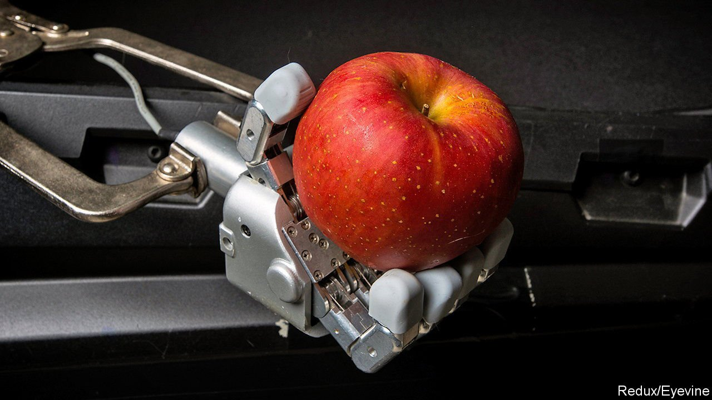
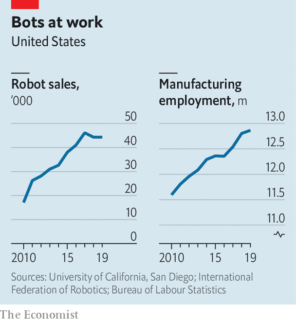

###### Robotics

# Covid has reset relations between people and robots 

##### Machines will do the nasty jobs; human beings the nice ones 

 

> Feb 25th 2022 

ROBOTS HAVE been around for six decades or so. Originally, they were simple devices which did as they were told, working on assembly lines in, well, a robotic manner. They were often kept in cages, like zoo animals, to stop people getting too close. And for similar reasons. They were dangerous. If a mere human being got in the way of a swinging robotic arm, so much the worse for the human.

Since then, they have got vastly more dexterous, mobile and autonomous. They are also more collaborative. There are now over 3m robots working in factories across the planet, according to the International Federation of Robotics, a worldwide industry association. Millions more move goods around warehouses, clean homes, mow lawns and help surgeons conduct operations. Some have also begun delivering goods, both on land and by air.


The pace of automation is likely to accelerate, for two reasons, a panel of robotics experts told the 2022 meeting of the American Association for the Advancement of Science (AAAS), held for the second year running in cyberspace, rather than in Philadelphia, as originally planned. The first reason is that covid-19 has created social changes which look likely to endure. The “Great Resignation”, in which millions around the world have quit their jobs, may in part be a consequence of lockdowns creating new opportunities for . These so-called lifestyle choices about which jobs to do, together with creaking supply chains and a boom in e-commerce, have left warehouses and many other businesses .

Universal robots

The second reason is that the bots are getting better. Instead of just moving goods in warehouses to human “pickers”, who then put items into bags for home delivery, they are l for themselves. In factories, they are stepping out of their cages and, equipped with advanced sensors and machine learning, a form of artificial intelligence (AI), are going to work alongside people. Such robots will increasingly help out in other places too, including hospitals, and in roles, such as caring for an ageing society—which, post-covid, has got used to a more techno future for health care, with “telemedicine” via remote doctors and health-monitoring mobile-phone apps.

There is, though, a long way to go. In the field of manufacturing, car plants lead automation. But, as Henrik Christensen, director of the Contextual Robotics Institute at the University of California, San Diego, told the meeting, even the most advanced of them, those in South Korea, average only around one robot per ten workers. So-called “lights-out” car manufacturing, with no human beings on the factory floor, remains a distant dream.

Even so, the rise of robots makes some people fear for their jobs and ask how they will earn a living. “It’s a good question. I get it every week,” says Dr Christensen. He replies that jobs which robots undertake are usually dull, repetitive and strenuous—and, post-covid, such jobs are getting harder to fill. In many industries it is less a desire to reduce labour costs that is driving automation than the sheer difficulty of recruiting flesh-and-blood workers. Indeed, instead of destroying jobs, robots can create them by making businesses more efficient, allowing firms to expand. As Dr Christensen points out, for the past decade manufacturing employment in America has grown, even as the number of factory robots increased (see chart).

 


There is a similar fear in health care that robots will destroy jobs. But this is a myth, Michelle Johnson told the meeting. Dr Johnson is the director of the Rehabilitation Robotics Lab at the University of Pennsylvania, and currently works in Botswana on ways to use robots to help people recover from illness and injury. Even in America, let alone Africa, “there are just not enough clinicians to do the job,” she adds.

Dr Johnson has a particular interest in helping people recover from strokes. This sometimes requires intensive therapy for long periods. But public health-care systems are often too stretched to offer anything but limited treatment. Robots can help here, and in some circumstances may be better, even, than human physiotherapists, since they are both tireless and reliable. They can exercise a person’s limbs with consistent movements and take objective measurements of recovery. This, says Dr Johnson, allows a single occupational therapist, assisted by a technician, to look after, at the same time, half-a-dozen or so patients who would otherwise need one-to-one attention.

Robots that work with people in such ways do, though, require special training. And there is a long way to go to improve that says Julie Shah, who leads the Interactive Robotics Group at the Massachusetts Institute of Technology. Most robots perform narrowly defined tasks, with mobile ones using their sensors to avoid bumping into people. “Robots need to see us as more than just an obstacle to manoeuvre around,” adds Dr Shah. “They need to work with us and anticipate what we need.”

Studying what happens in factories shows that the most successful applications employ robots programmed by an engineer who is working side-by-side with someone (a so-called “domain expert”) fully versed in the tasks at hand. To make that easier, she and her colleagues are developing AI systems which can school a robot using natural-language commands.

Although all three experts believe robots will enhance human capability, one problem is that regulation lags technology. With covid-19, says Dr Johnson, some clinicians worried that even the spread of telemedicine might affect their indemnity insurance, let alone robots. And although a long road remains ahead for the development of autonomous delivery vans and lorries, Dr Christensen finds it “ludicrous” that a test vehicle driving across a state border in America may thereafter have to comply with a completely different set of regulations from those which pertained in the place whence it came. It seems an awful lot of meetings lie ahead for roboticists and regulators to determine how machines and people will work together. ■

To enjoy more of our mind-expanding science coverage, , our weekly newsletter.

Dig deeper

All our stories relating to the pandemic can be found on our . You can also find trackers showing ,  and the virus’s spread across .

