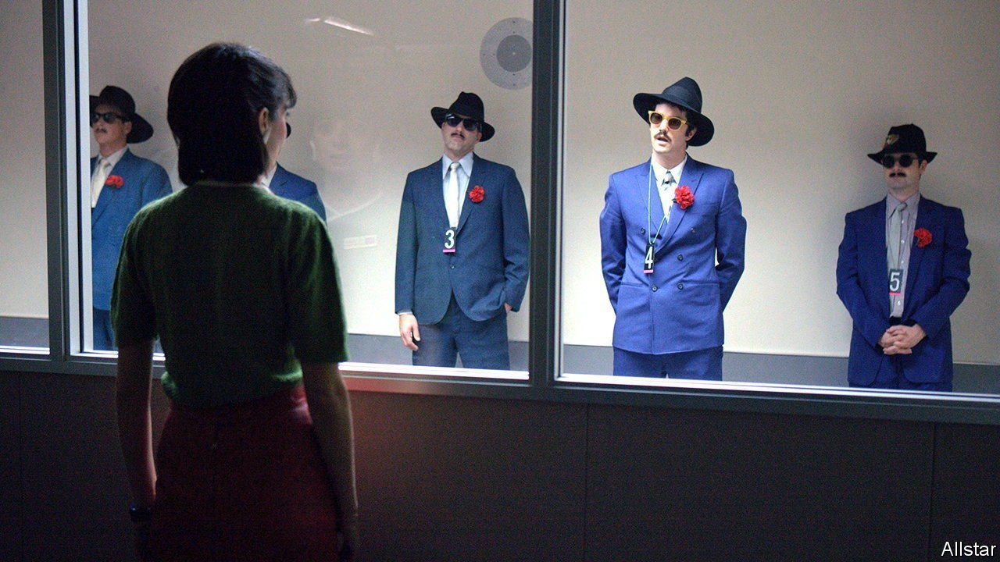

###### Science and the law

# Eyewitness evidence is more reliable than has been thought 

##### But only the first time you ask 

 

> Feb 26th 2022 

THE “SATANIC PANIC” that swept through America in the 1980s and 1990s held that thousands of ordinary people up and down the country were secretly members of devil-worshipping cults which were abusing, raping and murdering children on an industrial scale. Alleged victims made detailed allegations, often after therapy designed to “recover” memories that had supposedly been buried in the aftermath of trauma. Many people went to prison. None of it was true.

One after-effect of the panic was to cement in the minds of both the public and the justice system the idea that eyewitness testimony is unreliable. That fitted with experiments by psychologists such as Elizabeth Loftus, which demonstrated just how malleable memories can be. The Innocence Project, an American charity, examined 375 cases of wrongful conviction for all sorts of crimes, and found misidentification of suspects by witnesses was a factor in around 70% of them.


But at the annual meeting of the American Association for the Advancement of Science, John Wixted, a psychologist at the University of California, San Diego, argued that this institutional distrust has gone too far. Eyewitness memories, he said, can in fact be very reliable—if they are tested in the right circumstances.

The key to reliability, said Dr Wixted, is the confidence of witnesses in their assessments. Experiments suggest that when witnesses to a simulated crime are confident of having identified the suspect in a later photo line-up, they are almost always correct. Similarly, if they are sure the suspect is not present, that is likely to be right too. Only when a witness is unsure does a risk of misidentification arise. A field study conducted in 2016 by Houston’s police came to similar conclusions.

The problem is that this confidence is trustworthy only the first time the question is asked. One of the unavoidable frustrations of quantum mechanics is that measuring a particle’s position or energy irretrievably alters it. Something similar, said Dr Wixted, happens with memories. The very act of testing them contaminates every other test that comes after. Assessing people’s faces for a possible match, for example, lodges them in a witness’s memory. Once that has happened, anything from police encouragement to the high-pressure environment of a courtroom can twist subsequent attempts at recollection.

Dr Wixted drew a comparison with evidence such as DNA samples. Improper handling can contaminate these. That does not mean DNA tests are inherently unreliable, but it does mean the technology must be used carefully. The same, he says, is true of witnesses. The answer, as he and Dr Loftus argue in a recently published paper, is to test a witness’s memory as fairly as possible, and—crucially—to do so only once.

Decades after the Satanic panic, the matter remains important. Dr Wixted cited the case of Charles Don Flores, a prisoner awaiting execution for a murder committed in 1998. Initially, when shown a line-up that included Mr Flores, a crucial witness said none of the people matched her recollection. (She had recalled a white man with long hair. Mr Flores is of Latin American extraction, and had short hair then.) By the time the case came to trial a year later, she had changed her mind, and Mr Flores was convicted. His appeal on the basis of the witness’s change of mind has been denied. Dr Wixted, however, suggests she was likely to have been right the first time and wrong the second. ■

To enjoy more of our mind-expanding science coverage, , our weekly newsletter.

