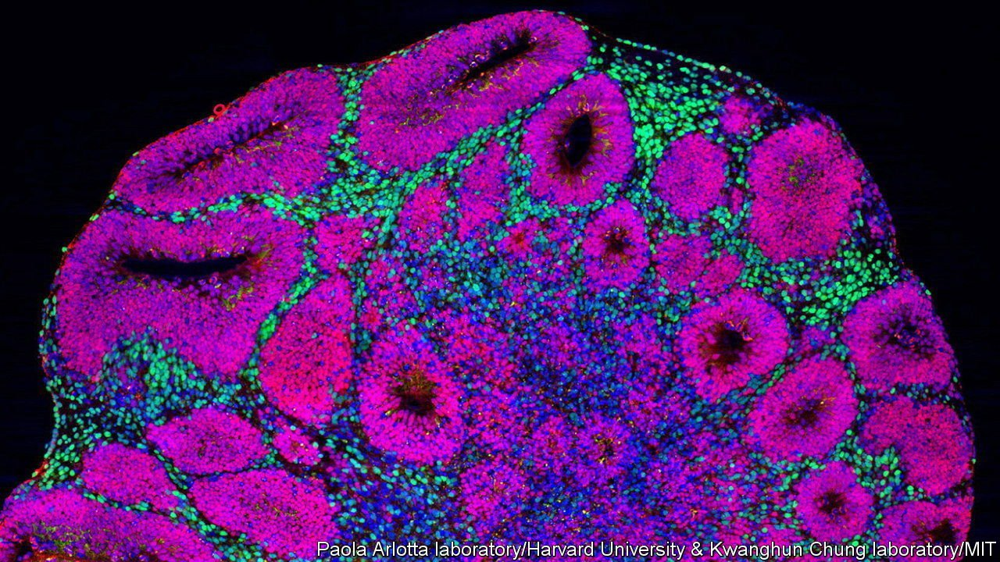

###### Neuroscience

# Organoids and neuron transplants give new ways to study the brain 

##### But they also bring ethical concerns 

 

> Feb 26th 2022 

STUDYING THE human brain is hard. Other animals’ brains provide clues. But they cannot reveal the special essence that makes human brains different. Nor, often, do they make good models for neurological conditions that affect human beings.

Recently, however, two halfway-house approaches have been developed. One is to grow so-called brain organoids from human tissue. The other is to create animals with human-derived neurons in their bodies. As the AAAS heard, both approaches are yielding results. But they also raise ethical questions of their own.


Organoids are usually grown from induced pluripotent stem cells—artificial equivalents of embryonic cells. The process is now sufficiently well understood for them to be mass produced and Paola Arlotta of Harvard University described ways they are being put to use. These include studying brain development, examining the pathology and genetics of disease, and screening potential drugs. A particularly exciting idea is to grow organoids using cells from people with known, genetically related problems. That will allow specific instances of disease to be investigated.

Dr Arlotta herself employs organoids to study autistic-spectrum disorders (ASDs), using versions which incorporate mutations of three genes seemingly linked to those conditions. Though these genes work in different ways, she found that mutating any one of them induces the same effects. These include accelerated development of cells called GABAergic neurons and a consequent slowing of the rate, and diminution of the amplitude, of electrical spiking. This is of interest because other studies suggest that disrupted GABAergic signalling is indeed associated with ASDs.

Dr Arlotta also described how it is now possible to make organoids that resemble, in their mix of cells, different parts of the central nervous system (for example, the cerebral cortex and the spinal cord) and to link these together, and also to muscle organoids, to create what are known as assembloids. That permits preliminary investigation of how different regions of the brain connect up, and how the brain connects with the rest of the body.

A thoughtful individual might, at this point, be tempted to stop and ask whether brain organoids themselves can do anything remotely like thinking. At the moment, the answer to that is a pretty definitive “no”. Those currently emerging from the culture tanks are under 5mm across, so have less than a ten-thousandth of the volume of an adult human brain. More importantly, microscopic examination shows that they have little of the complex organisation found in real brains. And they have no sensory connections through which to learn about the world. But technology moves on. As Bernard Lo, a medical ethicist at the University of California, San Francisco, told the meeting, “this science is developing rapidly, and we don’t know what will be possible in a decade.”

The second approach, putting human neurons into living animals, was outlined by Joshua Sanes, who also works at Harvard. Dr Sanes came to public attention a few years ago as co-inventor of “Brainbow mice”—creatures that have had individual neurons in their brains “painted” using proteins that fluoresce in different colours. Recently, though, he has found himself struggling against the limits of what can be learned from laboratory animals, and has become interested in the idea of partly “humanising” them.

Transplanting neurons is an old technique, and is even being tested therapeutically for the treatment of Parkinson’s disease. But they can also be transplanted between species, and human neurons have, indeed, been transplanted into mice. Some, though, talk of going further, and transplanting human neural stem cells into embryonic mouse brains. The intention would be to create a “chimera” in which brain cells from both sources were intermixed and interfunctional.

At the moment, formidable technical obstacles stand in the way of doing this. But Dr Lo’s observation about scientific progress is equally applicable here. And chimeric animals of this sort, which might even exhibit humanlike behaviours, are an idea at least as disturbing as brain organoids’ becoming conscious. In 2020, therefore, America’s scientific establishment, in the form of its National Academies of Sciences, Engineering and Medicine, set up a committee, co-chaired by Dr Lo and Dr Sanes, to investigate both matters, in order to head off future trouble.

This committee published its report last year, and Dr Lo discussed it with a fellow committee member, Alta Charo, of the University of Wisconsin-Madison. The general tenor was keep calm and carry on. But cautiously. The potential benefits of both types of research are huge. As Dr Sanes had earlier pointed out, ailments of the brain are, collectively, the biggest cause of morbidity around the world, as well as a huge cause of mortality. But experiments must be ethical. Any sign of heightened suffering in animals caused by their having human neurons in their brains needs to be scrutinised carefully.

As to brain-organoid consciousness, though organoids’ simplicity and lack of connection to the world makes this unlikely, assembloids might change that. As Dr Lo observed, this sort of work taps into fears raised over many years by science fiction. But science fiction does sometimes go on to become scientific fact. ■

To enjoy more of our mind-expanding science coverage, , our weekly newsletter.

