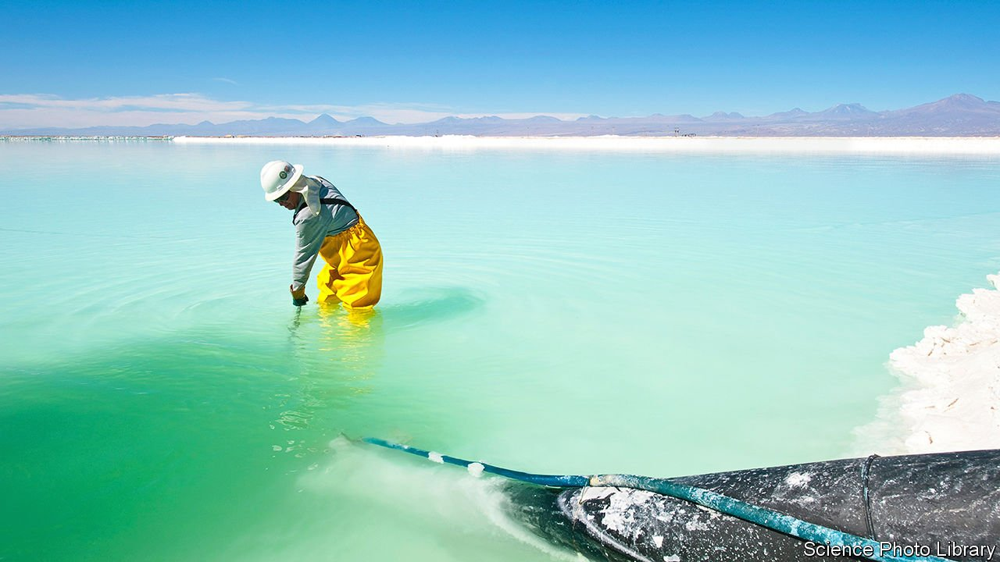

###### Lithium production

# Two new ways of extracting lithium from brine 

##### How to increase the supply of an increasingly valuable metal 

 

> Feb 26th 2022 

AROUND 60% of the world’s lithium, a metal in high demand for making batteries, comes from evaporation ponds, like that pictured overleaf, located in deserts in Argentina, Bolivia and Chile. These ponds, which can have individual areas of 60km or more, are filled with lithium-rich brine pumped from underground. That brine, as the ponds’ name suggests, is then concentrated in them by evaporation, after which it is treated to purge it of other metals, such as sodium and magnesium, and the lithium is precipitated as lithium carbonate.

This all takes time—often as much as two years. And the process of purification is complex and inefficient. As a consequence, only about 30% of the lithium in the original brine reaches the marketplace.


An American firm called EnergyX, plans, however, to change that. Using a polymer membrane developed by Benny Freeman of the University of Texas at Austin the company intends, beginning later this year, to filter lithium directly from brine. Dr Freeman says the company’s pilot plant, which will be able to fit into a standard shipping container, should be able to handle millions of litres of brine a day. Once the process is perfected, he reckons it will be able to extract at least 90% of the lithium within a brine.

Speaking at the AAAS meeting, Dr Freeman explained that his inspiration was the protein channels which control the flow of metal ions in and out of biological cells. A potassium channel, for example, is 10,000 times more permeable to potassium ions than to those of sodium. Modern imaging tools and supercomputers have revealed the structure of these channels, permitting them to be mimicked.

The upshot is a membrane pierced by nanometre-sized pores made from rings of carbon and oxygen atoms precisely arranged to let lithium ions through while slowing the passage of others, such as sodium. To start with, these membranes will enrich a brine’s lithium levels before it enters the ponds. Eventually, they could replace the ponds by generating a pure and concentrated solution of lithium hydroxide suitable for immediate industrial use.

Another way to improve the efficiency of ponds was also proposed at the meeting, by Seth Darling of Argonne National Laboratory, in Illinois. The actual evaporating is done mainly by heat delivered as sunlight. But much of this is wasted. Either it warms water below a pond’s surface—which, not being in contact with the air, is thus unavailable for evaporation—or it is re-radiated before it has had a chance to liberate any water molecules.

Dr Darling worked out that covering a pond with a material that converts light to heat quickly would stop these unfortunate losses by concentrating the warming effect at the pond’s surface, thus promoting evaporation. As long as that material was also porous, it would then let the resulting water vapour through and out into the air, to be blown away. His first try was Chinese calligraphy ink which, being viscous and a light-absorbing black, worked well—except that eventually (as ink does) it dissolved in the water. Now, though, he prefers charcoal, which also has the green bonus of being made from farm waste.

Dr Darling says the result is a process that can convert incident sunlight into heat at the water’s surface with near 100% efficiency. Besides improving lithium extraction, that could also help industries, such as fracking and mining, that tend to accumulate large ponds of waste water as a by-product of their activities. It could be used as well as a low-cost way to turn seawater into fresh, by capturing the water vapour as it evaporated.

Moreover, if Dr Freeman’s and Dr Darling’s ideas can get rid of the need to use vast evaporation ponds, that would open up new sources of lithium. The Salton Sea, a lake in southern California, contains huge quantities of the stuff, and in Texas a lot of groundwater released as a side-effect of oil production is rich in it. Unfortunately, neither of these places has the vast acreages of otherwise valueless land required for the sorts of inefficient evaporation ponds used in South America. Shrinking the sizes of those ponds, or even getting rid of them altogether, would change that. ■

To enjoy more of our mind-expanding science coverage, , our weekly newsletter.

