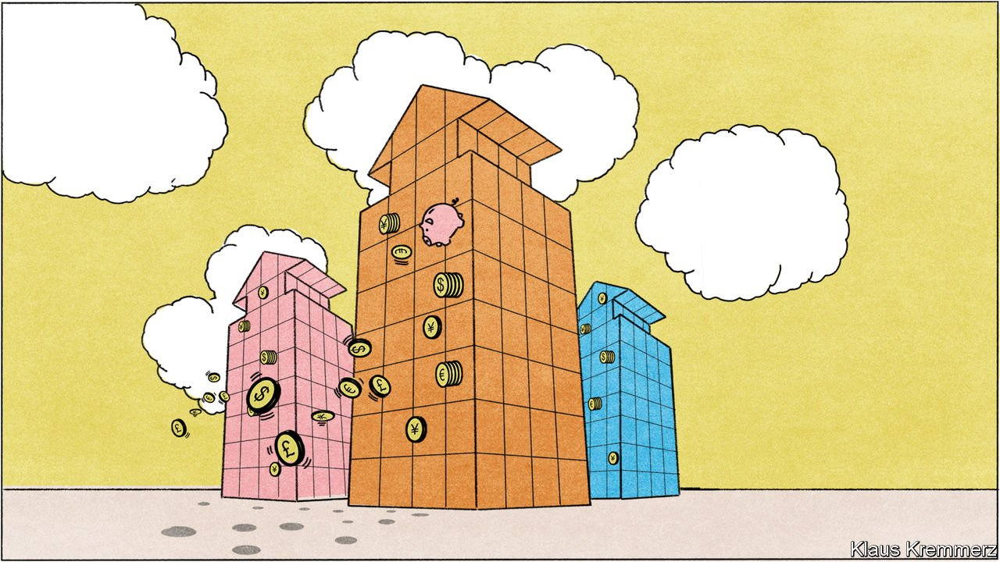

###### Strategic priorities

# Alternative fund managers are increasingly mainstream 

##### But many “artisanal” PE firms are touting themselves as specialists 

 

> Feb 23rd 2022 

BLACKSTONE STARTED life in 1985 with $400,000 in seed capital and plans as an advisory boutique. Its founders, Peter Peterson and Stephen Schwarzman, wanted to try leveraged buy-outs too, but struggled to get backing. That was then. In October Mr Schwarzman called his New York-based firm the private markets’ “reference institution…reinventing the asset class”. It is a justifiable boast. Blackstone towers above rivals, with $880bn of managed assets. “Ten years ago we were essentially a small club with a select group of investors focused on private equity, with a bit of real estate and distressed debt,” says Mr Gray at Blackstone. “Now we have a much wider group of investors saying ‘If you can get us a competitive return across private equity, lending, real estate, infrastructure or one of a number of other strategies, we’re happy to have the capital tied up’.”

PE firms are often said to be the “new conglomerates”, given increasingly diverse portfolios. Unlike their industrial predecessors, they show capital discipline; owned companies are not cross-subsidised willy-nilly. The dozen or so firms atop the industry are more than corporate conglomerates. The likes of Blackstone and KKR “don’t much like the term, but they’re starting to look more like financial supermarkets,” says Tim Jenkinson of Oxford University’s Said Business School. One sign of this is a proliferation of distinct private-market strategies (eg, mid-cap industrials or commercial property).


Listing on public markets was a formative moment for alternative managers. The two main sources of PE income are management and performance fees; the second is known as carried interest (or carry). In the early days, carried interest was PE’s main source of profit, with management fees designed only to cover administrative costs. But the latter are more important now, making up 60-70% of GPs’ total profits, says one study.

Public markets find management fees easier to value than performance fees, which are more erratic. Floating a firm’s shares was an obvious way to monetise the fees’ future flows (as well as making it much easier for partners to cash out). The industry’s latest IPO, by TPG in January, was structured to give public investors what they most wanted, the management fees, while keeping most of the carried interest for owner-managers.

Once a firm goes public, the incentive is to maximise management fees. The best way to boost a share price is to gather assets furiously, not spend time painstakingly choosing the right buy-out targets. And because alternative managers can charge higher fees than those in the public markets, they enjoy higher valuation multiples. Blackstone has an eleventh of the assets of BlackRock, the world’s largest fund manager, but a higher market capitalisation.

Blackstone aims to reach $1trn of assets within a few years, as does another giant, Apollo. The race to bulk up will accelerate a bifurcation of the industry, says Mr Jenkinson. As giants go for scale and breadth, a long tail of “artisanal” PE firms will tout themselves as specialists who make superior returns by focusing on particular areas or geographies, doing just a few deals a year.


Gone are the days when the big PE firms focused on value, not growth. Today’s targets are often not the metal-bashers of old, but zippy new-economy firms. Software, health tech and green tech are hot. Last year one in three PE deals was classed as tech, twice the share before 2007-09. Blackstone hopes to become a king of content as well: its burgeoning media portfolio includes Moonbug and Hello Sunshine, which make TV shows for kids and women.

The search has led the industry into growth equity, a once-tiny sliver between venture capital (VC) for startups and buy-outs for mature firms. Growth equity makes up around 20% of all PE, about the same as VC, with buy-outs accounting for the rest, says Stan Miranda of Partners Capital. Growth equity is useful for firms entering adulthood but unsure about going public.

The focus on fast-growing firms has pushed up valuations. The average price for American leveraged buy-outs has climbed to 11.4 times earnings before interest, tax, depreciation and amortisation (EBITDA); even in heady pre-crisis years it did not exceed nine. Scott Kleinman, co-president of Apollo, one of the few big PE firms not to buy heavily at such multiples, suggested that the industry was gripped by a “collective delusion” on valuations.

Leverage is jangling nerves, too. It has fallen as a percentage of total capital in buy-outs: from 90% in the 1980s to around 70% before the crisis, and less than 50% today. Measured against earnings, however, it is at its highest relative to EBITDA for two decades. Over four-fifths of the American buy-out market is leveraged more than six times earnings, the level at which “Federal regulators start to raise eyebrows,” says Bain &amp; Company.

Dealmakers say prices look high only because acquisitions offer fast-growing, not just dependable, earnings. They say they have largely given up financial engineering, when the game was to buy unexciting firms with steady cashflows, leverage up and squeeze out juicy returns before selling them on, and embraced an operational version. The aim is to buy and improve good companies. PE firms have hired specialist fixer-uppers. KKR says it has three “supporting colleagues”, steeped in marketing strategy, employee engagement, regulatory risk and much else, for every portfolio manager in North America. “The buy, fire and sell image of the industry is so far from what we do,” says Mr Gray.

So too, he says, is PE’s reputation for indifference to environmental concerns. The big firms talk up “green tech” and the energy transition. Some put money where their mouths are: Toronto-based Brookfield Asset Management has raised a $15bn “Transition Fund”. In September a group of investors and PE firms, including Blackstone and Carlyle, launched an initiative to standardise environmental, social and governance (ESG) reporting in buy-outs. Some embrace other forms of stakeholderism: KKR is championing employee ownership. At Ingersoll Rand, a machinery firm, 16,000 workers have been given equity. KKR claims this has helped produce a meaningful improvement in company performance, including an 80% decline in the voluntary quit rate.

Going green, too

Investors, known as limited partners (LPs), want more of this. In a recent survey by Coller Capital, 56% of European LPs said ESG had played a role in rejecting fund commitments over the previous year. (America is behind, at 25%.) Several investors express optimism that PE firms can take a lead on greening business. “If they see it as good for the bottom line long-term, they can move quickly because of the power they have over their portfolio companies,” says Tilly Franklin, Cambridge University’s chief investment officer. Yet plenty of PE firms remain interested in “brown” assets at the right price. Some are buying oil companies and sniffing around coalmines that publicly listed operators want to divest.

 


As the industry embraces change, it is also looking for new types of investors. Mr Gray talks of “a revolution not just in what we do but who we do it for”. Large institutions will be its biggest clients for many years to come, but private funds are keenly searching out retail investors as well. That would deepen the pool of capital that could be tapped by a cool $50trn, reckons Bain. “Retail has been the holy grail of private markets since Steve Schwarzman got out of the advisory business a generation ago,” says one industry veteran.

The PE giants are hustling for high-end retail business from clients who count as “accredited” investors whom regulators deem sophisticated enough to buy private assets. The big firms are also strengthening private-wealth teams, in some cases poaching from banks. Alisa Wood of KKR says the firm is looking to raise a third or more of its capital from retail investors. Apollo expects individuals and advisers to invest $50bn over the next five years. To that end, in December Apollo acquired part of Griffin Capital, a Los Angeles-based fund manager. The next target is the “mass affluent”, or merely quite well off, who have little invested in private markets and want more. Several firms, including Blackstone and Brookfield, have launched or are working on PE, credit, property or infrastructure funds tailored to smaller investors.

One difficulty over turning this retail trickle into a flood is illiquidity. Retail investors want to trade in and out of investments at a reliable net asset value, if not daily then weekly or monthly. That is not easy to engineer with private assets. Some at the cutting edge are making headway. Swiss-headquartered Partners Group manages over $36bn in open-ended PE funds for investors including wealthy retail clients. Investors receive monthly net asset values and can redeem at 30-90 days’ notice (though funds can halt redemptions during market turmoil). Another barrier is regulation. Rule-setters have long been queasy about throwing private markets open to mom-and-pop investors.

There are signs that regulatory resistance is softening. Last year a panel convened by America’s Securities and Exchange Commission (SEC) backed giving retail investors greater access to private markets as long as there were investor protections. America’s Department of Labour also opened the door for defined-contribution (DC) pension plans to invest (defined-benefit plans have long done so). In November the British government proposed raising the ceiling on the fees that DC plans can pay. If enacted, this would allow them to invest in unlisted assets.

The retail push aims both to increase clients and to grow fee-based revenues. This goes hand in hand with the objective of raising more “perpetual” capital. Not only are profits from traditional PE funds erratic, but also the funds have to be wound up, typically after ten years. Big firms want to move away from this here-today-sold-tomorrow model. They like vehicles that can invest for longer, or are open-ended, avoiding the need to go cap in hand to investors every few years. Mr Gray has said that long-term capital “allows us to broaden who we serve and where we can invest. We’ve compared this to a ship moving from a narrow channel into open waters, and we believe this process has just begun.”

Similar thinking underlies efforts to tap long-term insurance pools of capital, according to Dec Mullarkey of SLC Management. Big firms have stepped up their purchases of books of annuities or life insurance on which insurers are struggling to make a return because of low interest rates. The typical PE investor acquires such books for their fee income, then brings down costs and spruces up their asset mix. Some of this is done using private-credit markets, where spreads are higher than in public markets. “We only need to earn 50 basis points [half a per cent] over what the annuity pays out to do nicely,” says one investor.

Apollo has pushed furthest into insurance. It set up Athene Holding in 2009 to buy annuity blocks, later floating its shares. It has since acquired stakes in other insurers. Today, Athene makes up around 40% of Apollo’s total assets. KKR is doing something similar. Blackstone is taking minority investments in insurers in exchange for exclusive asset-management arrangements. Last summer it bought 10% of AIG’s Life and Retirement business for $2.2bn. In return, Blackstone gets a long-term agreement to manage $50bn of AIG assets.

Public players’ private passion

As alternative asset managers grow less alternative, mainstream managers are getting more so. Nudged by clients in search of yield, they are looking to cash in on private-market strategies. They would also welcome the chance to charge higher fees, having seen those from conventional stock funds shrivel with the rise of passive investing.

Private markets were the busiest area of dealmaking for big mutual-fund firms in 2021. Franklin Templeton paid $1.8bn for Lexington Partners, which has raised more than $55bn for alternative strategies. It also hired Ben Meng, a former investment officer of a Chinese state agency which manages $3trn, to lead a push into Asia. T. Rowe Price splashed out $4.2bn for Oak Hill Advisors, a private-credit specialist. “They bring products our clients want, and we bring distribution,” says Rob Sharps, T. Rowe Price’s boss. Vanguard is expanding, through a partnership with HarbourVest Partners, a big PE fund of funds. Critics suggest that venturing into an area known for high fees and opacity would send Jack Bogle, Vanguard’s founder, spinning in his grave, but the firm argues that the move helps to give the little guys access to markets previously monopolised by institutions.

BlackRock, the world’s largest asset manager, has been quietly building an alternatives business. It has amassed assets of $320bn, more than all but the three largest alternative managers. Half its business is private credit, much of the rest property and infrastructure. The firm also has a growth-equity partnership with Temasek, a Singaporean sovereign-wealth fund. As BlackRock moves onto the same turf as its original parent, Blackstone, there may in 20 years’ time be little to differentiate the two except for the second syllable of their names. ■

