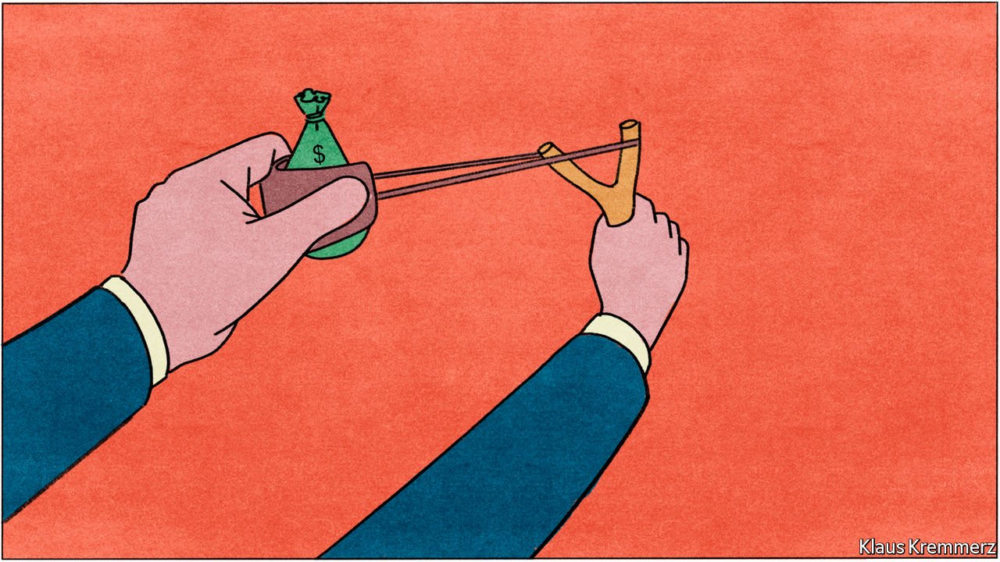
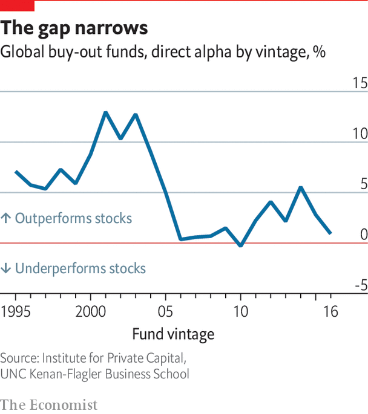

###### The investors

# Investors rely more and more on higher returns from private markets 

##### The institutional investors whose capital fuels private markets are growing more sophisticated. But picking winners gets no easier 

 

> Feb 23rd 2022 

WHEN DAVID SWENSEN died last year, the investing world mourned the loss of an icon. As head of Yale University’s nest-egg, Swensen pioneered the endowment model: eschewing bonds and lowering holdings of equities in favour of PE and property. His philosophy was that long-term capital could give up some liquidity for higher returns; and, with data scarcer in private markets, that it was easier for those who did their homework to gain an edge. In his 36 years at the helm, the endowment grew from $1.3bn to over $40bn, an average 13.7% compound annual gain.

The revolution Swensen started has spread to other endowments and foundations, and then to sovereign-wealth and pension funds and money managers for the super-rich. Academic institutions remain the trailblazers. In the 2020 fiscal year, leveraged buy-outs, VC and real assets made up an average 39% of the portfolios of American university endowments with more than $1bn. Yale has 45% in buy-outs and VC alone. But institutional investors of all stripes have been gradually raising their allocations to private markets, typically to percentages in the high teens or low 20s. Many plan to go higher: in a survey last year by Preqin, a research firm, around 90% said they expected to commit the same or more to PE funds over the next 12 months.


Last November CalPERS, America’s largest public-pension fund with around $500bn under management, signalled plans to increase PE and private debt from 8% to 18% of its portfolio. This is meant to keep CalPERS’ expected returns above its long-term target of 6.8%; falling short would matter to a fund whose obligations to pensioners already exceed the current value of its assets by over $160bn. “Most LPs just wish their boards would give them more access to private markets,” says a consultant to big investors.


Their investments are mostly made through GP-sponsored funds with a set lifespan. A growing share of funds buy investors’ existing commitments in the “secondary” market for PE stakes. This has boomed recently: 2021 saw a record $126bn in trans actions, 50% higher than in 2019, the previous peak. Big private-markets firms like Ares and KKR are acquiring secondary specialists or looking for targets. LPs used to sell stakes into the secondary market only in a cash crunch. Now they do so freely, as a tool of active management, eg to increase exposure to a sector or reduce it to a region. GPs have become big secondary players, too. One popular innovation is a “continuation fund”, essentially a vehicle for a GP to sell stakes to itself. One aim is to delay selling prized assets that might have to be divested as an old fund winds down.

The 50 or so largest LPs have used their clout to invest differently. Some make half their private-markets commitments outside fund structures, either “directly” or as “co-investors”, alongside a fund (in which they may also have a stake). The busiest direct and co-investors are Asian sovereign-wealth funds, such as Singapore’s GIC and Temasek, and Canada’s pension giants, including CPP Investments and the Ontario Teachers’ Pension Plan (OTPP).

The OTPP acquired 85% of the private assets in its $220bn portfolio as a direct investor. It ranges from lottery operators to renewable-energy facilities. To beef up its capability it has built an in-house investment team, now 350 strong. “We like influence, and we think in a 30-year horizon. That’s too long for most private-equity funds,” says Jo Taylor, the OTPP’s chief executive. Andrea Auerbach of Cambridge Associates, an investment firm, reckons co-investment alone now accounts for a quarter of big investors’ commitments, up from 10% 15 years ago.

As well as giving investors more control, direct and co-investment can boost returns. Over the past 25 years the OTPP’s direct investments have delivered a top-quartile return of around 20%, above that of its investments through funds. Between 2009 and 2016, around 80% of all co-investments outperformed funds launched in those years, says Michael Cembalest of JPMorgan Chase.

 


Higher returns are no mystery. Direct and co-investors avoid fees paid by fund investors: typically a 1.5-2% management fee and 20% performance fee (the manager’s “carried interest”). Institutions that do a lot of freelance investing can bring “blended” management fees down to 1-1.5%. The Universities Superannuation Scheme, an £82bn ($110bn) pension scheme in Britain, has saved its members “hundreds of millions” by investing directly, says Geoffrey Geiger, its head of PE funds. The extra staff cost pales beside the fees saved, says Matt Portner of McKinsey.

A good deal?

GPs are ambivalent about this. It means forgone fees, but it can still be useful. Some funds would find it hard to make large investments without co-investors, because of risk limits on single holdings as a share of the total. Blackstone and its partners would have struggled to complete the $34bn purchase last June of Medline, a medical-supply giant, without co-investors, including GIC.

Most investors pay close to the infamous “2 and 20”. Gary Gensler, chair of the SEC, said last year that average PE management and performance fees in 2018-19 were 1.76% and 20.3%, respectively, “not that different from when I was on Wall Street” in the 1980s. Other expenses can push overall fees, including carried interest, up to 5% or more per year over the life of a fund. These include charges for “monitoring” portfolio companies, for administrative expenses, or even for use of private jets. StepStone, a private-markets advisory firm, memorably described PE fees as “like snowflakes: abundant, unique and lacking in transparency”.

LPs don’t kick up much fuss about fees partly because they fear being excluded from GPs’ future funds or co-investment opportunities. Some keep quiet because they get rebates under side agreements. Still, many complain that fees are too high and that the fee structure is rigid even though funds’ performance varies. Others grumble that fees are charged on all committed capital, not just that actually deployed.

Some GPs seek to assuage such concerns. A few have switched to charging based on funds deployed. One large investor predicts that PE will eventually follow hedge funds: when relative returns sagged after the financial crisis, some hedge funds closed, others turned into family offices, and many of the rest cut fees.

Yet 2 and 20 is likely to stay as PE’s reference point. “The way the buy-out and venture-capital markets are rationed is that managers of underperforming funds struggle to raise more money and fade away rather than staying in business by slashing fees,” says Steven Kaplan of Chicago University’s Booth business school. The head of one American endowment’s PE portfolio says that, if anything, there is greater pressure on LPs to pay more than 20% carried interest for good results than to pay less than 20% for below-average results. Some investors will pay 25% or more if the manager delivers something special, such as four times the original investment.

The biggest factor limiting pressure from LPs for lower fees is their faith that unlisted investments will continue to outperform public markets. PE firms tout dizzying returns over the past 20 years. Academics who crunch the data are split, though not down the middle. A small, vocal minority, led by Ludovic Phalippou of Oxford’s Said Business School, argues that PE’s outperformance is an illusion created by an industry that has mastered ways to massage the numbers. Over the past decade, Mr Phalippou calculates, returns have merely matched those of stockmarkets. For GPs to insist otherwise amounts to “a mis-selling scandal”.

Most other boffins disagree. They acknowledge that the “internal rate of return” (IRR) measure favoured by the industry is flawed: it can be gamed by playing around with cashflows or by taking out “subscription lines”, loans that managers get from banks to delay calling capital from LPs. However, the academics have developed their own, more solid metrics. The best of these is “direct alpha”, a less manipulable, market-adjusted version of IRR.

A paper in January from the Institute for Private Capital at the UNC Kenan-Flagler Business School calculated direct alpha since the mid-1990s for funds in the 1986-2016 vintages. It found that PE, including buy-outs and VC, outperformed shares over all time periods (three, five, ten, 15 and 25 years) by 2-6 percentage points. It beat them regardless of the benchmark used; the authors tested among others the MSCI’s global-equities index, the Russell 3000 index of US stocks and a small-cap value index.

The less good news is that the performance gap has narrowed. As private markets get more crowded, competition for stand-out investments intensifies. And as the industry gets bigger, it learns the truth of Warren Buffett’s dictum that “no one in the world can earn 20% with big money.” The real question, says Gregory Brown, the study’s lead author, is whether private assets are worth it once returns are adjusted for risk. PE’s “beta” (risk relative to markets) is 20-30% higher than that of equities. Investors also demand a premium for illiquidity (the consensus is around three percentage points a year, says the BIS). Against this, investors must weigh the diversification benefits of holding private assets.

Even if institutional investors conclude that PE pays, average returns are just an average. Pick a below-average fund and you can be soaked in red ink. The gap in performance between top- and bottom-quartile PE funds is wider than in public markets: for some vintages 15 points or more. One-fifth of PE investments return less than was put in, reckons one private-markets adviser.

Picking winners is made harder by a weakening of the link between past and future performance. The odds that a PE manager’s next fund will be in the top quartile if its previous one was have fallen over time, to “not much better than 25%”, as the industry has grown, says Mr Jenkinson. And information about past performance is often incomplete: investors must decide whether to back a manager’s next fund three or four years after the previous one started investing, long before its final returns are clear. Even in the highest reaches of private markets, investing is as much about keeping the faith as studying the form. ■

