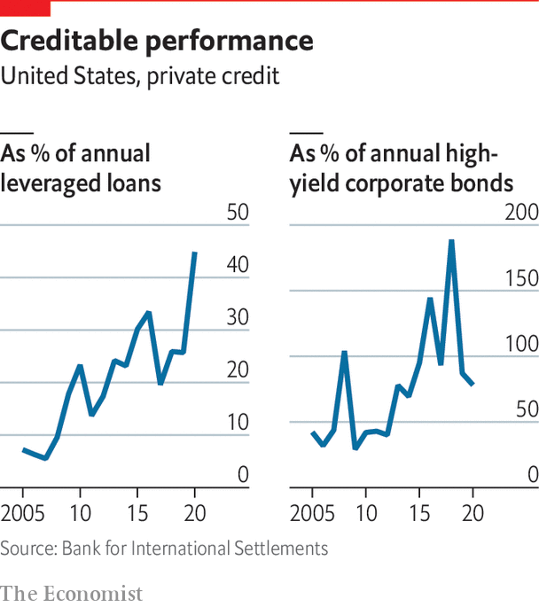

###### Private credit

# More borrowers turn to private markets for credit 

##### Asset managers rush in where banks fear to tread, transforming a formerly niche market 

 

> Feb 23rd 2022 

AS HE ASCENDED the hierarchy of corporate finance in the 1980s to become king of junk bonds, Michael Milken stood out. Not least physically: he paced the trading floor of Drexel Burnham Lambert sporting a lush but ill-fitting wig. More than 30 years on, junk bonds are a recognised part of the market for raising capital. So are other innovations spawned by the buy-out barons, such as collateralised loan obligations (CLOs), securities into which leveraged loans are packaged. Fast gaining ground on these debt markets is one for private credit, which may now be causing more excitement than any other private market.

Before the financial crisis, private credit was a niche pursuit, consisting of distressed debt and “mezzanine” finance (a risky segment between debt and equity). Over the past decade it has spread to activities ranging from aircraft leasing to “direct lending”, or loans to small and mid-size companies without using a bank or securities firm. PE firms are cutting out banks and borrowing from direct lenders, including each other’s credit arms, to fund buy-outs. Banks huff at this loosening of their grip on financing PE deals that used to be backed by their loans or junk bonds.


The private-credit market has more than doubled in size since 2015 and is now worth at least $1trn worldwide, not far off the $1.3trn institutional loan market, says Moody’s. The BIS reckons it may be closer to $1.5trn. Private credit has at times recently exceeded junk-bond issuance, itself at record levels. Transaction sizes have risen commensurately. “Fifteen years ago the biggest deals were a few hundred million dollars. Now they’re four or five billion,” says Michael Arougheti, boss of Ares Management.

Ares is one of several firms dominating the market. Others include Apollo, Blackstone and Brookfield. Ares sought to raise a $4.5bn credit fund last year. So strong was demand that it closed at $8bn. Debt specialists are among the private markets’ hottest assets. Brookfield bagged one of the most sought-after in 2019, paying $4.7bn for a majority stake in Oaktree Capital. Mainstream fund managers are also gaining a foothold: credit accounts for around half of BlackRock’s $320bn alternatives business.

The market has been propelled by two big forces. One is the retreat of banks, leaving a void for non-banks. This began in the 2000s as banks looked to trim inventory and go back to being agents, not principals. It accelerated after the financial crisis as banks were forced by tougher capital requirements to offload risky assets. The second is the ubiquitous search for yield. Private credit offers juicier returns than mainstream fixed income. Rock-bottom rates have “pushed ever more investors into a liquidity-for-yield exchange”, says Jean-Marc Chapus, the co-founder of Crescent Capital.

 


In America, banks’ share of lending to small and mid-size firms has fallen from around 30% to 20% since 2010, reckons Moody’s. Banks have also backed off property lending, particularly for construction and refurbishment, for which regulated lenders have been hit with steep capital charges. Spurred by accounting changes, banks across Europe have marked down dud property loans. Private-debt funds are snapping these up at 50-60 cents on the euro, rewriting loan covenants and, where necessary, offering borrowers fresh liquidity, says Stuart Fiertz of Cheyne Capital, an alternative asset manager.

They have also been busy in markets that emerged from the wreckage of the securitisation meltdown of 2008, conjuring deals for speciality-finance companies in equipment leasing, consumer lending and receivables financing. Apollo has bought two car-leasing firms, a provider of home-improvement loans and a commercial-mortgage lender with a clean-energy focus.

Private credit gives investors more options in the middle ground of risk, between staid bonds or syndicated debt and racy private or growth equity. Expected annual returns range from 4% to the low teens, depending on the product. Both fees and the risk of an investment flopping are lower than with buy-outs. Investors with explicit return targets, such as pension funds, are understandably tempted by coupons of 8-10% or more. Scott Kleinman, co-president of Apollo, says such long-term capital is a good fit for private credit. “I tell them they’re the long-term lenders of the future.”

For borrowers, the attraction is availability: smaller companies can’t easily access public or syndicated debt markets. Others value negotiating contracts more closely tailored to their needs than is possible in other markets, or the fact that direct lenders can move quickly and also be more forgiving of defaults. Some borrowers use the market to avoid disclosure required in public debt markets. For credit funds, an attraction is the promise of excess return for illiquidity or, as Marc Rowan, Apollo’s boss, puts it, “complexity and origination”. At a big enough scale, making a spread of a single percentage point over public markets is enough for a healthy return. “Five years ago our credit business was mostly high-octane distressed debt and special situations,” says Jonathan Gray at Blackstone. Now the firm is doing more, ranging from corporate-loan deals to “steadier yield products” such as property funds that yield less (say, 5-6% a year) but have the potential to be sold “at massive scale”.

On the market’s lower rungs there is space for specialists to carve out niches. A number of smaller players offer credit facilities with “ratchets”. These give borrowers a discount on interest rates (typically up to 0.25 percentage points) if they meet certain targets. Tikehau Capital, a Europe-focused asset manager, has arranged “ESG ratchets” for more than 20 loans, linked to goals ranging from renewable-energy use to reducing work accidents.

Not everyone sees the market’s growth as an unalloyed good. In a report last October Moody’s called it an opaque, less regulated “grey zone” with low liquidity and hidden leverage. Lenders claim defaults are lower than on institutional loans, but disclosure is thin and definitions of default inconsistent. As with junk bonds, covenants that protect creditors if borrowers get into trouble are being weakened as competition grows. Dan Rasmussen of Verdad Capital says the market has been lending to small tech firms based on flaky projected revenues.

Moody’s blues

The BIS recently analysed the growth of private markets, highlighting benefits but dwelling more on risks. Agustín Carstens, the BIS’s general manager, called for more comprehensive, systemic regulation of non-bank lending. Regulators are looking at what Christina Padgett of Moody’s calls “networks of collaboration” in private credit: the market is dominated by a small number of asset managers with overlapping interests. This raises questions about conflicts of interest and poorly understood risk transmission, yet to be tested by a full default cycle. Links between lenders and borrowers add further complexity. Apollo owns around 100 of the 5,000 firms with which it has a financial relationship.

“I could go back 20 years and show you the same doom-laden reports,” says Mr Arougheti. Before covid, he says, private credit was seen as the next shock. But nothing happened amid the tumult of spring 2020. The big private-market players were, if anything, a stabilising influence: many stayed in the game even as liquid markets briefly seized up. Few were forced sellers. “Private-credit funds and private-equity owners did a lot of bespoke rescue financing and other patching up, often in tandem,” says Ramya Tiller of Debevoise &amp; Plimpton, a law firm.

After the breakneck growth of the past few years, a pause or correction seems inevitable. For now, though, funds and their advisers are planning on a busy first half of 2022, with numerous credit mega-funds in the works. Some wonder if there will be enough borrowers to absorb the capital flowing in.

The big funds brush off talk of tighter market conditions. “The two things that drive investors to credit are volatility and higher rates,” says Holcombe Green, at Lazard. If both materialise, money may flow into private credit from buy-outs and growth equity, he suggests. Most private credit is floating-rate, making it less vulnerable to the interest-rate risk of traditional fixed income.

Ares expects its overall business, two-thirds of which is credit, almost to double by 2025. Apollo thinks its credit business could double over the next five years. “People say that private credit’s addressable market is $5trn-10trn,” says Jim Zelter, Apollo’s co-president. “We think it could be much bigger than that, if it also takes in swathes of the mortgage markets, trade and inventory finance and the like.” Add in “fixed-income replacement” products, less-risky credit offering returns in the 3-8% range, and the market could be $40trn, he says. As in all private markets, the bet is that greater scale will more than offset lower returns. ■

