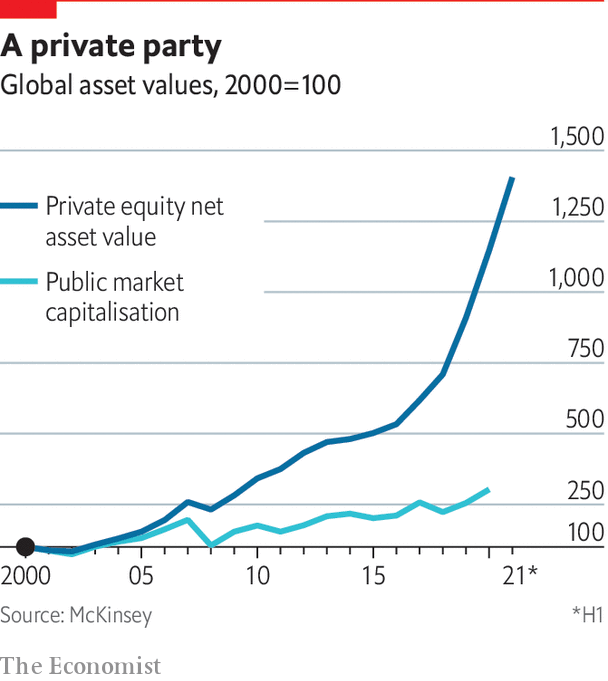
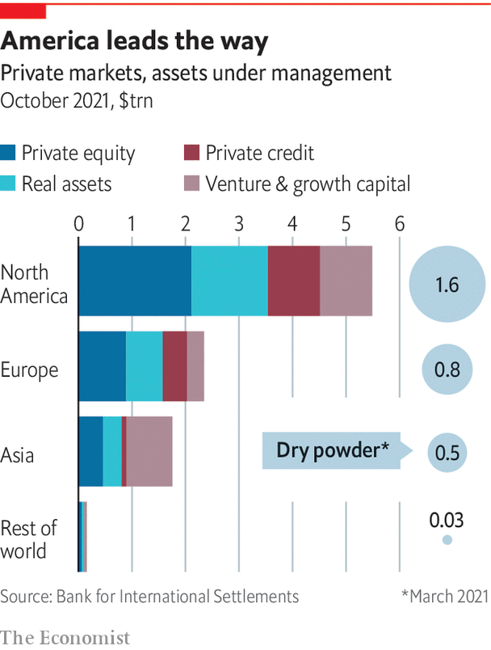

###### Into the mainstream

# Private markets have grown exponentially 

##### The past decade has been a golden one for private financial markets. As they become bigger they are being dramatically reshaped, says Matthew Valencia 

 

> Feb 23rd 2022 

WHEN JOHN CONNAUGHTON left consulting for private equity (PE) by joining Bain Capital in 1989, “my mentors counselled against it,” he recalls. “They said it wouldn’t last.” Now he heads Bain’s global PE business. He has helped assemble such huge deals as the formation of IQVIA, a life-sciences group valued at $47bn. Bain Capital manages $155bn of assets. The target for its 13th buy-out fund last year was $9bn; it closed just short of $12bn.

PE has been on a tear for three decades. Other firms set their sights even higher than Bain Capital. Blackstone, the biggest, wants to raise a record $30bn for its next fund. CVC, Hellman &amp; Friedman and Apollo Global Management have launched vehicles of $20bn or more. Funds are not just bigger but also being formed more quickly. The cycle between general partners (GPs), who manage PE funds, closing one fund and starting the next has shortened from five years to half that, says David Perdue of PJT Partners, an investment bank. Institutional investors such as university endowments, sovereign-wealth funds and pension plans are increasingly keen on PE and other alternatives to public markets. The attraction is understandable: in the latest fiscal year, many large American endowments enjoyed returns of 30-60% mainly thanks to private markets.


The PE industry has been “supersizing”, says Hugh MacArthur of Bain &amp; Company, a consultancy no longer affiliated with Bain Capital. By most measures, from fundraising to “dry powder” (committed capital awaiting deployment), it is three times larger than a decade ago. In just five years, the number of PE funds registered in America has jumped by more than half, to over 18,000.

Dealmaking is at record levels. The global value of disclosed leveraged buy-outs reached $1.2trn in 2021, far above the previous record of $800bn in 2006. PE made up a fifth of all mergers and acquisitions, its highest share for at least a decade. This deal splurge has supercharged activity in high-yield (junk) bond and leveraged-loan markets. Junk-bond issuance surpassed $600bn for the first time last year. So hungry were PE funds in 2021 that the bidding process sped up dramatically. Kem Ihenacho of Latham &amp; Watkins, a law firm, says that, just as buyers gazump when housing markets are red-hot, many bidders are “pre-empting the auction” by offering to sign less than halfway through the process.

Besides buying assets from corporate owners and founders, private funds buy from each other. Some firms have been through three or four PE funds’ hands. In America, secondary buy-outs can exceed the volume of initial public offerings (IPOs), the usual route for investors to cash out, says the Bank for International Settlements (BIS), the central bankers’ bank.

The PE boom is part of a broader expansion of private markets. Top-tier firms that once focused on leveraged buy-outs, such as Blackstone, KKR and Carlyle, now look just as keenly for opportunities in private debt, real assets such as property and infrastructure, and “growth equity”, which sits between venture capital and buy-outs. More than two-thirds of the industry’s dry powder is earmarked for investments other than buy-outs. Since 2010 buy-outs have gone from 80% of KKR’s business to less than half.

These market leaders are now “one-stop capital providers” for firms less able to tap traditional sources such as banks and public markets, says the BIS. Such diversification (along with stratospheric pay) has cemented their reputation as the new kings of Wall Street. Today’s business-school graduates may now be more likely to seek a career in private markets than in investment banking. Last year Blackstone had 29,000 applicants for just over 100 analyst jobs.

 


The growth of private markets has accelerated since the financial crisis of 2007-09, outpacing public markets. At its pre-crisis peak, the private-capital industry had some $2.2trn under management. Today it manages four to five times as much, a little over half of it in North America.

The private-markets party has boosted profits and share prices. In 2021 the industry’s upper ranks posted record results, and publicly listed PE firms enjoyed benchmark-beating share-price gains. Blackstone’s and KKR’s share prices doubled. The average profitability of alternative managers is well above that of banks (albeit more volatile). The Boston Consulting Group reckons alternative managers took in more than 40% of global asset-management revenues in 2020.

Since taking off in the 1980s, PE has seen two boom-and-bust cycles. The first boom was driven by swashbuckling dealmakers, epitomised by KKR co-founders Henry Kravis and George Roberts. Its emblematic deal was the highly leveraged $25bn takeover of RJR Nabisco in 1988. The first bust soon followed. The second boom, starting in the late 1990s, saw the industry scale up and expand beyond equity and outside America. Several managers, starting with Blackstone, took advantage of it to list their own shares, monetising fee income and giving GPs more exit options. More have since done so. TPG, a San Francisco leveraged-buy-out firm with some $110bn of assets, listed on the Nasdaq in January.

Boom back bigger

The financial crisis hit PE, but it bounced back, fuelled by cheap debt as interest rates fell. Even the arrival of covid-19 in 2020 did not knock it for long. Dealmaking froze briefly, but PE firms moved to shore up portfolio firms that needed help or as an opportunity to buy cheap assets. M&amp;A activity took off again later that year.

Private markets have been propelled by push and pull factors, says Mohamed El-Erian, chief economic adviser at Allianz, an insurer, and a former boss of PIMCO, a bond-fund manager. The main push factor was ultra-loose monetary policy, which drove investors towards illiquid markets that offered higher yields. Another was the retreat of banks in response to tougher capital requirements and post-crisis laws (such as Dodd-Frank in America) that discouraged or prohibited them from betting with their own balance-sheets. Private funds gleefully took up the slack. Among pull factors are innovations such as private-debt and property-investment funds that were designed to appeal to wealthy individuals and institutions.

 


As private markets have grown, more young firms have chosen to delay going public. The average age of companies doing an IPO in America was eight years in the 1980s and 1990s. The average since 2001 has been 11 years. “Private equity has redefined its role as a waystation to the public markets,” says Chip Kaye, boss of Warburg Pincus, a PE firm focused on growth investing.

As companies stay private longer, “more investors are looking to get in at that pre-IPO stage, as that’s when most of the wealth creation happens,” says Ben Meng of Franklin Templeton, a fund manager. Some firms opt not to go public at all, confident of raising enough capital privately, says Byron Trott, head of BDT Capital Partners, a merchant bank for family firms. Of the 40 companies BDT has invested in since 2009, only three have gone public.

Not that the public markets are down and out. Last year was a record one for IPO listings. Firms going public also have other routes, such as direct listings or mergers with special-purpose acquisition companies (SPACs), which landed with a bump after a boom in 2020-21 but are unlikely to disappear. Yet at around 4,000, the number of publicly listed American firms is far below its peak of nearly 6,000 in the mid-1990s. One reason is that investors see disadvantages in public ownership, including onerous disclosure requirements, quarterly earnings pressure and attacks by activist investors.

At PE-owned firms, the activists are on the inside. Owners work closely with managers to shape strategy and capital structure. They reward success handsomely while punishing failure faster than the owners of public firms. Done correctly, this can increase value by narrowing the information gap between shareholders and management, reducing agency costs. The endowments, pension funds and other institutional investors that fuel private markets are believers. They think large allocations to alternative investments offer the best hope of hitting annual-return targets for their portfolios that are typically in the high single digits.

But as the industry enters its third age, it faces challenges. One is the prospect of sustained higher inflation and interest rates. Cheap debt is PE’s lifeblood. A rise of a couple of percentage points in the cost of borrowing is unlikely to lead to surging bankruptcies. But more than that might. As more capital has flowed into private markets, prices for assets have risen so far that “there is little room for error,” says Bain &amp; Company’s Mr MacArthur. For buy-outs the average price tag relative to earnings is at an all-time high.

A second worry is greater scrutiny. Private markets are lightly regulated and opaque. Regulators want more transparency, especially on fees and performance measures. Supervisors want to know how private markets might affect financial stability. The industry must also navigate geopolitics, notably the reassessment of the virtues of foreign capital by China, until recently a big part of many managers’ plans. The collapse in September of Blackstone’s $3bn deal to buy SOHO China, a property developer, augurs ill.

The final test comes from within: generational change. Many who shaped the industry are leaving. Mr Kravis and Mr Roberts handed over to new co-heads last year. Stephen Schwarzman, Blackstone’s 75-year-old co-founder, remains the boss, but more day-to-day responsibility rests with its 52-year-old president, Jonathan Gray. Apollo’s co-founder, Leon Black, quit in March 2021 after an inquiry into his ties to Jeffrey Epstein. At Carlyle, one co-CEO quit in 2020 after losing a power struggle. Can new leaders keep the magic going? The challenge is tougher when, as Stan Miranda of Partners Capital, an investment firm, puts it, “We’ve been through a golden 40-year period in which conditions grew ever more benign. It’s been incredible—and it may well be over.”

This special report looks at the risks as the tailwinds of the past decade drop, and at the opportunities as private markets win new investors. It considers a future in which scoring big with buy-outs is no longer enough. It explores what institutional investors want and the burgeoning market for private debt; and it looks at regulatory and reputational landmines. The report focuses on America. Private markets have become more global, but it remains true that today’s trend in New York is tomorrow’s in London or Shanghai. ■

