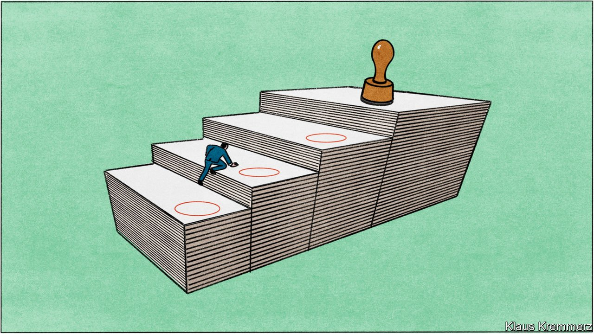

###### Regulation and reputation

# Regulators have private markets in their sights 

##### Criticism of private equity is overdone. That won’t stop regulators giving it a harder time 

 

> Feb 23rd 2022 

IN NOVEMBER GARY GENSLER of the SEC addressed the Institutional Limited Partners Association (ILPA). Private equity and hedge funds matter, he said, because they are growing in size, complexity and number, and because of who they serve, such as retirement plans for teachers or firefighters. Caveat emptor? Not on his watch. “It is worth asking ourselves at the SEC whether we’re meeting our mission with respect to this important slice of the capital markets,” he said. His speech was a clear sign that private markets could expect more red tape.

Regulation increased after the financial crisis. Many private funds had to register with the SEC and start filing information about their holdings. But it remains light compared with the thicket of red tape entwined around public markets. Now regulators, egged on by public and political animus towards PE, are looking to narrow the gap. The political attack is led by Democratic senators such as Elizabeth Warren and Sherrod Brown. They are promoting the Stop Wall Street Looting act, designed to “rip up the predatory playbook” and stop PE “exploiting workers, consumers and communities”. The law would, among other things, make funds’ GPs share responsibility for the liabilities of firms they own and curb “dividend recapitalisations”, the practice of using money borrowed by a firm they own to give themselves a big payout—sometimes enough to cover their entire investment.


Mr Gensler has more time for such pitchfork-waving than his Republican-minded predecessor, Jay Clayton, who now chairs the board of Apollo. Mr Gensler has three main concerns, which will only grow as the industry signs up more retail clients: the opacity and unevenness of fees and other expenses; opaque performance measures; and GPs’ discharging of fiduciary duties to clients. He has ordered reviews in all three areas. The SEC has already proposed new rules that would ban certain activities involving conflicts of interest and force more disclosure of fees and performance. It is also working on a plan to force “unicorns” (private startups worth over $1bn) to disclose more about their operations and accounts. And it has increased scrutiny of SPACs, adumbral vehicles used as an alternative way of listing shares.

This push marks a “massive shift” in the SEC’s stance towards private markets, says Igor Rozenblit, a former head of the commission’s private-funds unit, now with Iron Road Partners, a consultancy. The ILPA hopes to take advantage of it to lobby regulators to force funds to report fees in a clearer, more consistent format. The trade group created just such a template in 2016 and has been trying to persuade PE funds to use it; over 60% of investors have received data in this format from funds launched in America since 2017, says Colmore, a data provider.


The Federal Trade Commission is also eyeing PE more sceptically. Its chair, Lina Khan, an appointee of Joe Biden’s, is “a red-blooded anti-private-equity crusader”, says one industry bigwig. Ms Khan has made policing buy-outs a priority. “We’re now seeing information requests directed not just at the acquiring fund but at its sponsors themselves. Some are even being asked to provide information about their industry track record,” says Erica Weisgerber of Debevoise &amp; Plimpton, a law firm. Scrutiny is intensifying even where there is no competitive overlap between seller and buyer. The industry’s big fear is that regulators may take a stricter approach to “common ownership”, meaning they would consider all firms in a manager’s portfolio as part of the same entity.

Private markets face scrutiny from guardians of fiscal stability, too. The BIS has warned that non-banks can “trigger or amplify market stress” and called for a more “macroprudential” approach to mitigate systemic risks. It highlighted hidden leverage, often at multiple levels: not only the firms owned by leveraged-buy-out funds but also the funds themselves (which often borrow to delay making capital calls) and their investors (CalPERS has added leverage for the first time, of 5%). The BIS did, however, acknowledge that private markets involve less “liquidity transformation” (short-term liabilities funding long-term assets) and that long-term investments should make funding more resilient.

The industry is under assault over taxation as well. GPs have faced repeated calls to pay exchequers a bigger slice of their carried interest, the share of profits made on investments. This is taxed as a capital gain at a lower rate than if it counted as income. PE billionaires have more to fear from the end of what many see as an unfair tax break than from heavier regulation.

One result is that the industry employs almost 200 lobbyists in America alone, according to the New York Times. It has made congressional-campaign contributions of over $630m in the past decade, calculates Open Secrets, a non-profit. The investment appears to have paid dividends. The Looting act is stuck in Congress and a push to close the carried-interest tax loophole has floundered. Nor has any other country closed it. The British government rejected a proposal to raise the tax. Even if governments did act, the industry might find a way to convert carried interest into a common-stock equivalent that still qualified as capital gain.

Shark practice

Yet the industry has a huge image problem. It faces a negative press despite insisting its reputation for stripping assets and killing jobs is outdated. The British media feature stories of “sharks” as PE has acquired such household names as Morrisons, a supermarket chain. Failures to bag targets, such as Bain Capital’s abortive attempt to buy LV, a mutually owned insurer, are met with glee. On both sides of the Atlantic the industry is seen as an emblem of inequality—the more so since it emerged that KKR’s co-heads had stock awards potentially worth more than $1bn each.

The financial engineering of PE’s early days, when purchases were mostly debt-financed and firms were hollowed out, is less usual now. The new charge is of anti-social behaviour. In 2020 five academics in the private-capital field, including Mr Brown and Steven Kaplan of Chicago University, wrote an article on PE’s “Accomplishments and Challenges”. Though broadly positive, it took the industry to task for operating in “a profit-maximising way that, although compliant with laws and regulation, is not always what most of us would view as socially optimal”. PE-backed for-profit college education is linked to worse outcomes for students.

Another stain is the care-home sector. PE-owned firms have fewer nurses and worse health outcomes, partly because of “arbitraging” of nursing regulations, the authors concluded. In Britain private funds’ takeovers of care homes have raised pressure to maximise revenue per bed. Many state-financed places have been reallocated to private payers, leading to bed-blocking in hospitals by those who could be better looked after in homes. Numbers of self-paying residents have risen even as supply has fallen.

Mr Brown and his co-authors say the onus should be on governments to design policy better, with fewer loopholes. Poor outcomes in education, they say, are largely down to the shoddy design of student-loan schemes. But institutional investors think PE must do more than just wait for better policy. In a survey of LPs last year, conducted by Coller Capital, a majority said that just staying within the law was not enough and predicted that “societal pressure will force the industry to begin self-regulating.”

It would feel less pressure if it could persuade critics that it is a force for good. The industry has a history of exaggerating its benefits and its returns, says Jeffrey Hooke, author of “The Myth of Private Equity”. Academic studies are less damning. Reports in 2014 and 2019 linked buy-outs with productivity gains from exiting less productive businesses and entering friskier ones, and from more effective resource allocation. A study in 2020 looked at what happens to public companies when PE invests in their industry: it forces rivals to respond by becoming more productive.

On jobs, a study in 2019 of PE-backed firms in America found that employment declined in existing plants by 4% relative to others in the same industry. But in new operations, started from scratch or acquired, it increased by 2.3%. Another study in 2021 of 9,800 American buy-outs between 1980 and 2013 concluded that employment shrinks 13% over two years after buy-outs of publicly listed firms, relative to control firms, but grows by 13% after buy-outs of privately held firms. It also found post-buy-out productivity gains at target firms to be “large on average and much larger yet for deals executed amidst tight credit conditions”.

Critics talk up PE’s costs and ignore its benefits. When citing the study of 9,800 buy-outs, Ms Warren’s office focused on the jobs lost at bought-out public firms, not those added at private ones. But PE boosters play down all instances of rapaciousness, employing the “no business is without the odd bad apple” defence. Tougher regulation looms, in any event. ■

