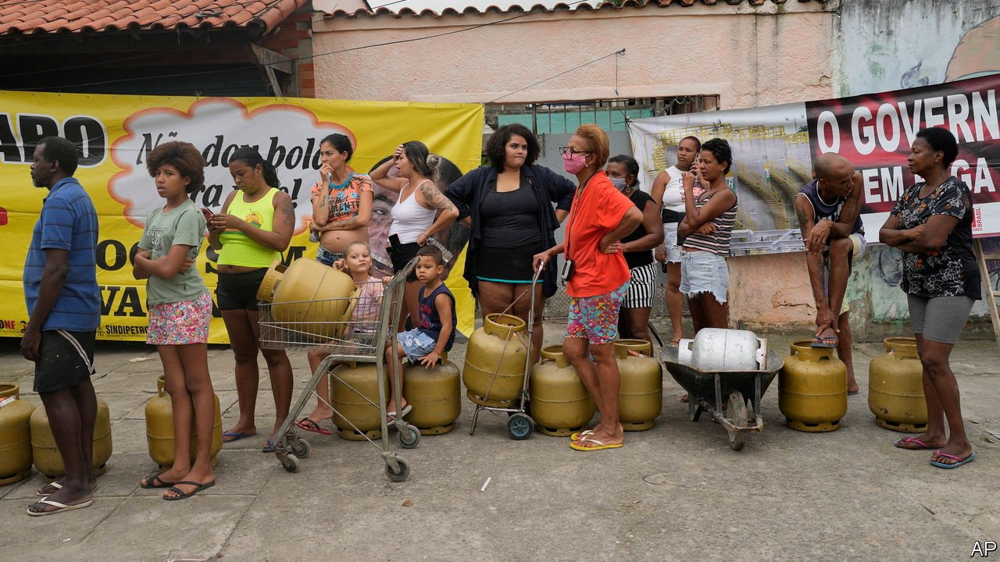
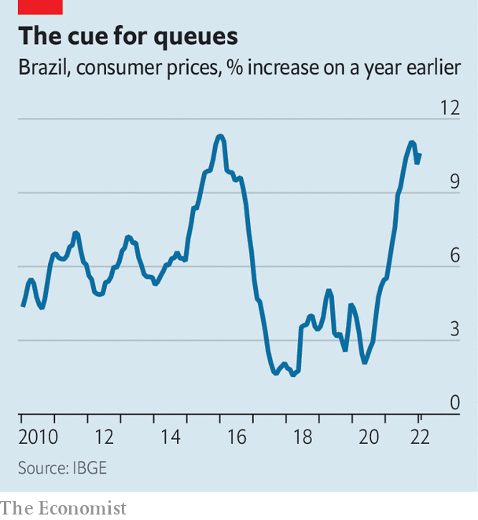

###### The price of high prices

# Brazil’s 10% inflation is eroding incomes and the president’s popularity 

##### But not all the surge in prices can be blamed on Jair Bolsonaro 

 

> Feb 26th 2022 

BRAZILIANS ARE no strangers to inflation. In the mid-1980s people crowded around supermarket gates and, as soon as they opened, raced in to buy as much as they could carry. With inflation running on average at 300% that decade, it paid to be early. If an unlucky customer missed the morning rush, they would end up paying higher prices in the afternoon.

Today’s Brazilians are not yet racing down supermarket aisles, nor even stockpiling as much as their inflation-beset neighbours in Argentina. But poor and, increasingly, middle-class Brazilians are feeling the pinch. At 10.6% the inflation rate is among the highest in big economies, and the median income, adjusted for inflation, is at its lowest in eight years. Prices of petrol and ethanol, commonly used in Brazilian cars, soared by 47% and 62% respectively in 2021. Already inflation is one of the most important issues shaping a presidential election due in October. Fully 73% of people surveyed in one poll in January said Jair Bolsonaro, the president, has done a bad job of controlling it.


To cushion the blow Mr Bolsonaro has promised salary increases and is trying to lower fuel taxes. He has beefed up a welfare payment introduced by Luiz Inácio Lula da Silva, president from 2003 to 2010 and probably Mr Bolsonaro’s main opponent in the election. To do so, he persuaded Congress to approve a constitutional amendment busting through a cap on public spending, mandated in law since 2016. That has unnerved investors by suggesting fiscal prodigality. Reckless government spending, after all, has often contributed to bursts of high inflation in the past.

The government is not solely to blame for rising prices, however. Inflation is on the increase around the world, driven in large part by supply shortages and spiralling oil prices. In Brazil it has been exacerbated by the worst drought in 90 years. A consumer boom fuelled by generous fiscal stimulus may have pushed up prices, but this is also true in the United States, where consumer-price inflation is running at 7.5%. What is more, were it not for Mr Bolsonaro’s emergency payments during the pandemic, twice as many Brazilians would have found themselves in extreme poverty—defined as living on less than $1.90 a day—in 2020.

The central bank has been raising rates much faster than most of its counterparts elsewhere. Its main interest rate has risen by eight percentage points, from 2.75% in March 2021 to 10.75% in February this year. That is the highest level in nearly five years. The harsh medicine shows no sign of ending. Consumer prices are decelerating at a slower rate than expected (see chart), and the bank has indicated that further increases may be needed.

 


But deeper problems appear to be undermining the bank’s efforts. “I don’t think it’s a given that inflation will be brought back under control,” says Arminio Fraga, one of its former bosses. One reason is expectations. In the last budget Mr Bolsonaro wangled an extra $310m to increase the salaries of government workers whose wages had been frozen during the pandemic. Although a tiny amount, it sets a precedent. On February 21st police in the state of Minas Gerais announced that they would be going on strike to demand higher pay.

Pensions, the minimum wage and other kinds of social spending are indexed to inflation. Such automatic adjustments will keep inflation hovering around 6% in 2022, projects Credit Suisse, a bank—above the central bank’s target of 3.5%.

Similar structural problems belie the numbers on government spending. On the surface they are pretty good, notes Marco Bonomo of Insper, a business school in São Paulo. Last year the government’s debts fell from 89% of GDP to around 80%. This was mostly the result of growth and inflation, though the budget deficit was also smaller than expected.

But by weakening the spending cap Mr Bolsonaro has not only drawn his own credentials as a fiscal hawk into question, but also shown how easy it would be for a spendthrift president to get around rules intended to constrain spending. That debases all future promises of thrift.

The concern about future fiscal incontinence may explain the depreciation of the real. Since Mr Bolsonaro took office in 2019 it has fallen by over 30%, although it has recovered a little recently. This is unusual: when commodity prices are high and Brazil is running a trade surplus, as it is today, the exchange rate tends to appreciate. The falling exchange rate, in turn, fuels inflation, as imported goods become dearer.

In an election year, however, it is the presidential candidates who are the greatest source of uncertainty. The two main contenders are both fiscal chameleons. In 2002 Lula’s win spooked the markets, but he was reasonably responsible in his spending in his first term, at least. Mr Bolsonaro, in contrast, has seemed ever less in accord with Paulo Guedes, his orthodox finance minister, as his term has progressed. For now investors seem to expect Lula, who is leading in the polls, to govern moderately. But as with rising prices, they may be in for an unpleasant surprise. ■

