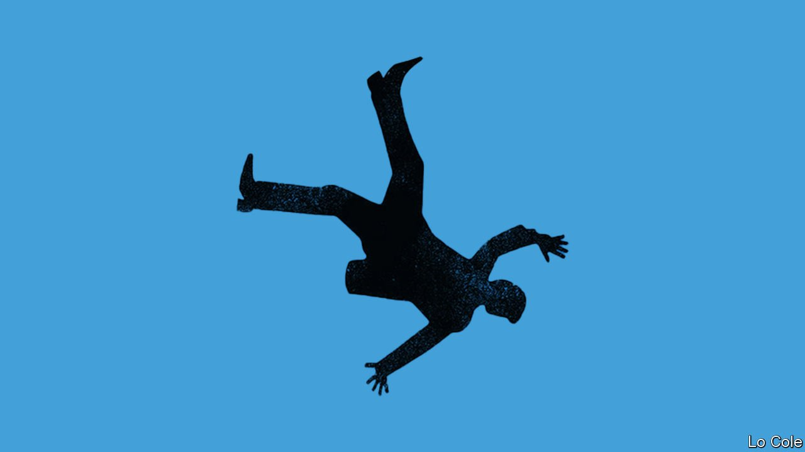

###### Bello

# Juan Orlando Hernández, a former Honduran president, is arrested 

##### His case highlights how far drug money has penetrated Latin American politics 

 

> Feb 26th 2022 

IT WAS A swift public humiliation. On February 15th, just 19 days after he left office as his country’s all-powerful president, Juan Orlando Hernández was arrested at his mansion in Tegucigalpa and taken away in handcuffs. The arrest was in response to an extradition request from prosecutors in New York who have charged him with taking part in a violent conspiracy to export 500 tonnes of cocaine to the United States since 2004. He says he is innocent. His arrest holds out the possibility of a new dawn in a country benighted by corruption, violence, poverty and natural disasters.

Mr Hernández’s rise followed the ousting in 2009 of Manuel Zelaya, a Liberal-turned-populist who allied with Venezuela’s Hugo Chávez and sought to change the constitution in order to run for a second consecutive term. Mr Hernández, a conservative, at first presented himself as a reformer. He promised to crack down on drug-trafficking and purged the police. He allowed the Organisation of American States (OAS) to set up a unit to investigate corruption.


He then persuaded Honduras’s Supreme Court, stuffed with nominees of his National Party, to allow him to run for a second term in 2017. The OAS and others denounced his victory as fraudulent. But the United States blessed it. Mr Hernández played the administration of Donald Trump as sweetly as a marimba. Honduras became only the fourth country to move its embassy in Israel to Jerusalem, as Mr Trump wanted. When scores of migrant caravans began leaving for the border with the United States, Mr Hernández agreed to stop them.

American prosecutors had another view. They secured the arrest and in 2021 the conviction for drug-trafficking of Tony Hernández, the president’s brother. Witnesses told of bribes from drug lords, paid to the National Party to persuade the government to look the other way. The president said he wanted to “stuff drugs up the gringos’ noses”, a witness statement claims. He shut down the OAS unit because it did its job too well. The administration of Joe Biden has published a list of 21 Honduran officials it says are “corrupt and undemocratic”, including Mr Hernández’s predecessor, Porfirio Lobo (who denies the accusation).

Hondurans have had enough, too. In November they elected as president Xiomara Castro, the wife of Mr Zelaya. At her inauguration she pledged to fight corruption. She brought back a police chief fired by Mr Hernández, who promptly arrested him. She wants the UN to set up an anti-corruption commission.

Mr Hernández says the case against him is based on the testimony of convicted drug-traffickers seeking revenge. The pressure to extradite him is strong. His arrest was celebrated with fireworks in Tegucigalpa. Ms Castro seems to have a different agenda from the one her husband had when he was president. She won in part because she allied with an anti-corruption party of the centre-right whose legislative backing she needs. She seems to have dropped a campaign promise to recognise China’s claim on Taiwan. “She clearly has opted to go with the United States,” says David Holiday, an analyst of Central America. Her first meeting as president was with Kamala Harris, America’s vice-president.

Mr Hernández is not the first Latin American head of state to be accused of drug-trafficking. The case merely highlights the continuing penetration of drug money in the region. Luis García Meza, a Bolivian dictator of the early 1980s, placed his government at the service of the industry. Manuel Noriega, Panama’s former strongman, was convicted of trafficking by an American court. Ernesto Samper, a Colombian president in the 1990s, admitted that his campaign took money from the Cali drug gang, though he insists he was unaware of it. Gangs have bribed politicians, police and officials from Argentina to Mexico.

But the rot goes particularly deep in Honduras. Its business and political elites, safe in their gated communities, have allowed the capture of the state by organised crime even as hundreds of thousands of ordinary Hondurans flee. Remittances of nearly $6bn in 2020, equal to almost 70% of exports and a quarter of GDP, keep an unreformed country going.

Ms Castro could change this. Her first test is to try to ensure that a new Supreme Court and attorney-general are politically independent. If they are, that may persuade the UN to get involved. Mr Biden’s team will be supportive. But it will take many years of hard work for Honduras to police itself.

Read more from Bello, our columnist on Latin America: (Feb 19th)

 (Feb 12th) 

 (Feb 5th)

