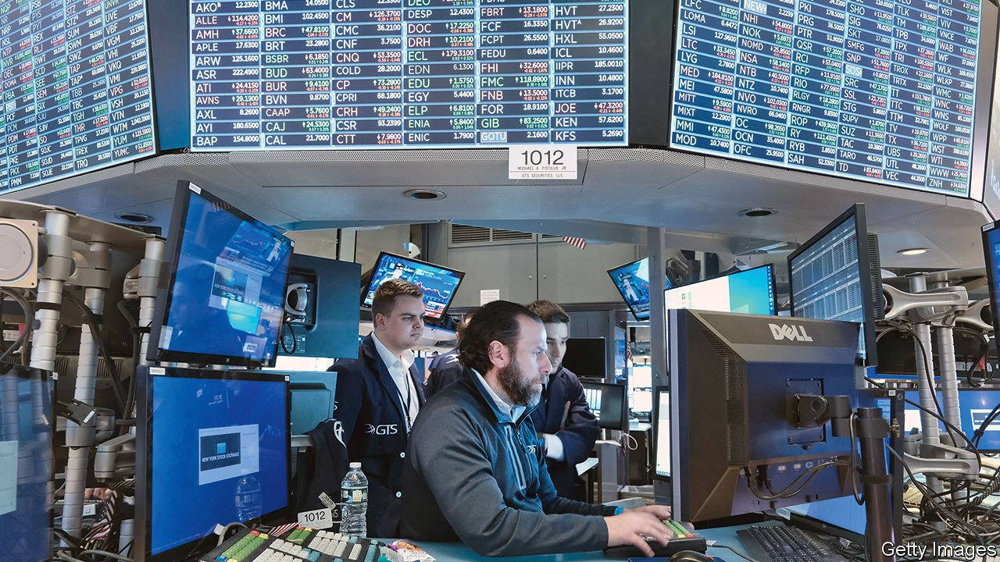

###### The world this week

# Business 

#####  

 

> Feb 26th 2022 

Russia’s invasion of Ukraine shook  that were already unsettled by the crisis. The day before the attack the S&amp;P 500 had already hit its lowest level in eight months, taking it down by almost 12% since the beginning of the year. Before the assault the NASDAQ was also down from the start of January, by 17%. The Moscow Exchange suspended trading when the invasion began. When trading resumed the Moex index of Russia’s leading companies plunged by 45% before pulling back some of its losses. The central bank brought in emergency support for Russian banks and banned the short-selling of shares.

Oil prices surged as investors weighed up the risk of Russia’s military intervention to the flow of energy supplies. Brent crude passed $100 a barrel for the first time since 2014. Many Western oil firms are also assessing what effect sanctions will have on their considerable assets in Russia. The price of natural gas soared in what is an already tight market. The main indicator for gas futures in north-west Europe was up by 30% in early trading.


America held its biggest auction to date of rights to develop offshore-wind fields. The sale covered half a million acres in shallow waters off the coasts of New Jersey and New York’s Long Island in an area of sea known as the New York Bight. The wind turbines could eventually power 2m homes.

The French government said it would inject €2.1bn ($2.4bn) into EDF to tide over the utility’s finances as it deals with outages at its nuclear-power plants. EDF reckons it could take a €13bn net hit to its profit this year because of reduced output from nuclear production and the government’s insistence that it bear some of the costs of increases to household electricity bills.

The resurgence in commodity prices in 2021 pushed revenues up by 42% at Rio Tinto, helping the mining company turn an annual net profit of $21bn and return a staggering $16.8bn to shareholders in dividends for the year. Rio’s annual report reiterated its commitment to change its workplace culture following an external investigation into claims of bullying, and sexual and racial harassment. It will implement all of the investigation’s recommendations.

Fresh concerns about China’s regulatory crackdown on the  caused another sell-off in Chinese tech stocks. Meituan’s share price swooned after regulators said they wanted the food-delivery platform to reduce its fees to restaurants. Tencent was forced to deny that it was once again the target of another big clampdown. And reports emerged that the authorities were recommencing their inquiries into Jack Ma’s Ant Group. The Hang Seng Tech Index of technology companies listed in Hong Kong fell to its lowest level since its creation in 2020.

Last year China’s regulators also brought in tough new restrictions on the private-tutoring business, including a ban on foreign investment in the sector. This week New Oriental, the largest online-tutoring company, reported an $876m six-month net loss, as its income plunged.

Airbus signed an agreement with CFM International, a venture between General Electric and Safran, a French aerospace firm, to develop a combustion engine for aircraft fuelled by hydrogen. The company said it was its most significant step yet “to usher in a new era of hydrogen-powered flight”. An A380 super-jumbo will be fitted with liquid hydrogen tanks and used for test flights by mid-decade, with an aim of the first zero-emission commercial aircraft entering service by 2035.

Volkswagen announced that it is in advanced discussions to float its  sports-car brand in an IPO. The German carmaker is in talks with its biggest shareholder, the holding company that is owned by the Porsche-Piëch family. A stockmarket listing of Porsche would provide VW with the funds to accelerate its roll-out of electric vehicles and battery technology.

Meta made its Reels platform available to all users on Facebook worldwide, upping its rivalry with TikTok over short-form video content. Mark Zuckerberg’s comment that Facebook is encountering stiff competition from TikTok for attention on social media was a factor behind a 26% fall in Meta’s share price on February 3rd. It has fallen by another 16.5% since then.

 launched a fight with McDonald’s by nominating two directors to its board in a dispute over animal rights. The activist investor is a veteran of boardroom battles, including an unsuccessful attempt to block a buy-out of Dell and a clash with Warren Buffett over an oil-company takeover. His beef with McDonald’s is its treatment of pregnant pigs. Mr Icahn thinks they should not be kept in gestation crates. The fast-food chain says it expects these to be phased out. Until then Mr Icahn could uncomfortably hog the limelight with calls for an abrupt end to the practice.

