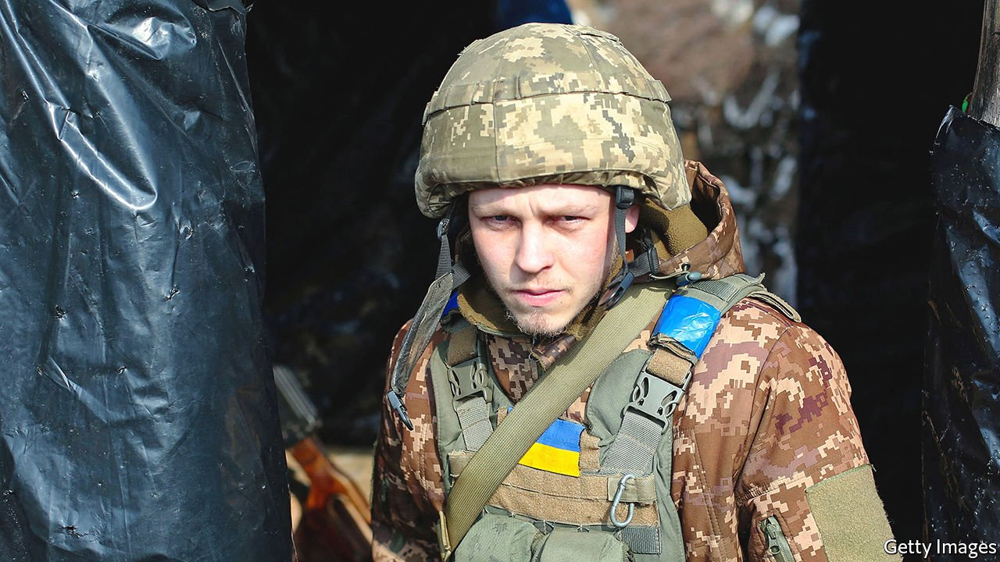
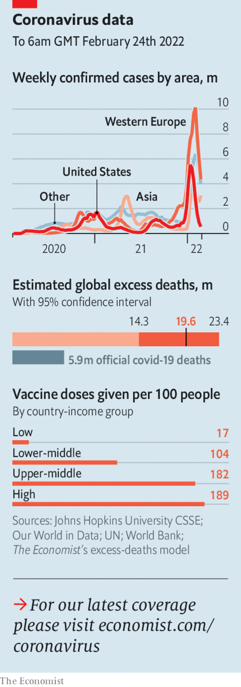

###### The world this week

# Politics 

#####  

 

> Feb 26th 2022 

After months of denying any such intention, Vladimir Putin, Russia’s president, launched an . Russian troops appear to have entered the country not only from Russia itself, but also from Belarus and the Crimea, a Ukrainian territory seized by Russia in 2014. Russian aircraft and missiles struck targets across the country, including near the capital, Kyiv. Russian forces advanced on Kharkiv, the second city, and Mariupol, a strategic port. Mr Putin said he was seeking to “de-Nazify” Ukraine. The Ukrainian government declared martial law. It claimed to be holding back Russian forces in several parts of the country. Large traffic jams formed as civilians tried to flee Kyiv and other cities. Airlines were warned not to fly over the country. The scale of casualties was not immediately apparent.

Mr Putin’s attack was immediately condemned by Western countries. Joe Biden said that America would impose swift and severe  sanctions on Russia. Ursula von der Leyen, the president of the European Commission, promised the same on the EU’s behalf. It is time “to up the pain level”, said Mark Warner, the chairman of the Senate Intelligence Committee. NATO, the G7 and the EU all called emergency summits of their leaders. Even before the invasion, Germany had suspended the process of starting up , an undersea pipeline intended to carry gas from Russia to Germany, deliberately bypassing Ukraine.


In response to the Russian invasion of Ukraine, Estonia invoked a clause of the NATO treaty for members under threat. The alliance said it was deploying extra troops to eastern Europe to bolster its members’ defences. Mr Putin threatened “consequences that you have never faced in your history” for anyone attempting to interfere in the war.

The Israeli justice ministry found no evidence that the police bypassed judicial oversight and hacked the mobile phones of civilians. Israel’s attorney-general had ordered the investigation after a newspaper claimed the police spied on activists, businessmen and politicians.

A chemical explosion at a small-scale gold mine in Burkina Faso killed 59 people. The number of artisanal and small gold mines in west Africa is growing rapidly, but few are regulated.

Six African countries—Egypt, Kenya, Nigeria, Senegal, South Africa and Tunisia—will receive the technology needed to produce mRNA vaccines in a project established by the World Health Organisation.

Britain’s prime minister, Boris Johnson, announced an  in England, including self-isolation for the infected (except for health staff). Some rules on travel remain in force.

America’s Supreme Court agreed to hear the case of a web designer in Colorado who does not want to offer marriage-related services to gay couples on religious grounds. Four years ago the court sided with a baker who refused to make a wedding cake for a same-sex couple, but the ruling was narrowly tailored to the specifics of that lawsuit.

Canada’s capital was cleared after three weeks of protests. Nearly 200 people were arrested and scores of trucks were towed from downtown Ottawa. The self-styled “freedom convoy” had begun as a backlash against vaccine-mandate rules, but broadened into general anti-government discontent. Several civil-liberties groups have threatened to take the government to court over its use of an emergency-powers law to remove the protesters, even though those powers were quickly repealed.

Colombia’s constitutional court decriminalised abortions in the first 24 weeks of pregnancy. The decision, in a 5-4 vote, brings the country in line with Mexico, which decriminalised abortions last year, and Argentina, which has legalised them. Until now abortions in the deeply Catholic country were only allowed in limited circumstances, such as rape, and most women had little recourse to them.

The death toll from the recent flooding and landslides in the Brazilian hill town of Petrópolis, just north of Rio de Janeiro, rose to at least 200. Around 50 other people are still missing.

 


Imran Khan, the prime minister of Pakistan, offered to hold a televised debate with Narendra Modi, his counterpart in India. He hopes this would help resolve some of the issues that have bedevilled relations between two countries, such as Kashmir. The Pakistani government has signalled that it would like to start a dialogue with India on trade. Mr Khan flew to Moscow to meet Vladimir Putin this week to discuss economic co-operation.

A protest in Kathmandu against a $500m aid grant from America to Nepal turned violent. Police fired rubber bullets and tear-gas to disperse the crowd. Communist parties in the coalition government claim the grant has strings attached that will limit Nepali sovereignty.

The American Justice Department said it was ending the China Initiative, a contentious Trump-era effort to fight Chinese security threats, that critics said unfairly targeted professors of Asian descent. A senior official said the agency would introduce a broader strategy to counter threats from hostile nations, to include countries like Russia and North Korea.

The chief executive of Hong Kong, Carrie Lam, ordered the compulsory testing of all 7.4m people in the territory as it fights a surge in covid infections. Residents will have to undergo three rounds of tests starting in mid-March. While other countries are starting to live with the disease, China has stuck to a “zero covid” policy, yet the Omicron variant has overwhelmed Hong Kong’s hospitals.

There were tearful reunions in Australia as it reopened its international borders for the first time in two years. The country imposed a strict travel ban in March 2020 because of covid. Australians and some others were allowed to return from late last year, but most foreigners could not. Vaccinated visitors will no longer need to quarantine. Australia is now looking to rebuild its tourist industry.

