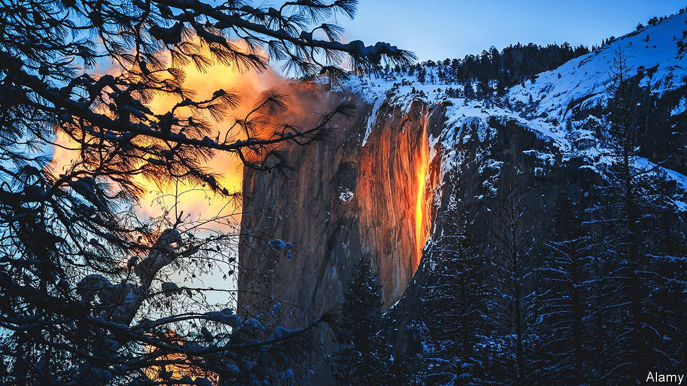

###### Parks and permits

# America’s outdoor permits are not solving overcrowding 

##### Controlling access to fragile areas of natural beauty is not as simple as it sounds 

 

> Feb 26th 2022 

YOSEMITE NATIONAL PARK is almost always brimming with visitors. For two weeks each February, however, the crowd intensifies. For just a few minutes each day, the setting sun lines up with Horsetail Fall, lighting the waterfall so that it appears to be lava. “Firefall” has become a tourist spectacle: it drew over 2,000 visitors on a single day. Big crowds have big drawbacks, though, risking environmental degradation, unsafe conditions and wildlife disruption.

The National Park Service (NPS) introduced a permit for the spectacle in 2021 because of covid-19, but lifted restrictions this year. “It’s a disaster,” says one of a pair of photographers frustrated with the number of visitors and lack of restrictions this year. Surrounding their painstaking set-up was a long queue of cars and large groups shouting to one another while they waited for the sunset. The pair preferred the permit system, which limited the crowds.


But are permits the solution to overcrowding? America’s parks have many permitting methods, from digital sign-ups to bingo balls in community centres. The aim is to keep visits sustainable and access fair. The results are mixed.

Some permits are effective. The delicate sandstone feature known as “The Wave” near Kanab, Utah, can cope with only a trickle of visitors without suffering rapid erosion. The odds of getting one of the four group permits issued in person each day are low, but Utah’s “only legal lottery” has succeeded in preserving one of the country’s most unusual natural structures while creating a gloriously uncrowded hiking experience.

Permits typically carry a fee. Although parks try to avoid discouraging the poor, that can be tricky. The cost of the passes and permits can mount up.

Several areas have permits for reasons of safety. Take Half Dome, a short drive from Horsetail Fall, a challenging hike which attracts tens of thousands of people each year. Cables have been installed on the steepest stretches, to enable those without rock-climbing skills to reach the summit. From 2005 to 2009 there were 85 search-and-rescue incidents and eight deaths. In 2010 the NPS limited access to those with permits. The number of visitors dropped sharply, and fatal accidents fell by half—but serious incidents per person actually rose. The scarcity of permits may have unhelpfully increased the pressure to complete the hike, leading to more accidents.

And some permits are doubly useless: neither preventing crowds nor enhancing safety. The Enchantments, an alpine area in Washington state, requires permits for camping, but not for day use. Many attempt to hike it in a single day, even though it is long and strenuous. On a recent visit, your correspondent only got out a few hours after dark despite starting before sunrise. Many people without proper gear were still hours behind. Several stragglers confessed that they had no idea about the difficulty.

What may sound like a simple solution, in other words, turns out in practice to be anything but. Permit systems require a fine balance—much like the nature they seek to protect.

For exclusive insight and reading recommendations from our correspondents in America, , our weekly newsletter.

